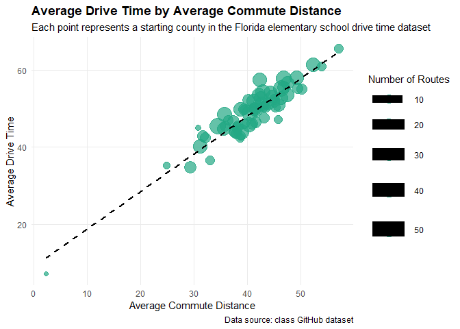

# Data Visualization and Reproducible Research

> Thomas Spangler. 

The following is a sample of products created during the _"Data Visualization and Reproducible Research"_ course.

## Project 01

In the `project-01/` folder you can find my Billboard Summer Hits project. This project explores how popular summer songs changed across decades using variables such as energy, danceability, valence, and decade. The project also includes an interactive visualization and a bad chart redesign using one of the charts from the report.

**Sample data visualization:** 

## Project 02

In this project, I explored Florida elementary school drive time data. The project focuses on commute distance, drive time, county-level patterns, and school locations across Florida. The report includes an interactive chart, a spatial map, a model-based visualization, and a bad chart redesign. Find the code and report in the `project-02/` folder.

**Sample data visualization:** 

## Project 03

In this project, I explored Tampa weather data and concrete strength data. The weather section uses histograms, density plots, ridgeline plots, and a precipitation chart to show patterns in 2022 weather. The concrete section explores distributions, curing age, cement amount, and compressive strength. This project also includes a bad chart redesign created from the concrete strength by age visualization.

**Sample data visualization:** 

### Moving Forward

Overall, these projects helped me better understand how data, design, and explanation work together. Moving forward, I would focus on making my visualizations clearer, more accessible, and more useful for readers.