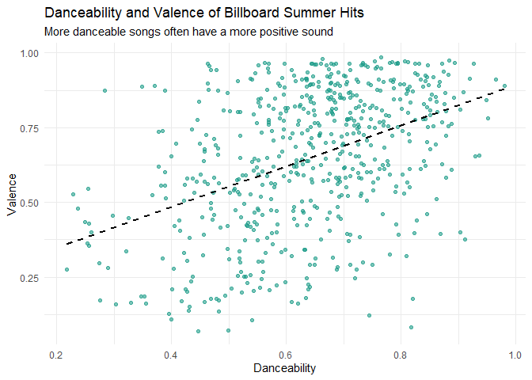
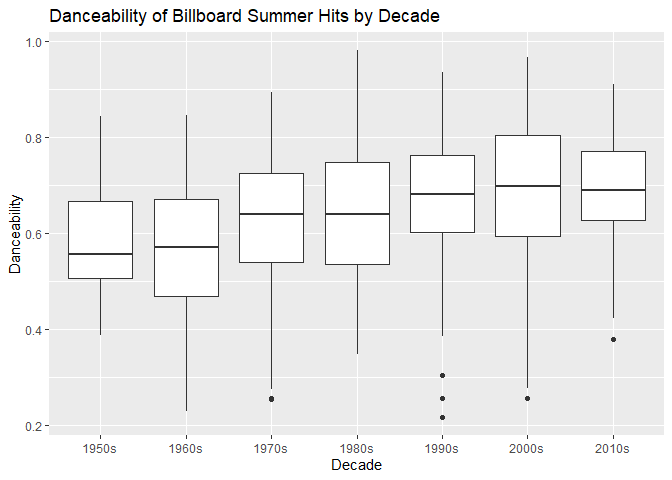
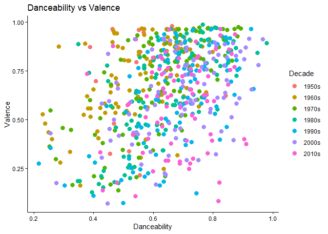
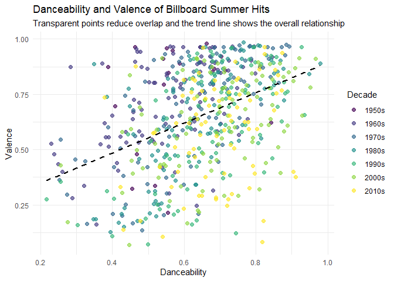

## Dataset


``` r
library(tidyverse)
library(plotly)
library(viridis)

billboard_hits <- read_csv("../data/all_billboard_summer_hits.csv", col_types = cols()) %>%
  mutate(
    decade = factor(
      paste0(floor(year / 10) * 10, "s"),
      levels = paste0(seq(1950, 2010, by = 10), "s")
    )
  )
```

The data set used in this report is the all_billboard_summer_hits.csv. It contains audio features for Billboard summer hit songs from 1958 to 2017. The data was downloaded from the GitHub data repository provided and saved in the `data/` folder of this project.


``` r
str(billboard_hits)
```

```
## tibble [600 × 23] (S3: tbl_df/tbl/data.frame)
##  $ danceability    : num [1:600] 0.518 0.543 0.541 0.408 0.554 0.679 0.663 0.684 0.645 0.388 ...
##  $ energy          : num [1:600] 0.06 0.332 0.676 0.397 0.189 0.279 0.619 0.556 0.943 0.434 ...
##  $ key             : chr [1:600] "A#" "C" "C" "A" ...
##  $ loudness        : num [1:600] -14.89 -11.57 -7.99 -12.54 -14.28 ...
##  $ mode            : chr [1:600] "major" "major" "major" "major" ...
##  $ speechiness     : num [1:600] 0.0441 0.0317 0.135 0.03 0.0279 0.0384 0.0334 0.0377 0.0393 0.0354 ...
##  $ acousticness    : num [1:600] 0.987 0.669 0.188 0.873 0.915 0.645 0.336 0.468 0.385 0.789 ...
##  $ instrumentalness: num [1:600] 7.87e-06 0.00 8.03e-01 0.00 1.37e-05 0.00 8.61e-06 0.00 0.00 9.54e-01 ...
##  $ liveness        : num [1:600] 0.161 0.134 0.123 0.28 0.132 0.118 0.0622 0.0664 0.37 0.728 ...
##  $ valence         : num [1:600] 0.336 0.795 0.911 0.697 0.214 0.854 0.979 0.867 0.965 0.873 ...
##  $ tempo           : num [1:600] 127.9 155 76.2 72.6 136.7 ...
##  $ track_uri       : chr [1:600] "006Ndmw2hHxvnLbJsBFnPx" "5ayybTSXNwcarDtxQKqvWX" "4jmFSkpcqLOUN6scGU6BOO" "3c7KT5CN8uYRaK3xThhdYt" ...
##  $ duration_ms     : num [1:600] 216373 153933 128360 162773 165293 ...
##  $ time_signature  : num [1:600] 4 4 4 4 3 3 4 4 4 4 ...
##  $ key_mode        : chr [1:600] "A# major" "C major" "C major" "A major" ...
##  $ playlist_name   : chr [1:600] "summer_hits_1958" "summer_hits_1958" "summer_hits_1958" "summer_hits_1958" ...
##  $ playlist_img    : chr [1:600] "https://mosaic.scdn.co/640/5e8c49f7a8d161c1d6510999bd867b6a91640dae6488d1b4d3b17500498b1e648e8a15a663ee1cc08335"| __truncated__ "https://mosaic.scdn.co/640/5e8c49f7a8d161c1d6510999bd867b6a91640dae6488d1b4d3b17500498b1e648e8a15a663ee1cc08335"| __truncated__ "https://mosaic.scdn.co/640/5e8c49f7a8d161c1d6510999bd867b6a91640dae6488d1b4d3b17500498b1e648e8a15a663ee1cc08335"| __truncated__ "https://mosaic.scdn.co/640/5e8c49f7a8d161c1d6510999bd867b6a91640dae6488d1b4d3b17500498b1e648e8a15a663ee1cc08335"| __truncated__ ...
##  $ track_name      : chr [1:600] "Nel blu dipinto di blu" "Poor Little Fool" "Patricia" "Little Star" ...
##  $ artist_name     : chr [1:600] "Domenico Modugno" "Ricky Nelson" "Pérez Prado" "The Elegants" ...
##  $ album_name      : chr [1:600] "Tutto Modugno (Mister Volare)" "Ricky Nelson (Expanded Edition / Remastered)" "El Rey Del Mambo" "Little Star: The Best Of The Elegants" ...
##  $ album_img       : chr [1:600] "https://i.scdn.co/image/5e8c49f7a8d161c1d6510999bd867b6a91640dae" "https://i.scdn.co/image/f0f2c3321ca683bdc121ba039b98c13bbf37d6b2" "https://i.scdn.co/image/6488d1b4d3b17500498b1e648e8a15a663ee1cc0" "https://i.scdn.co/image/83350f7f3e709bffbd6bf47bea2d4132c145484a" ...
##  $ year            : num [1:600] 1958 1958 1958 1958 1958 ...
##  $ decade          : Factor w/ 7 levels "1950s","1960s",..: 1 1 1 1 1 1 1 1 1 1 ...
```

``` r
nrow(billboard_hits)
```

```
## [1] 600
```

``` r
ncol(billboard_hits)
```

```
## [1] 23
```

``` r
names(billboard_hits)
```

```
##  [1] "danceability"     "energy"           "key"              "loudness"        
##  [5] "mode"             "speechiness"      "acousticness"     "instrumentalness"
##  [9] "liveness"         "valence"          "tempo"            "track_uri"       
## [13] "duration_ms"      "time_signature"   "key_mode"         "playlist_name"   
## [17] "playlist_img"     "track_name"       "artist_name"      "album_name"      
## [21] "album_img"        "year"             "decade"
```
The Billboard summer hits dataset contains 600 observations and 23 variables after adding the decade variable. Each row represents a song and the variables include information about the song as well as other features such as danceability, energy, loudness, speechiness, acousticness, liveness, valence, and tempo.


``` r
colSums(is.na(billboard_hits))
```

```
##     danceability           energy              key         loudness 
##                0                0                0                0 
##             mode      speechiness     acousticness instrumentalness 
##                0                0                0                0 
##         liveness          valence            tempo        track_uri 
##                0                0                0                0 
##      duration_ms   time_signature         key_mode    playlist_name 
##                0                0                0                0 
##     playlist_img       track_name      artist_name       album_name 
##                0                0                0                0 
##        album_img             year           decade 
##                0                0                0
```
This shows that all variables have no missing values, so the dataset won't need to be cleaned for missing data before creating the charts.


``` r
billboard_hits %>%
  select(where(is.numeric)) %>%
  summary()
```

```
##   danceability        energy          loudness        speechiness     
##  Min.   :0.2170   Min.   :0.0600   Min.   :-23.574   Min.   :0.02330  
##  1st Qu.:0.5457   1st Qu.:0.4768   1st Qu.:-10.947   1st Qu.:0.03280  
##  Median :0.6480   Median :0.6405   Median : -8.072   Median :0.04140  
##  Mean   :0.6407   Mean   :0.6221   Mean   : -8.587   Mean   :0.06866  
##  3rd Qu.:0.7402   3rd Qu.:0.7830   3rd Qu.: -5.862   3rd Qu.:0.06990  
##  Max.   :0.9800   Max.   :0.9890   Max.   : -1.097   Max.   :0.51700  
##   acousticness       instrumentalness       liveness          valence      
##  Min.   :0.0000488   Min.   :0.000e+00   Min.   :0.02480   Min.   :0.0695  
##  1st Qu.:0.0417250   1st Qu.:0.000e+00   1st Qu.:0.08595   1st Qu.:0.4790  
##  Median :0.1620000   Median :3.240e-06   Median :0.12400   Median :0.6900  
##  Mean   :0.2665156   Mean   :3.643e-02   Mean   :0.17979   Mean   :0.6488  
##  3rd Qu.:0.4472500   3rd Qu.:7.133e-04   3rd Qu.:0.22275   3rd Qu.:0.8482  
##  Max.   :0.9870000   Max.   :9.540e-01   Max.   :0.98900   Max.   :0.9860  
##      tempo         duration_ms     time_signature       year     
##  Min.   : 62.83   Min.   :103386   Min.   :3.000   Min.   :1958  
##  1st Qu.:100.22   1st Qu.:192887   1st Qu.:4.000   1st Qu.:1973  
##  Median :120.01   Median :226927   Median :4.000   Median :1988  
##  Mean   :120.48   Mean   :229434   Mean   :3.972   Mean   :1988  
##  3rd Qu.:133.84   3rd Qu.:257854   3rd Qu.:4.000   3rd Qu.:2002  
##  Max.   :210.75   Max.   :557293   Max.   :5.000   Max.   :2017
```
The summary table gives an overview of the numeric variables in the dataset. Several audio features, including danceability, energy, and valence, have fairly wide ranges, showing that the songs vary in how upbeat, energetic, and positive they sound. The median values for danceability, energy, and valence are all above 0.60 which suggests that many summer hits were danceable, energetic, and positive. Based on these statistics, the following visualizations will focus on patterns in the energy, danceability, and valence. These variables are useful for understanding how the sound of popular summer songs has changed over time and how different audio features relate to each other.

## Visualization 1


``` r
yearly_energy <- billboard_hits %>%
  group_by(year) %>%
  summarize(average_energy = mean(energy, na.rm = TRUE), .groups = "drop")

energy_plot <- ggplot(
  yearly_energy,
  aes(
    x = year,
    y = average_energy,
    text = paste(
      "Year:", year,
      "<br>Average energy:", round(average_energy, 3)
    )
  )
) +
  geom_line(linewidth = 0.8) +
  geom_point(size = 1.5) +
  labs(
    title = "Average Energy of Billboard Summer Hits Over Time",
    x = "Year",
    y = "Average Energy"
  ) + theme_minimal()

ggplotly(energy_plot, tooltip = "text")
```

```{=html}
<div class="plotly html-widget html-fill-item" id="htmlwidget-c5eed8a8013b5b1cfe43" style="width:672px;height:480px;"></div>
<script type="application/json" data-for="htmlwidget-c5eed8a8013b5b1cfe43">{"x":{"data":[{"x":[1958,null,1959,null,1960,null,1961,null,1962,null,1963,null,1964,null,1965,null,1966,null,1967,null,1968,null,1969,null,1970,null,1971,null,1972,null,1973,null,1974,null,1975,null,1976,null,1977,null,1978,null,1979,null,1980,null,1981,null,1982,null,1983,null,1984,null,1985,null,1986,null,1987,null,1988,null,1989,null,1990,null,1991,null,1992,null,1993,null,1994,null,1995,null,1996,null,1997,null,1998,null,1999,null,2000,null,2001,null,2002,null,2003,null,2004,null,2005,null,2006,null,2007,null,2008,null,2009,null,2010,null,2011,null,2012,null,2013,null,2014,null,2015,null,2016,null,2017],"y":[0.44850000000000001,null,0.52510000000000001,null,0.55030000000000001,null,0.51139000000000001,null,0.501,null,0.59508000000000005,null,0.51459999999999995,null,0.60709999999999997,null,0.59260000000000002,null,0.57020000000000004,null,0.58789999999999998,null,0.42570000000000002,null,0.56240000000000001,null,0.42880000000000001,null,0.51760000000000006,null,0.58379999999999999,null,0.49540000000000001,null,0.54349999999999998,null,0.58220000000000005,null,0.5151,null,0.53605999999999998,null,0.6663,null,0.5796,null,0.53180000000000005,null,0.61460000000000004,null,0.63629999999999998,null,0.71889999999999998,null,0.75290000000000001,null,0.751,null,0.71189999999999998,null,0.68159999999999998,null,0.54830000000000001,null,0.70210000000000006,null,0.62719999999999998,null,0.55469999999999997,null,0.62290000000000001,null,0.56609999999999994,null,0.59719999999999995,null,0.59970000000000001,null,0.75800000000000001,null,0.53700000000000003,null,0.69230000000000003,null,0.74870000000000003,null,0.64800000000000002,null,0.71230000000000004,null,0.69379999999999997,null,0.62339999999999995,null,0.71040000000000003,null,0.70679999999999998,null,0.63439999999999996,null,0.69289999999999996,null,0.78900000000000003,null,0.80459999999999998,null,0.70440000000000003,null,0.72789999999999999,null,0.71360000000000001,null,0.6724,null,0.73299999999999998,null,0.68320000000000003,null,0.68159999999999998],"text":["Year: 1958 <br>Average energy: 0.448",null,"Year: 1959 <br>Average energy: 0.525",null,"Year: 1960 <br>Average energy: 0.55",null,"Year: 1961 <br>Average energy: 0.511",null,"Year: 1962 <br>Average energy: 0.501",null,"Year: 1963 <br>Average energy: 0.595",null,"Year: 1964 <br>Average energy: 0.515",null,"Year: 1965 <br>Average energy: 0.607",null,"Year: 1966 <br>Average energy: 0.593",null,"Year: 1967 <br>Average energy: 0.57",null,"Year: 1968 <br>Average energy: 0.588",null,"Year: 1969 <br>Average energy: 0.426",null,"Year: 1970 <br>Average energy: 0.562",null,"Year: 1971 <br>Average energy: 0.429",null,"Year: 1972 <br>Average energy: 0.518",null,"Year: 1973 <br>Average energy: 0.584",null,"Year: 1974 <br>Average energy: 0.495",null,"Year: 1975 <br>Average energy: 0.543",null,"Year: 1976 <br>Average energy: 0.582",null,"Year: 1977 <br>Average energy: 0.515",null,"Year: 1978 <br>Average energy: 0.536",null,"Year: 1979 <br>Average energy: 0.666",null,"Year: 1980 <br>Average energy: 0.58",null,"Year: 1981 <br>Average energy: 0.532",null,"Year: 1982 <br>Average energy: 0.615",null,"Year: 1983 <br>Average energy: 0.636",null,"Year: 1984 <br>Average energy: 0.719",null,"Year: 1985 <br>Average energy: 0.753",null,"Year: 1986 <br>Average energy: 0.751",null,"Year: 1987 <br>Average energy: 0.712",null,"Year: 1988 <br>Average energy: 0.682",null,"Year: 1989 <br>Average energy: 0.548",null,"Year: 1990 <br>Average energy: 0.702",null,"Year: 1991 <br>Average energy: 0.627",null,"Year: 1992 <br>Average energy: 0.555",null,"Year: 1993 <br>Average energy: 0.623",null,"Year: 1994 <br>Average energy: 0.566",null,"Year: 1995 <br>Average energy: 0.597",null,"Year: 1996 <br>Average energy: 0.6",null,"Year: 1997 <br>Average energy: 0.758",null,"Year: 1998 <br>Average energy: 0.537",null,"Year: 1999 <br>Average energy: 0.692",null,"Year: 2000 <br>Average energy: 0.749",null,"Year: 2001 <br>Average energy: 0.648",null,"Year: 2002 <br>Average energy: 0.712",null,"Year: 2003 <br>Average energy: 0.694",null,"Year: 2004 <br>Average energy: 0.623",null,"Year: 2005 <br>Average energy: 0.71",null,"Year: 2006 <br>Average energy: 0.707",null,"Year: 2007 <br>Average energy: 0.634",null,"Year: 2008 <br>Average energy: 0.693",null,"Year: 2009 <br>Average energy: 0.789",null,"Year: 2010 <br>Average energy: 0.805",null,"Year: 2011 <br>Average energy: 0.704",null,"Year: 2012 <br>Average energy: 0.728",null,"Year: 2013 <br>Average energy: 0.714",null,"Year: 2014 <br>Average energy: 0.672",null,"Year: 2015 <br>Average energy: 0.733",null,"Year: 2016 <br>Average energy: 0.683",null,"Year: 2017 <br>Average energy: 0.682"],"type":"scatter","mode":"lines","line":{"width":3.0236220472440949,"color":"rgba(0,0,0,1)","dash":"solid"},"hoveron":"points","showlegend":false,"xaxis":"x","yaxis":"y","hoverinfo":"text","frame":null},{"x":[1958,1959,1960,1961,1962,1963,1964,1965,1966,1967,1968,1969,1970,1971,1972,1973,1974,1975,1976,1977,1978,1979,1980,1981,1982,1983,1984,1985,1986,1987,1988,1989,1990,1991,1992,1993,1994,1995,1996,1997,1998,1999,2000,2001,2002,2003,2004,2005,2006,2007,2008,2009,2010,2011,2012,2013,2014,2015,2016,2017],"y":[0.44850000000000001,0.52510000000000001,0.55030000000000001,0.51139000000000001,0.501,0.59508000000000005,0.51459999999999995,0.60709999999999997,0.59260000000000002,0.57020000000000004,0.58789999999999998,0.42570000000000002,0.56240000000000001,0.42880000000000001,0.51760000000000006,0.58379999999999999,0.49540000000000001,0.54349999999999998,0.58220000000000005,0.5151,0.53605999999999998,0.6663,0.5796,0.53180000000000005,0.61460000000000004,0.63629999999999998,0.71889999999999998,0.75290000000000001,0.751,0.71189999999999998,0.68159999999999998,0.54830000000000001,0.70210000000000006,0.62719999999999998,0.55469999999999997,0.62290000000000001,0.56609999999999994,0.59719999999999995,0.59970000000000001,0.75800000000000001,0.53700000000000003,0.69230000000000003,0.74870000000000003,0.64800000000000002,0.71230000000000004,0.69379999999999997,0.62339999999999995,0.71040000000000003,0.70679999999999998,0.63439999999999996,0.69289999999999996,0.78900000000000003,0.80459999999999998,0.70440000000000003,0.72789999999999999,0.71360000000000001,0.6724,0.73299999999999998,0.68320000000000003,0.68159999999999998],"text":["Year: 1958 <br>Average energy: 0.448","Year: 1959 <br>Average energy: 0.525","Year: 1960 <br>Average energy: 0.55","Year: 1961 <br>Average energy: 0.511","Year: 1962 <br>Average energy: 0.501","Year: 1963 <br>Average energy: 0.595","Year: 1964 <br>Average energy: 0.515","Year: 1965 <br>Average energy: 0.607","Year: 1966 <br>Average energy: 0.593","Year: 1967 <br>Average energy: 0.57","Year: 1968 <br>Average energy: 0.588","Year: 1969 <br>Average energy: 0.426","Year: 1970 <br>Average energy: 0.562","Year: 1971 <br>Average energy: 0.429","Year: 1972 <br>Average energy: 0.518","Year: 1973 <br>Average energy: 0.584","Year: 1974 <br>Average energy: 0.495","Year: 1975 <br>Average energy: 0.543","Year: 1976 <br>Average energy: 0.582","Year: 1977 <br>Average energy: 0.515","Year: 1978 <br>Average energy: 0.536","Year: 1979 <br>Average energy: 0.666","Year: 1980 <br>Average energy: 0.58","Year: 1981 <br>Average energy: 0.532","Year: 1982 <br>Average energy: 0.615","Year: 1983 <br>Average energy: 0.636","Year: 1984 <br>Average energy: 0.719","Year: 1985 <br>Average energy: 0.753","Year: 1986 <br>Average energy: 0.751","Year: 1987 <br>Average energy: 0.712","Year: 1988 <br>Average energy: 0.682","Year: 1989 <br>Average energy: 0.548","Year: 1990 <br>Average energy: 0.702","Year: 1991 <br>Average energy: 0.627","Year: 1992 <br>Average energy: 0.555","Year: 1993 <br>Average energy: 0.623","Year: 1994 <br>Average energy: 0.566","Year: 1995 <br>Average energy: 0.597","Year: 1996 <br>Average energy: 0.6","Year: 1997 <br>Average energy: 0.758","Year: 1998 <br>Average energy: 0.537","Year: 1999 <br>Average energy: 0.692","Year: 2000 <br>Average energy: 0.749","Year: 2001 <br>Average energy: 0.648","Year: 2002 <br>Average energy: 0.712","Year: 2003 <br>Average energy: 0.694","Year: 2004 <br>Average energy: 0.623","Year: 2005 <br>Average energy: 0.71","Year: 2006 <br>Average energy: 0.707","Year: 2007 <br>Average energy: 0.634","Year: 2008 <br>Average energy: 0.693","Year: 2009 <br>Average energy: 0.789","Year: 2010 <br>Average energy: 0.805","Year: 2011 <br>Average energy: 0.704","Year: 2012 <br>Average energy: 0.728","Year: 2013 <br>Average energy: 0.714","Year: 2014 <br>Average energy: 0.672","Year: 2015 <br>Average energy: 0.733","Year: 2016 <br>Average energy: 0.683","Year: 2017 <br>Average energy: 0.682"],"type":"scatter","mode":"markers","marker":{"autocolorscale":false,"color":"rgba(0,0,0,1)","opacity":1,"size":5.6692913385826778,"symbol":"circle","line":{"width":1.8897637795275593,"color":"rgba(0,0,0,1)"}},"hoveron":"points","showlegend":false,"xaxis":"x","yaxis":"y","hoverinfo":"text","frame":null}],"layout":{"margin":{"t":40.840182648401829,"r":7.3059360730593621,"b":37.260273972602747,"l":43.105022831050235},"paper_bgcolor":"rgba(255,255,255,1)","font":{"color":"rgba(0,0,0,1)","family":"","size":14.611872146118724},"title":{"text":"Average Energy of Billboard Summer Hits Over Time","font":{"color":"rgba(0,0,0,1)","family":"","size":17.534246575342465},"x":0,"xref":"paper"},"xaxis":{"domain":[0,1],"automargin":true,"type":"linear","autorange":false,"range":[1955.05,2019.95],"tickmode":"array","ticktext":["1960","1980","2000"],"tickvals":[1960,1980,2000],"categoryorder":"array","categoryarray":["1960","1980","2000"],"nticks":null,"ticks":"","tickcolor":null,"ticklen":3.6529680365296811,"tickwidth":0,"showticklabels":true,"tickfont":{"color":"rgba(77,77,77,1)","family":"","size":11.68949771689498},"tickangle":-0,"showline":false,"linecolor":null,"linewidth":0,"showgrid":true,"gridcolor":"rgba(235,235,235,1)","gridwidth":0.66417600664176002,"zeroline":false,"anchor":"y","title":{"text":"Year","font":{"color":"rgba(0,0,0,1)","family":"","size":14.611872146118724}},"hoverformat":".2f"},"yaxis":{"domain":[0,1],"automargin":true,"type":"linear","autorange":false,"range":[0.40675500000000003,0.82354499999999997],"tickmode":"array","ticktext":["0.5","0.6","0.7","0.8"],"tickvals":[0.5,0.60000000000000009,0.70000000000000007,0.80000000000000004],"categoryorder":"array","categoryarray":["0.5","0.6","0.7","0.8"],"nticks":null,"ticks":"","tickcolor":null,"ticklen":3.6529680365296811,"tickwidth":0,"showticklabels":true,"tickfont":{"color":"rgba(77,77,77,1)","family":"","size":11.68949771689498},"tickangle":-0,"showline":false,"linecolor":null,"linewidth":0,"showgrid":true,"gridcolor":"rgba(235,235,235,1)","gridwidth":0.66417600664176002,"zeroline":false,"anchor":"x","title":{"text":"Average Energy","font":{"color":"rgba(0,0,0,1)","family":"","size":14.611872146118724}},"hoverformat":".2f"},"shapes":[],"showlegend":false,"legend":{"bgcolor":null,"bordercolor":null,"borderwidth":0,"font":{"color":"rgba(0,0,0,1)","family":"","size":11.68949771689498}},"hovermode":"closest","barmode":"relative"},"config":{"doubleClick":"reset","modeBarButtonsToAdd":["hoverclosest","hovercompare"],"showSendToCloud":false},"source":"A","attrs":{"395c13d62bf8":{"x":{},"y":{},"text":{},"type":"scatter"},"395c2a616e2c":{"x":{},"y":{},"text":{}}},"cur_data":"395c13d62bf8","visdat":{"395c13d62bf8":["function (y) ","x"],"395c2a616e2c":["function (y) ","x"]},"highlight":{"on":"plotly_click","persistent":false,"dynamic":false,"selectize":false,"opacityDim":0.20000000000000001,"selected":{"opacity":1},"debounce":0},"shinyEvents":["plotly_hover","plotly_click","plotly_selected","plotly_relayout","plotly_brushed","plotly_brushing","plotly_clickannotation","plotly_doubleclick","plotly_deselect","plotly_afterplot","plotly_sunburstclick"],"base_url":"https://plot.ly"},"evals":[],"jsHooks":[]}</script>
```

This line graph shows how the average energy of Billboard summer hit songs changed from 1958 to 2017. The average energy appears to increase over time with some decreases at some years. In the earlier years especially the late 1950s through the 1970s, the songs generally have lower average energy scores, while many years after the 1980s have higher average energy scores. This chart is interactive, so the reader can hover over each year to see the exact average energy value. This gives the reader more detail than a static chart because they can explore specific years instead of only seeing the overall trend.

## Visualization 2


``` r
ggplot(billboard_hits, aes(x = danceability, y = valence)) +
  geom_point(
    alpha = 0.6,
    color = viridis(1, option = "D", begin = 0.55)
  ) +
  geom_smooth(
    method = "lm",
    se = FALSE,
    color = "black",
    linetype = "dashed",
    linewidth = 0.9
  ) +
  labs(
    title = "Danceability and Valence of Billboard Summer Hits",
    subtitle = "More danceable songs often have a more positive sound",
    x = "Danceability",
    y = "Valence"
  ) + theme_minimal()
```



This scatterplot compares the danceability and valence for songs. The upward trend line suggests a positive relationship between the two variables. Songs with higher danceability often have higher valence which means they tend to sound more positive or upbeat. However, since the points are still spread out, danceability does not perfectly predict how positive songs sound.

## Visualization 3


``` r
billboard_hits %>%
  ggplot(aes(x = decade, y = danceability, fill = decade)) + geom_boxplot(alpha = 0.85, outlier.alpha = 0.5) +
  scale_fill_viridis_d(option = "D", guide = "none") +
  labs(
    title = "Danceability of Billboard Summer Hits by Decade",
    subtitle = "Danceability tends to be higher in more recent decades",
    x = "Decade",
    y = "Danceability"
  ) + theme_minimal()
```



This boxplot shows the distribution of danceability scores for Billboard summer hits across different decades. The median danceability appears to increase from the 1950s and 1960s into the 1990s, 2000s, and 2010s. This suggests that more recent summer hits were more danceable than earlier summer hits. The chart also shows variation within each decade, meaning not every song from a decade follows the same pattern.

## Conclusion and discussion

Overall, the Billboard summer hits dataset shows that popular summer songs changed over time in many different ways. The first visualization suggests that the average energy of summer hits increased from 1958 to 2017. The second visualization shows a positive relationship between danceability and valence, meaning more danceable songs often sound more positive or upbeat. The third visualization shows that danceability tended to be higher in more recent decades than in earlier decades. Together, these visualizations suggest that Billboard summer hits have generally become more energetic and danceable over time.

I planned to create three charts that would explain how the sound of Billboard summer hits changed over time. The first chart I planned was a line graph showing the average energy of songs by year because a line graph is useful for showing trends over time. The second chart I planned was a scatterplot comparing danceability and valence because I wanted to see whether more danceable songs also tended to sound more positive or upbeat. The third chart I planned was a boxplot showing danceability by decade because this made it easier to compare the distribution of scores across different time periods. 

I applied data visualization and design principles by choosing chart types that matched the kind of data being shown. I used a line graph because time is ordered and the main goal was to show change over time. I used a scatterplot for both variables because they are numeric and the goal was to show the relationship between them. I used a boxplot because it shows the median, spread, and variation within each decade. I also used clear titles and axis labels so the reader could understand what each graph was showing without needing extra explanation. For the scatterplot, I added transparency on the points to reduce overlap and added a trend line to make the overall relationship easier to see.

## Bad Chart Redesign

### Bad Chart: Danceability and Valence Scatterplot


``` r
ggplot(billboard_hits, aes(x = danceability, y = valence, color = decade)) +
  geom_point(size = 3) +
  labs(
    title = "Danceability vs Valence",
    x = "Danceability",
    y = "Valence",
    color = "Decade"
  ) +
  theme_classic()
```



This chart is a bad version of the danceability and valence scatterplot because the points are large and opaque, which makes overlapping points harder to see. It is also difficult to see any relationships in the chart and it also over relies on the colors which can lead the person reading it to look back and forward constantly.

### Redesigned Chart: Danceability and Valence Scatterplot


``` r
ggplot(billboard_hits, aes(x = danceability, y = valence, color = decade)) +
  geom_point(alpha = 0.65, size = 2) +
  geom_smooth(
    aes(group = 1),
    method = "lm",
    se = FALSE,
    color = "black",
    linetype = "dashed"
  ) +
  scale_color_viridis_d(option = "D") +
  labs(
    title = "Danceability and Valence of Billboard Summer Hits",
    subtitle = "Transparent points reduce overlap and the trend line shows the overall relationship",
    x = "Danceability",
    y = "Valence",
    color = "Decade"
  ) + theme_minimal()
```



The redesigned version improves the same chart by using smaller transparent points to reduce overplotting. It also adds a dashed trend line to make the overall relationship easier to interpret. The chart does not rely on color because the x and y axis still show the main comparison.
