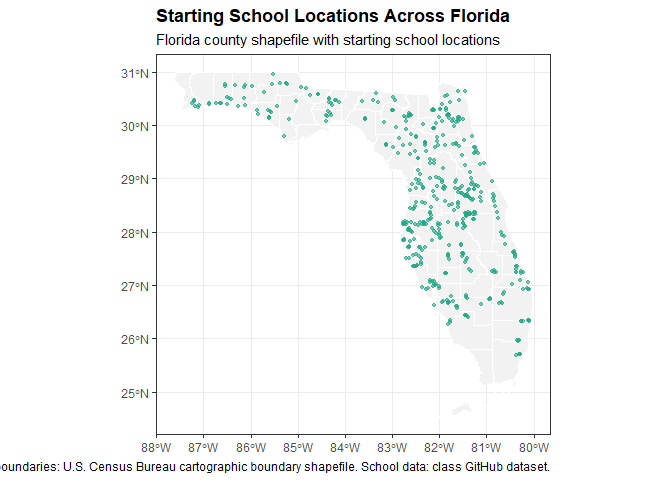
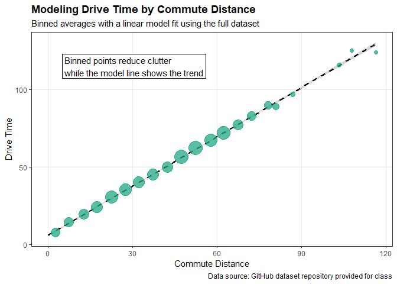

# Data Visualization Project 02

## Dataset


``` r
library(tidyverse)
library(plotly)
library(sf)
library(viridis)

drive_times <- read_csv("../data/drive_times_elementary_12_18.csv", col_types = cols())
```

The data set used is drive_times_elementary_12_18.csv. This dataset was downloaded from the GitHub data repository provided for the class and saved in the data/ folder of this project. I chose this dataset because it includes drive time, commute distance, and location information for Florida elementary school routes.


``` r
str(drive_times)
```

```
## spc_tbl_ [1,713 × 26] (S3: spec_tbl_df/tbl_df/tbl/data.frame)
##  $ objectid     : num [1:1713] 236 15431 12553 14525 15452 ...
##  $ objectid_1   : num [1:1713] 236 15431 12553 14525 15452 ...
##  $ input_fid    : num [1:1713] 0 33 25 30 33 25 58 25 7 18 ...
##  $ near_fid     : num [1:1713] 33 27 33 25 2 57 25 58 58 57 ...
##  $ distance     : num [1:1713] 0.589 0.603 0.609 0.614 0.616 ...
##  $ distmet      : num [1:1713] 65506 67034 67729 68229 68499 ...
##  $ distmiles    : num [1:1713] 40.7 41.7 42.1 42.4 42.6 ...
##  $ from_county  : chr [1:1713] "ALACHUA" "BAKER" "ALACHUA" "BAKER" ...
##  $ fromschoolnum: num [1:1713] 161 91 950 31 91 950 51 950 492 341 ...
##  $ fromschool   : chr [1:1713] "ALACHUA ELEMENTARY SCHOOL" "WESTSIDE ELEMENTARY SCHOOL" "THE ONE ROOM SCHOOL HOUSE PROJECT" "J FRANKLYN KELLER INTERMEDIATE SCHOOL" ...
##  $ fromlat      : num [1:1713] 29.8 30.3 29.7 30.3 30.3 ...
##  $ fromlon      : num [1:1713] -82.5 -82.2 -82.3 -82.1 -82.2 ...
##  $ tocounty     : chr [1:1713] "BAKER" "ALACHUA" "BAKER" "ALACHUA" ...
##  $ toschoolnum  : num [1:1713] 91 571 91 950 541 81 950 51 51 81 ...
##  $ toschoolname : chr [1:1713] "WESTSIDE ELEMENTARY SCHOOL" "W. W. IRBY ELEMENTARY SCHOOL" "WESTSIDE ELEMENTARY SCHOOL" "THE ONE ROOM SCHOOL HOUSE PROJECT" ...
##  $ tolat        : num [1:1713] 30.3 29.8 30.3 29.7 29.7 ...
##  $ tolon        : num [1:1713] -82.2 -82.5 -82.2 -82.3 -82.4 ...
##  $ tsid         : num [1:1713] 38 32 38 30 3 70 30 71 71 70 ...
##  $ fsid         : num [1:1713] 10 38 29 37 38 29 67 29 19 16 ...
##  $ tcoid        : num [1:1713] 2 1 2 1 1 4 1 4 4 4 ...
##  $ fcoid        : num [1:1713] 1 2 1 2 2 1 4 1 1 1 ...
##  $ copairid     : num [1:1713] 1 1 1 1 1 2 2 2 2 2 ...
##  $ from_lat_lon : chr [1:1713] "29.79541+-82.492447" "30.280935+-82.158279" "29.689863+-82.306648" "30.277275+-82.128227" ...
##  $ to_lat_lon   : chr [1:1713] "30.280935+-82.158279" "29.779131+-82.492928" "30.280935+-82.158279" "29.689863+-82.306648" ...
##  $ drive_time   : num [1:1713] 54.7 57.5 59.8 61.9 61.1 ...
##  $ commute_dist : num [1:1713] 44.8 45.8 51 51.5 49 ...
##  - attr(*, "spec")=
##   .. cols(
##   ..   objectid = col_double(),
##   ..   objectid_1 = col_double(),
##   ..   input_fid = col_double(),
##   ..   near_fid = col_double(),
##   ..   distance = col_double(),
##   ..   distmet = col_double(),
##   ..   distmiles = col_double(),
##   ..   from_county = col_character(),
##   ..   fromschoolnum = col_double(),
##   ..   fromschool = col_character(),
##   ..   fromlat = col_double(),
##   ..   fromlon = col_double(),
##   ..   tocounty = col_character(),
##   ..   toschoolnum = col_double(),
##   ..   toschoolname = col_character(),
##   ..   tolat = col_double(),
##   ..   tolon = col_double(),
##   ..   tsid = col_double(),
##   ..   fsid = col_double(),
##   ..   tcoid = col_double(),
##   ..   fcoid = col_double(),
##   ..   copairid = col_double(),
##   ..   from_lat_lon = col_character(),
##   ..   to_lat_lon = col_character(),
##   ..   drive_time = col_double(),
##   ..   commute_dist = col_double()
##   .. )
##  - attr(*, "problems")=<pointer: 0x0000024018dfbde0>
```

``` r
nrow(drive_times)
```

```
## [1] 1713
```

``` r
ncol(drive_times)
```

```
## [1] 26
```

``` r
names(drive_times)
```

```
##  [1] "objectid"      "objectid_1"    "input_fid"     "near_fid"     
##  [5] "distance"      "distmet"       "distmiles"     "from_county"  
##  [9] "fromschoolnum" "fromschool"    "fromlat"       "fromlon"      
## [13] "tocounty"      "toschoolnum"   "toschoolname"  "tolat"        
## [17] "tolon"         "tsid"          "fsid"          "tcoid"        
## [21] "fcoid"         "copairid"      "from_lat_lon"  "to_lat_lon"   
## [25] "drive_time"    "commute_dist"
```

The data overview shows that the dataset contains 1,713 rows and 26 columns. Each row represents a route between elementary schools. The structure output shows that the dataset includes school names, counties, latitude and longitude, drive time, and commute distance. These variables make the dataset useful for studying how distance and location are related to travel time.


``` r
colSums(is.na(drive_times))
```

```
##      objectid    objectid_1     input_fid      near_fid      distance 
##             0             0             0             0             0 
##       distmet     distmiles   from_county fromschoolnum    fromschool 
##             0             0             0             0             0 
##       fromlat       fromlon      tocounty   toschoolnum  toschoolname 
##             0             0             0             0             0 
##         tolat         tolon          tsid          fsid         tcoid 
##             0             0             0             0             0 
##         fcoid      copairid  from_lat_lon    to_lat_lon    drive_time 
##             0             0             0             0             0 
##  commute_dist 
##             0
```

The missing-value check shows that every variable has 0 missing values. This means the dataset does not have missing data that needs to be removed or filled in before making the visualizations. This is helpful because the drive time, commute distance, latitude, and longitude variables can be used directly for the charts, map, and model.


``` r
drive_times %>%
  select(drive_time, commute_dist, fromlat, fromlon, tolat, tolon) %>%
  summary()
```

```
##    drive_time      commute_dist       fromlat         fromlon      
##  Min.   :  0.35   Min.   :  0.00   Min.   :25.68   Min.   :-87.24  
##  1st Qu.: 31.72   1st Qu.: 24.68   1st Qu.:27.77   1st Qu.:-82.64  
##  Median : 50.65   Median : 44.23   Median :28.93   Median :-82.10  
##  Mean   : 49.89   Mean   : 41.51   Mean   :28.86   Mean   :-82.34  
##  3rd Qu.: 66.88   3rd Qu.: 57.59   3rd Qu.:30.02   3rd Qu.:-81.52  
##  Max.   :125.02   Max.   :116.46   Max.   :30.96   Max.   :-80.09  
##      tolat           tolon       
##  Min.   :25.69   Min.   :-87.24  
##  1st Qu.:27.85   1st Qu.:-82.66  
##  Median :28.93   Median :-82.07  
##  Mean   :28.87   Mean   :-82.34  
##  3rd Qu.:30.05   3rd Qu.:-81.51  
##  Max.   :30.96   Max.   :-80.09
```
The data summary shows that drive_time ranges from 0.35 to 125.02 with an average of 49.89. The commute_dist variable ranges from 0 to 116.46, with an average of 41.51. This suggests that most routes are moderate in distance and time but some routes are much longer than others.


``` r
county_summary <- drive_times %>% group_by(from_county) %>%
  summarize(
    number_of_routes = n(),
    average_drive_time = mean(drive_time, na.rm = TRUE),
    average_commute_distance = mean(commute_dist, na.rm = TRUE)
  ) %>% arrange(desc(number_of_routes))
head(county_summary, 10)
```

```
## # A tibble: 10 × 4
##    from_county  number_of_routes average_drive_time average_commute_distance
##    <chr>                   <int>              <dbl>                    <dbl>
##  1 ALACHUA                    52               48.8                     40.5
##  2 LAKE                       52               45.5                     34.5
##  3 MARION                     52               55.2                     46.4
##  4 COLUMBIA                   50               43.9                     38.8
##  5 POLK                       47               57.8                     46.8
##  6 HILLSBOROUGH               45               45.8                     40.3
##  7 PUTNAM                     43               54.3                     43.0
##  8 PALM BEACH                 41               48.3                     35.7
##  9 HIGHLANDS                  40               61.4                     52.3
## 10 PASCO                      40               49.8                     38.7
```

This table summarizes the dataset by starting county. The counties with the most routes in this dataset include Alachua, Lake, and Marion, each with 52 routes. Among the counties shown, Highlands has one of the highest average drive times and average commute distances, while Lake has a lower average commute distance. This summary helps show that drive times and distances vary by county.

## Visualization 1: Interactive Plot


``` r
drive_times %>%
  summarize(
    average_drive_time = mean(drive_time),
    average_commute_distance = mean(commute_dist),
    correlation = cor(drive_time, commute_dist)
  )
```

```
## # A tibble: 1 × 3
##   average_drive_time average_commute_distance correlation
##                <dbl>                    <dbl>       <dbl>
## 1               49.9                     41.5       0.960
```

This summary shows that commute distance and drive time have a strong positive relationship. This supports the decision to use scatterplots and a linear model because these methods are useful for comparing two numeric variables.


``` r
county_interactive <- drive_times %>%
  group_by(from_county) %>%
  summarize(
    number_of_routes = n(),
    average_drive_time = mean(drive_time, na.rm = TRUE),
    average_commute_distance = mean(commute_dist, na.rm = TRUE),
    .groups = "drop"
  )

county_drive_time_plot <- ggplot(
  data = county_interactive,
  aes(
    x = average_commute_distance,
    y = average_drive_time,
    size = number_of_routes,
    text = paste(
      "County:", from_county,
      "<br>Number of routes:", number_of_routes,
      "<br>Average commute distance:", round(average_commute_distance, 2),
      "<br>Average drive time:", round(average_drive_time, 2)
    )
  )
) +
  geom_point(alpha = 0.7) +
  scale_size_continuous(range = c(2, 8), guide = "none") +
  labs(
    title = "Average Drive Time by Average Commute Distance",
    subtitle = "Each point represents a starting county",
    x = "Average Commute Distance",
    y = "Average Drive Time",
    caption = "Data source: GitHub dataset repository provided for class"
  ) +
  theme_bw() +
  theme(
    plot.title = element_text(face = "bold"),
    panel.grid.minor = element_blank()
  )

interactive_plot <- ggplotly(county_drive_time_plot, tooltip = "text")

interactive_plot
```

```{=html}
<div class="plotly html-widget html-fill-item" id="htmlwidget-328bf997a5184cae40e8" style="width:672px;height:480px;"></div>
<script type="application/json" data-for="htmlwidget-328bf997a5184cae40e8">{"x":{"data":[{"x":[40.53185167850522,37.671069502492536,38.094462860703018,35.635579621261826,46.793771786559596,38.926160804236588,45.194536131215919,43.866196412948383,42.721133579893419,31.232506011049317,45.10266294838145,38.822874413425595,43.391115118477323,45.936915911079296,29.365930848460376,30.852073888491212,46.402952072397198,39.483245968543706,44.761208180588994,50.26964402887139,57.148321112395912,41.615065841572175,49.195461661789885,47.517699338565478,41.138585122344963,52.278832244691003,40.349677328843995,45.764547542352659,43.172608806674283,40.918184541408607,37.941442807338476,34.537029708043484,37.509538047800845,33.051133168013088,41.666631159741392,43.206980444729098,41.422974090570328,46.378966546904536,32.189029953957778,2.396939374055516,38.247289239929721,35.97209402353414,49.561918688974039,42.282365855200503,42.243991518105688,35.740998180382661,38.723588617473951,31.674504588853267,46.811078091181543,43.024911840433262,24.934560736726088,44.389119813019242,40.340427528235104,39.344743742001256,39.489825845632929,47.549583161608929,37.535034528786667,45.250153167998889,41.447964051231132,42.570878258470529,53.992984541705013,36.396983284286435,38.801257797320787],"y":[48.764423076923073,44.075806451612905,45.045238095238098,44.619791666666664,55.55747126436782,42.920833333333334,52.339814814814815,51.318333333333335,51.286752136752135,40.248717948717946,51.534999999999997,43.928333333333335,50.434615384615384,50.939444444444447,34.637820512820511,45.056666666666672,52.731250000000003,46.103124999999999,53.014646464646468,54.945,65.546153846153842,46.382608695652173,57.96140350877193,53.646846846846849,52.019369369369372,61.407916666666665,45.822592592592592,47.238333333333337,50.501754385964915,46.115217391304348,43.412962962962965,45.463461538461537,46.629166666666663,36.50595238095238,49.554285714285712,47.535964912280704,50.049999999999997,55.240064102564105,42.399074074074072,7.0458333333333334,45.469696969696969,45.376315789473686,55.194117647058825,57.530341880341879,53.648095238095237,48.341869918699189,49.845833333333331,42.907246376811592,57.7968085106383,54.255038759689924,35.24285714285714,54.035858585858584,52.089583333333337,49.769696969696973,49.678571428571423,56.538383838383837,43.934057971014497,50.434375000000003,49.752688172043008,52.737499999999997,60.960714285714282,46.961111111111109,42.429761904761904],"text":["County: ALACHUA <br>Number of routes: 52 <br>Average commute distance: 40.53 <br>Average drive time: 48.76","County: BAKER <br>Number of routes: 31 <br>Average commute distance: 37.67 <br>Average drive time: 44.08","County: BAY <br>Number of routes: 21 <br>Average commute distance: 38.09 <br>Average drive time: 45.05","County: BRADFORD <br>Number of routes: 32 <br>Average commute distance: 35.64 <br>Average drive time: 44.62","County: BREVARD <br>Number of routes: 29 <br>Average commute distance: 46.79 <br>Average drive time: 55.56","County: BROWARD <br>Number of routes: 12 <br>Average commute distance: 38.93 <br>Average drive time: 42.92","County: CALHOUN <br>Number of routes: 18 <br>Average commute distance: 45.19 <br>Average drive time: 52.34","County: CHARLOTTE <br>Number of routes: 30 <br>Average commute distance: 43.87 <br>Average drive time: 51.32","County: CITRUS <br>Number of routes: 39 <br>Average commute distance: 42.72 <br>Average drive time: 51.29","County: CLAY <br>Number of routes: 39 <br>Average commute distance: 31.23 <br>Average drive time: 40.25","County: COLLIER <br>Number of routes: 20 <br>Average commute distance: 45.1 <br>Average drive time: 51.53","County: COLUMBIA <br>Number of routes: 50 <br>Average commute distance: 38.82 <br>Average drive time: 43.93","County: DESOTO <br>Number of routes: 26 <br>Average commute distance: 43.39 <br>Average drive time: 50.43","County: DIXIE <br>Number of routes: 30 <br>Average commute distance: 45.94 <br>Average drive time: 50.94","County: DUVAL <br>Number of routes: 26 <br>Average commute distance: 29.37 <br>Average drive time: 34.64","County: ESCAMBIA <br>Number of routes: 5 <br>Average commute distance: 30.85 <br>Average drive time: 45.06","County: FLAGLER <br>Number of routes: 32 <br>Average commute distance: 46.4 <br>Average drive time: 52.73","County: GADSDEN <br>Number of routes: 16 <br>Average commute distance: 39.48 <br>Average drive time: 46.1","County: GILCHRIST <br>Number of routes: 33 <br>Average commute distance: 44.76 <br>Average drive time: 53.01","County: GLADES <br>Number of routes: 20 <br>Average commute distance: 50.27 <br>Average drive time: 54.94","County: GULF <br>Number of routes: 13 <br>Average commute distance: 57.15 <br>Average drive time: 65.55","County: HAMILTON <br>Number of routes: 23 <br>Average commute distance: 41.62 <br>Average drive time: 46.38","County: HARDEE <br>Number of routes: 38 <br>Average commute distance: 49.2 <br>Average drive time: 57.96","County: HENDRY <br>Number of routes: 37 <br>Average commute distance: 47.52 <br>Average drive time: 53.65","County: HERNANDO <br>Number of routes: 37 <br>Average commute distance: 41.14 <br>Average drive time: 52.02","County: HIGHLANDS <br>Number of routes: 40 <br>Average commute distance: 52.28 <br>Average drive time: 61.41","County: HILLSBOROUGH <br>Number of routes: 45 <br>Average commute distance: 40.35 <br>Average drive time: 45.82","County: HOLMES <br>Number of routes: 10 <br>Average commute distance: 45.76 <br>Average drive time: 47.24","County: INDIAN RIVER <br>Number of routes: 19 <br>Average commute distance: 43.17 <br>Average drive time: 50.5","County: JACKSON <br>Number of routes: 23 <br>Average commute distance: 40.92 <br>Average drive time: 46.12","County: LAFAYETTE <br>Number of routes: 18 <br>Average commute distance: 37.94 <br>Average drive time: 43.41","County: LAKE <br>Number of routes: 52 <br>Average commute distance: 34.54 <br>Average drive time: 45.46","County: LEE <br>Number of routes: 24 <br>Average commute distance: 37.51 <br>Average drive time: 46.63","County: LEON <br>Number of routes: 14 <br>Average commute distance: 33.05 <br>Average drive time: 36.51","County: LEVY <br>Number of routes: 35 <br>Average commute distance: 41.67 <br>Average drive time: 49.55","County: MADISON <br>Number of routes: 19 <br>Average commute distance: 43.21 <br>Average drive time: 47.54","County: MANATEE <br>Number of routes: 27 <br>Average commute distance: 41.42 <br>Average drive time: 50.05","County: MARION <br>Number of routes: 52 <br>Average commute distance: 46.38 <br>Average drive time: 55.24","County: MARTIN <br>Number of routes: 18 <br>Average commute distance: 32.19 <br>Average drive time: 42.4","County: MIAMI-DADE <br>Number of routes: 4 <br>Average commute distance: 2.4 <br>Average drive time: 7.05","County: NASSAU <br>Number of routes: 22 <br>Average commute distance: 38.25 <br>Average drive time: 45.47","County: OKALOOSA <br>Number of routes: 19 <br>Average commute distance: 35.97 <br>Average drive time: 45.38","County: OKEECHOBEE <br>Number of routes: 17 <br>Average commute distance: 49.56 <br>Average drive time: 55.19","County: ORANGE <br>Number of routes: 39 <br>Average commute distance: 42.28 <br>Average drive time: 57.53","County: OSCEOLA <br>Number of routes: 35 <br>Average commute distance: 42.24 <br>Average drive time: 53.65","County: PALM BEACH <br>Number of routes: 41 <br>Average commute distance: 35.74 <br>Average drive time: 48.34","County: PASCO <br>Number of routes: 40 <br>Average commute distance: 38.72 <br>Average drive time: 49.85","County: PINELLAS <br>Number of routes: 23 <br>Average commute distance: 31.67 <br>Average drive time: 42.91","County: POLK <br>Number of routes: 47 <br>Average commute distance: 46.81 <br>Average drive time: 57.8","County: PUTNAM <br>Number of routes: 43 <br>Average commute distance: 43.02 <br>Average drive time: 54.26","County: SANTA ROSA <br>Number of routes: 7 <br>Average commute distance: 24.93 <br>Average drive time: 35.24","County: SARASOTA <br>Number of routes: 33 <br>Average commute distance: 44.39 <br>Average drive time: 54.04","County: SEMINOLE <br>Number of routes: 24 <br>Average commute distance: 40.34 <br>Average drive time: 52.09","County: ST. JOHNS <br>Number of routes: 22 <br>Average commute distance: 39.34 <br>Average drive time: 49.77","County: ST. LUCIE <br>Number of routes: 14 <br>Average commute distance: 39.49 <br>Average drive time: 49.68","County: SUMTER <br>Number of routes: 33 <br>Average commute distance: 47.55 <br>Average drive time: 56.54","County: SUWANNEE <br>Number of routes: 23 <br>Average commute distance: 37.54 <br>Average drive time: 43.93","County: TAYLOR <br>Number of routes: 16 <br>Average commute distance: 45.25 <br>Average drive time: 50.43","County: UNION <br>Number of routes: 31 <br>Average commute distance: 41.45 <br>Average drive time: 49.75","County: VOLUSIA <br>Number of routes: 32 <br>Average commute distance: 42.57 <br>Average drive time: 52.74","County: WAKULLA <br>Number of routes: 14 <br>Average commute distance: 53.99 <br>Average drive time: 60.96","County: WALTON <br>Number of routes: 15 <br>Average commute distance: 36.4 <br>Average drive time: 46.96","County: WASHINGTON <br>Number of routes: 14 <br>Average commute distance: 38.8 <br>Average drive time: 42.43"],"type":"scatter","mode":"markers","marker":{"autocolorscale":false,"color":"rgba(0,0,0,1)","opacity":0.69999999999999996,"size":[30.236220472440948,24.56692913385827,21.05466789645893,24.879026248651996,23.924889520335849,16.816969106582089,19.806124154471547,24.248996912745536,26.923371526222866,26.923371526222866,20.651722639890728,29.758752991125789,22.91156863868213,24.248996912745536,22.91156863868213,10.83222199855536,24.879026248651996,18.897637795275593,25.18559821056154,20.651722639890728,17.378555759445604,21.826458775314801,26.644733741786606,26.361967315400694,26.361967315400694,27.198056400780974,28.517549303450867,15.57664381817818,20.235975935431878,21.826458775314801,19.806124154471547,30.236220472440948,22.19710241086268,17.909717622144875,25.783277028648104,20.235975935431878,23.256612024412114,30.236220472440948,19.806124154471547,7.559055118110237,21.445926100818017,20.235975935431878,19.360626138705637,26.923371526222866,25.783277028648104,27.468951973894946,27.198056400780974,21.826458775314801,29.022645716410484,27.999975734913953,13.228346456692915,25.18559821056154,22.19710241086268,21.445926100818017,17.909717622144875,25.18559821056154,21.826458775314801,18.897637795275593,24.56692913385827,24.879026248651996,17.909717622144875,18.41492153676478,17.909717622144875],"symbol":"circle","line":{"width":1.8897637795275593,"color":"rgba(0,0,0,1)"}},"hoveron":"points","showlegend":false,"xaxis":"x","yaxis":"y","hoverinfo":"text","frame":null}],"layout":{"margin":{"t":40.840182648401829,"r":7.3059360730593621,"b":37.260273972602747,"l":37.260273972602747},"plot_bgcolor":"rgba(255,255,255,1)","paper_bgcolor":"rgba(255,255,255,1)","font":{"color":"rgba(0,0,0,1)","family":"","size":14.611872146118724},"title":{"text":"<b> Average Drive Time by Average Commute Distance <\/b>","font":{"color":"rgba(0,0,0,1)","family":"","size":17.534246575342465},"x":0,"xref":"paper"},"xaxis":{"domain":[0,1],"automargin":true,"type":"linear","autorange":false,"range":[-0.3406297128615039,59.885890199312932],"tickmode":"array","ticktext":["0","10","20","30","40","50"],"tickvals":[0,10,20,30,40,50],"categoryorder":"array","categoryarray":["0","10","20","30","40","50"],"nticks":null,"ticks":"outside","tickcolor":"rgba(51,51,51,1)","ticklen":3.6529680365296811,"tickwidth":0.66417600664176002,"showticklabels":true,"tickfont":{"color":"rgba(77,77,77,1)","family":"","size":11.68949771689498},"tickangle":-0,"showline":false,"linecolor":null,"linewidth":0,"showgrid":true,"gridcolor":"rgba(235,235,235,1)","gridwidth":0.66417600664176002,"zeroline":false,"anchor":"y","title":{"text":"Average Commute Distance","font":{"color":"rgba(0,0,0,1)","family":"","size":14.611872146118724}},"hoverformat":".2f"},"yaxis":{"domain":[0,1],"automargin":true,"type":"linear","autorange":false,"range":[4.1208173076923078,68.471169871794871],"tickmode":"array","ticktext":["20","40","60"],"tickvals":[20,40,60],"categoryorder":"array","categoryarray":["20","40","60"],"nticks":null,"ticks":"outside","tickcolor":"rgba(51,51,51,1)","ticklen":3.6529680365296811,"tickwidth":0.66417600664176002,"showticklabels":true,"tickfont":{"color":"rgba(77,77,77,1)","family":"","size":11.68949771689498},"tickangle":-0,"showline":false,"linecolor":null,"linewidth":0,"showgrid":true,"gridcolor":"rgba(235,235,235,1)","gridwidth":0.66417600664176002,"zeroline":false,"anchor":"x","title":{"text":"Average Drive Time","font":{"color":"rgba(0,0,0,1)","family":"","size":14.611872146118724}},"hoverformat":".2f"},"shapes":[{"type":"rect","fillcolor":"rgba(255,255,255,1)","line":{"color":"rgba(51,51,51,1)","width":0.66417600664176002,"linetype":"solid"},"yref":"paper","xref":"paper","layer":"below","x0":0,"x1":1,"y0":0,"y1":1}],"showlegend":false,"legend":{"bgcolor":"rgba(255,255,255,1)","bordercolor":"transparent","borderwidth":1.8897637795275593,"font":{"color":"rgba(0,0,0,1)","family":"","size":11.68949771689498},"title":{"text":"","font":{"color":"rgba(0,0,0,1)","family":"","size":14.611872146118724}}},"hovermode":"closest","barmode":"relative"},"config":{"doubleClick":"reset","modeBarButtonsToAdd":["hoverclosest","hovercompare"],"showSendToCloud":false},"source":"A","attrs":{"5ea850af294c":{"x":{},"y":{},"size":{},"text":{},"type":"scatter"}},"cur_data":"5ea850af294c","visdat":{"5ea850af294c":["function (y) ","x"]},"highlight":{"on":"plotly_click","persistent":false,"dynamic":false,"selectize":false,"opacityDim":0.20000000000000001,"selected":{"opacity":1},"debounce":0},"shinyEvents":["plotly_hover","plotly_click","plotly_selected","plotly_relayout","plotly_brushed","plotly_brushing","plotly_clickannotation","plotly_doubleclick","plotly_deselect","plotly_afterplot","plotly_sunburstclick"],"base_url":"https://plot.ly"},"evals":[],"jsHooks":[]}</script>
```

``` r
htmlwidgets::saveWidget(
  interactive_plot,
  file = "interactive_drive_time_plot.html",
  selfcontained = TRUE
)
```

This interactive scatterplot compares average commute distance and average drive time by starting county. Each point represents a county summary instead of one individual route. The plot shows a positive relationship, meaning that counties with longer average commute distances usually have longer average drive times. The interactive hover labels make the plot more useful because the viewer can inspect each county and see the number of routes, average commute distance, and average drive time.

## Visualization 2: Spatial Visualization


``` r
fl_counties <- st_read("../data/fl_counties/cb_2023_us_county_500k.shp",
  quiet = TRUE
) %>%
  filter(STUSPS == "FL") %>%
  st_transform(4326)

school_points <- drive_times %>%
  distinct(fromschool, from_county, fromlat, fromlon, .keep_all = TRUE) %>%
  st_as_sf(coords = c("fromlon", "fromlat"), crs = 4326)

ggplot() + geom_sf(data = fl_counties, fill = "gray95", color = "white") +
  geom_sf(
    data = school_points,
    alpha = 0.6,
    size = 1.2,
    color = viridis(1, option = "D", begin = 0.6)
  ) +
  labs(
    title = "Starting School Locations Across Florida",
    subtitle = "Florida county shapefile with starting school locations",
    caption = "County boundaries: U.S. Census Bureau cartographic boundary shapefile. School data: class GitHub dataset."
  ) +
  theme_bw() +
  theme(
    plot.title = element_text(face = "bold"),
    panel.grid.minor = element_blank()
  )
```



This spatial visualization maps the starting school locations using latitude and longitude over a Florida county shapefile. Each point represents a starting school location from the dataset, while the county boundaries provide geographic context. The map shows that the data includes schools across many parts of Florida. This visualization is useful because it uses both the route location data and a shapefile to show the geographic distribution of the school routes.

## Visualization 3: Model Visualization


``` r
drive_times_binned <- drive_times %>% mutate(distance_bin = floor(commute_dist / 5) * 5) %>% group_by(distance_bin) %>%
  summarize(
    average_commute_distance = mean(commute_dist, na.rm = TRUE),
    average_drive_time = mean(drive_time, na.rm = TRUE),
    number_of_routes = n(),
    .groups = "drop"
  )

ggplot() +
  geom_smooth(
  data = drive_times,
  aes(x = commute_dist, y = drive_time),
  method = "lm",
  se = TRUE,
  color = "black",
  linetype = "dashed"
) +
geom_point(
  data = drive_times_binned,
  aes(
    x = average_commute_distance,
    y = average_drive_time,
    size = number_of_routes
  ),
  alpha = 0.75,
  color = viridis(1, option = "D", begin = 0.6)
) +
  scale_size_continuous(range = c(2, 8), guide = "none") +
  annotate(
    "label",
    x = 5,
    y = 115,
    label = "Binned points reduce clutter\nwhile the model line shows the trend",
    hjust = 0
  ) +
  labs(
    title = "Modeling Drive Time by Commute Distance",
    subtitle = "Binned averages with a linear model fit using the full dataset",
    x = "Commute Distance",
    y = "Drive Time",
    caption = "Data source: GitHub dataset repository provided for class"
  ) +
  theme_bw() +
  theme(
    plot.title = element_text(face = "bold"),
    panel.grid.minor = element_blank()
  )
```



This model visualization shows the relationship between commute distance and drive time. The points are summarized into commute distance groups to make the plot easier to read, while the linear model line is still based on the full dataset. The upward trend shows that longer commute distances are generally associated with longer drive times. The annotation highlights the main pattern in the plot and helps guide the viewer toward the most important takeaway.


``` r
drive_time_model <- lm(drive_time ~ commute_dist, data = drive_times)

summary(drive_time_model)
```

```
## 
## Call:
## lm(formula = drive_time ~ commute_dist, data = drive_times)
## 
## Residuals:
##     Min      1Q  Median      3Q     Max 
## -16.522  -3.550  -0.959   2.713  33.371 
## 
## Coefficients:
##              Estimate Std. Error t value Pr(>|t|)    
## (Intercept)  5.870408   0.343596   17.09   <2e-16 ***
## commute_dist 1.060552   0.007432  142.71   <2e-16 ***
## ---
## Signif. codes:  0 '***' 0.001 '**' 0.01 '*' 0.05 '.' 0.1 ' ' 1
## 
## Residual standard error: 6.265 on 1711 degrees of freedom
## Multiple R-squared:  0.9225,	Adjusted R-squared:  0.9224 
## F-statistic: 2.037e+04 on 1 and 1711 DF,  p-value: < 2.2e-16
```
The linear model uses commute distance to predict drive time. The model output shows that commute distance is a strong predictor of drive time. The coefficient for commute distance is about 1.06, meaning that for each additional unit of commute distance, the predicted drive time increases by about 1.06 units. The p-value is very small, which suggests that this relationship is statistically significant. The R-squared value is 0.9225, meaning that the model explains about 92% of the variation in drive time. This supports the visual pattern shown in the model plot.

## Conclusion

Overall, the visualizations show a clear relationship between commute distance and drive time for Florida elementary school routes. The interactive scatterplot shows that counties with longer average commute distances generally have longer average drive times. The model visualization confirms this relationship with a strong upward trend, while using summarized points to make the plot easier to read. The spatial map adds geographic context by showing that the dataset includes schools across many parts of Florida. Based on the model results, commute distance is a strong predictor of drive time in this dataset.


## Report Discussion

The three visualizations were created to explain how distance and location are related to drive times between Florida elementary schools.

The first visualization was an interactive scatterplot comparing average commute distance and average drive time by starting county. This plot was chosen because scatterplots are useful for showing relationships between two numeric variables. I used county summaries instead of every individual route to reduce clutter and make the overall pattern easier to read. The interactive hover labels still allow the viewer to inspect each county’s number of routes, average commute distance, and average drive time.

The second visualization was a spatial map using latitude and longitude to show the starting school locations across Florida. A map was appropriate because the dataset includes geographic coordinates. I chose to map the school locations instead of drawing every route because showing every route could make the map too crowded and harder to interpret.

The third visualization used a linear model to show the relationship between commute distance and drive time. The plotted points were summarized into commute-distance groups to make the graph easier to read, while the linear model line was still based on the full dataset. I added an annotation to highlight the main takeaway: longer commute distances usually have longer drive times.

The main story shown by the visualizations is that commute distance is strongly related to drive time. The county-level interactive plot and the model visualization both show a strong upward pattern, while the spatial map adds geographic context by showing that the routes come from many parts of Florida. One difficulty was deciding how much geographic information to show, so I simplified the map to focus on school locations rather than trying to show every route.
