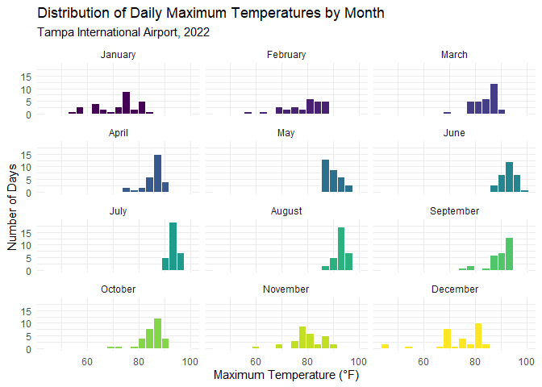
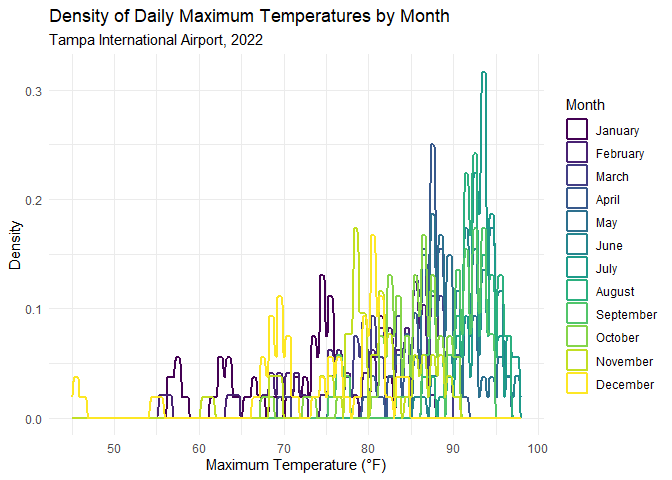
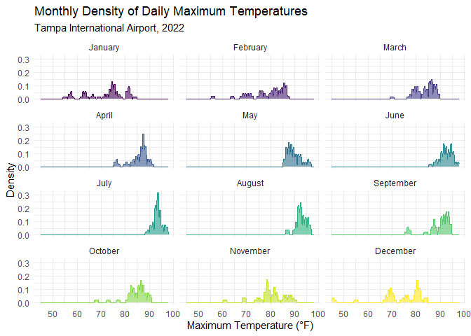
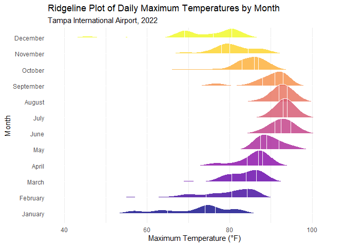
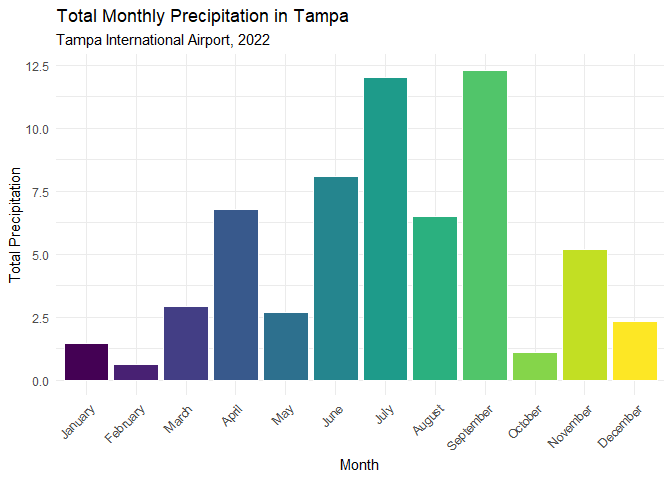
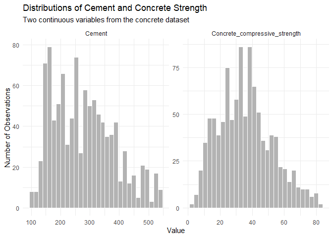
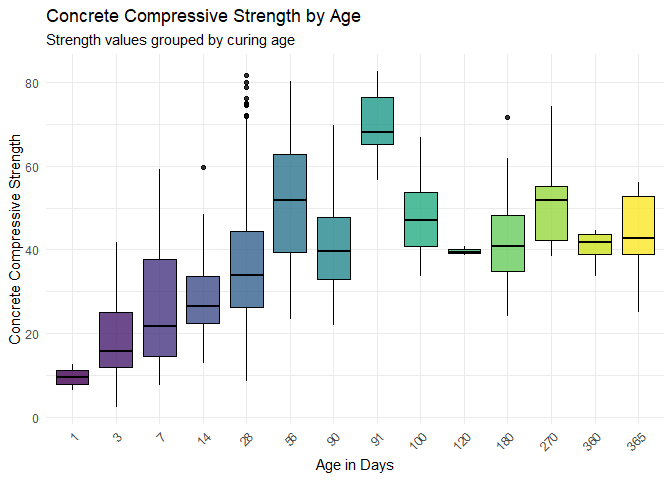
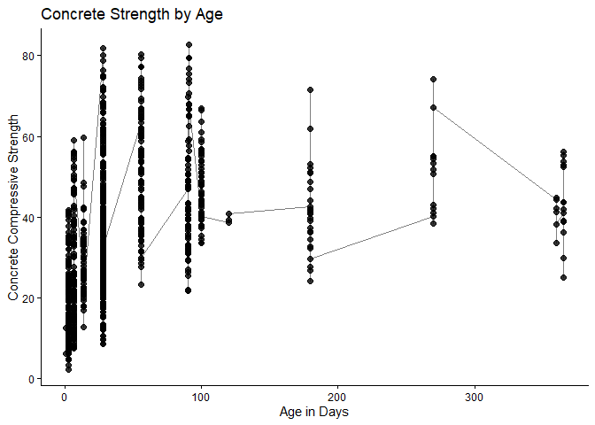
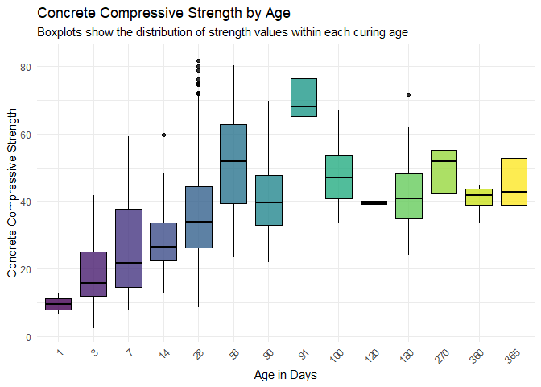

# Data Visualization Project 03

This report focuses on recreating several required visualizations from the final project template. Part 1 uses 2022 weather data from Tampa International Airport to explore distributions of temperature and precipitation. Part 2 uses concrete strength data to examine relationships between concrete ingredients, age, and compressive strength.

## PART 1: Density Plots

Using the dataset obtained from FSU's [Florida Climate Center](https://climatecenter.fsu.edu/climate-data-access-tools/downloadable-data), for a station at Tampa International Airport (TPA) for 2022, attempt to recreate the charts shown below which were generated using data from 2016. You can read the 2022 dataset using the code below: 


``` r
library(tidyverse)
library(ggridges)
library(plotly)

weather_tpa <- read_csv("../data/tpa_weather_2022.csv", col_types = cols()) %>%
  mutate(
    date = as.Date(paste(year, month, day, sep = "-")),
    month_name = factor(month.name[month], levels = month.name)
  )
weather_clean <- weather_tpa %>%
  filter(max_temp != -99.9)

# random sample 
sample_n(weather_tpa, 4)
```

```
## # A tibble: 4 × 9
##    year month   day precipitation max_temp min_temp ave_temp date      
##   <dbl> <dbl> <dbl>         <dbl>    <dbl>    <dbl>    <dbl> <date>    
## 1  2022     3     2          0          78       58     68   2022-03-02
## 2  2022    11    13          0.01       78       65     71.5 2022-11-13
## 3  2022    11    28          0          78       64     71   2022-11-28
## 4  2022    10     5          0          83       64     73.5 2022-10-05
## # ℹ 1 more variable: month_name <fct>
```


(a) Histogram

``` r
ggplot(weather_clean, aes(x = max_temp, fill = month_name)) +
  geom_histogram(
    binwidth = 3,
    color = "white"
  ) + facet_wrap(~ month_name, ncol = 3) + scale_fill_viridis_d(option = "D", guide = "none") +
  labs(
    title = "Distribution of Daily Maximum Temperatures by Month",
    subtitle = "Tampa International Airport, 2022",
    x = "Maximum Temperature (°F)",
    y = "Number of Days"
  ) + theme_minimal()
```




This section uses 2022 weather data from Tampa International Airport. The visualizations focus on the distribution of daily maximum temperatures across months, followed by a precipitation chart showing how rainfall totals varied throughout the year.

(b) Density plot

``` r
ggplot(weather_clean, aes(x = max_temp, color = month_name)) +
  geom_density(
    kernel = "rectangular",
    bw = 0.5,
    linewidth = 0.8
  ) +
  scale_color_viridis_d(option = "D", name = "Month") +
  labs(
    title = "Density of Daily Maximum Temperatures by Month",
    subtitle = "Tampa International Airport, 2022",
    x = "Maximum Temperature (°F)",
    y = "Density"
  ) + theme_minimal()
```



This density plot shows the distribution of daily maximum temperatures for each month in Tampa during 2022. The monthly curves make it easier to compare the general shape of temperature distributions. Cooler months have density curves farther to the left while summer months are concentrated toward higher maximum temperatures.

(c) Faceted density plot:

``` r
ggplot(weather_clean, aes(x = max_temp, fill = month_name, color = month_name)) +
  geom_density(
    kernel = "rectangular",
    bw = 0.5,
    alpha = 0.6,
    linewidth = 0.6
  ) +
  facet_wrap(~ month_name, ncol = 3) +
  scale_fill_viridis_d(option = "D", guide = "none") + scale_color_viridis_d(option = "D", guide = "none") +
  labs(
    title = "Monthly Density of Daily Maximum Temperatures",
    subtitle = "Tampa International Airport, 2022",
    x = "Maximum Temperature (°F)",
    y = "Density"
  ) + theme_minimal()
```



This faceted density plot separates each month into its own panel. This makes the monthly temperature distributions easier to compare because the curves do not overlap as much as they do in the previous density plot. The chart also shows a clear seasonal pattern with cooler distributions in winter and warmer distributions in summer.


(d) Ridgeline plot:


``` r
ggplot(weather_clean, aes(x = max_temp, y = month_name, fill = month_name)) +
  geom_density_ridges(
    quantile_lines = TRUE,
    quantiles = c(0.25, 0.5, 0.75),
    alpha = 0.8,
    scale = 1.2,
    color = "white"
  ) + scale_fill_viridis_d(option = "plasma", guide = "none") +
  labs(
    title = "Ridgeline Plot of Daily Maximum Temperatures by Month",
    subtitle = "Tampa International Airport, 2022",
    x = "Maximum Temperature (°F)",
    y = "Month"
  ) + theme_minimal() +
  theme(
    panel.grid.major.y = element_blank()
  )
```



This ridgeline plot shows the monthly distributions of daily maximum temperatures in a stacked format. The quantile lines help show where the middle and spread of each month’s temperatures fall. The seasonal pattern shows that the weather is cooler in the winter months and warmer in the summer months.

(e) Monthly precipitation totals

``` r
precip_monthly <- weather_tpa %>%
  filter(precipitation != -99.99) %>%
  group_by(month_name) %>%
  summarize(
    total_precipitation = sum(precipitation, na.rm = TRUE),
    rainy_days = sum(precipitation > 0, na.rm = TRUE),
    .groups = "drop"
  )

ggplot(precip_monthly, aes(x = month_name, y = total_precipitation, fill = month_name)) +
  geom_col(color = "white") +
  scale_fill_viridis_d(option = "D", guide = "none") +
  labs(
    title = "Total Monthly Precipitation in Tampa",
    subtitle = "Tampa International Airport, 2022",
    x = "Month",
    y = "Total Precipitation"
  ) + theme_minimal() +
  theme(
    axis.text.x = element_text(angle = 45, hjust = 1)
  )
```



This bar chart shows total precipitation for each month in Tampa during 2022. The chart makes it easier to see which months had the most rainfall overall. Compared with the temperature charts, precipitation is less evenly distributed because rainfall can be concentrated in certain months and individual storm events.

Overall, the Part 1 weather visualizations show a clear seasonal pattern in Tampa’s 2022 weather data. Maximum temperatures are lower and more spread out during the winter months, while summer temperatures are more concentrated at higher values. The precipitation chart adds a different view by showing that rainfall is not evenly distributed across the year.

## PART 2 Data on Concrete Strength 

Concrete is the most important material in **civil engineering**. The concrete compressive strength is a highly nonlinear function of _age_ and _ingredients_. The dataset used here is from the [UCI Machine Learning Repository](https://archive.ics.uci.edu/ml/index.php), and it contains 1030 observations with 9 different attributes 9 (8 quantitative input variables, and 1 quantitative output variable). A data dictionary is included below: 


Variable                      |    Notes                
------------------------------|-------------------------------------------
Cement                        | kg in a $m^3$ mixture             
Blast Furnace Slag            | kg in a $m^3$ mixture  
Fly Ash                       | kg in a $m^3$ mixture             
Water                         | kg in a $m^3$ mixture              
Superplasticizer              | kg in a $m^3$ mixture
Coarse Aggregate              | kg in a $m^3$ mixture
Fine Aggregate                | kg in a $m^3$ mixture      
Age                           | in days                                             
Concrete compressive strength | MPa, megapascals


Below we read the `.csv` file using `readr::read_csv()` (the `readr` package is part of the `tidyverse`)


``` r
concrete <- read_csv("../data/concrete.csv", col_types = cols())
```


Let us create a new attribute for visualization purposes, `strength_range`: 


``` r
new_concrete <- concrete %>%
  mutate(strength_range = cut(Concrete_compressive_strength, 
                              breaks = quantile(Concrete_compressive_strength, 
                                                probs = seq(0, 1, 0.2))) )
```


``` r
str(concrete)
```

```
## spc_tbl_ [1,030 × 9] (S3: spec_tbl_df/tbl_df/tbl/data.frame)
##  $ Cement                       : num [1:1030] 540 540 332 332 199 ...
##  $ Blast_Furnace_Slag           : num [1:1030] 0 0 142 142 132 ...
##  $ Fly_Ash                      : num [1:1030] 0 0 0 0 0 0 0 0 0 0 ...
##  $ Water                        : num [1:1030] 162 162 228 228 192 228 228 228 228 228 ...
##  $ Superplasticizer             : num [1:1030] 2.5 2.5 0 0 0 0 0 0 0 0 ...
##  $ Coarse_Aggregate             : num [1:1030] 1040 1055 932 932 978 ...
##  $ Fine_Aggregate               : num [1:1030] 676 676 594 594 826 ...
##  $ Age                          : num [1:1030] 28 28 270 365 360 90 365 28 28 28 ...
##  $ Concrete_compressive_strength: num [1:1030] 80 61.9 40.3 41.1 44.3 ...
##  - attr(*, "spec")=
##   .. cols(
##   ..   Cement = col_double(),
##   ..   Blast_Furnace_Slag = col_double(),
##   ..   Fly_Ash = col_double(),
##   ..   Water = col_double(),
##   ..   Superplasticizer = col_double(),
##   ..   Coarse_Aggregate = col_double(),
##   ..   Fine_Aggregate = col_double(),
##   ..   Age = col_double(),
##   ..   Concrete_compressive_strength = col_double()
##   .. )
##  - attr(*, "problems")=<pointer: 0x000001cbf1ae12a0>
```

``` r
nrow(concrete)
```

```
## [1] 1030
```

``` r
ncol(concrete)
```

```
## [1] 9
```

``` r
names(concrete)
```

```
## [1] "Cement"                        "Blast_Furnace_Slag"           
## [3] "Fly_Ash"                       "Water"                        
## [5] "Superplasticizer"              "Coarse_Aggregate"             
## [7] "Fine_Aggregate"                "Age"                          
## [9] "Concrete_compressive_strength"
```

``` r
summary(concrete)
```

```
##      Cement      Blast_Furnace_Slag    Fly_Ash           Water      
##  Min.   :102.0   Min.   :  0.0      Min.   :  0.00   Min.   :121.8  
##  1st Qu.:192.4   1st Qu.:  0.0      1st Qu.:  0.00   1st Qu.:164.9  
##  Median :272.9   Median : 22.0      Median :  0.00   Median :185.0  
##  Mean   :281.2   Mean   : 73.9      Mean   : 54.19   Mean   :181.6  
##  3rd Qu.:350.0   3rd Qu.:142.9      3rd Qu.:118.27   3rd Qu.:192.0  
##  Max.   :540.0   Max.   :359.4      Max.   :200.10   Max.   :247.0  
##  Superplasticizer Coarse_Aggregate Fine_Aggregate       Age        
##  Min.   : 0.000   Min.   : 801.0   Min.   :594.0   Min.   :  1.00  
##  1st Qu.: 0.000   1st Qu.: 932.0   1st Qu.:731.0   1st Qu.:  7.00  
##  Median : 6.350   Median : 968.0   Median :779.5   Median : 28.00  
##  Mean   : 6.203   Mean   : 972.9   Mean   :773.6   Mean   : 45.66  
##  3rd Qu.:10.160   3rd Qu.:1029.4   3rd Qu.:824.0   3rd Qu.: 56.00  
##  Max.   :32.200   Max.   :1145.0   Max.   :992.6   Max.   :365.00  
##  Concrete_compressive_strength
##  Min.   : 2.332               
##  1st Qu.:23.707               
##  Median :34.443               
##  Mean   :35.818               
##  3rd Qu.:46.136               
##  Max.   :82.599
```

The concrete dataset contains measurements for concrete ingredients, curing age, and compressive strength. The main response variable is concrete compressive strength, while the other variables describe the material amounts and curing time that may influence the final strength of the concrete.


### Distribution of Two Continuous Variables


``` r
concrete_distribution <- concrete %>%
  select(Cement, Concrete_compressive_strength) %>%
  pivot_longer(
    cols = everything(),
    names_to = "variable",
    values_to = "value"
  )

ggplot(concrete_distribution, aes(x = value)) +
  geom_histogram(
    bins = 30,
    fill = "gray70",
    color = "white"
  ) +
  facet_wrap(~ variable, scales = "free") +
  labs(
    title = "Distributions of Cement and Concrete Strength",
    subtitle = "Two continuous variables from the concrete dataset",
    x = "Value",
    y = "Number of Observations"
  ) + theme_minimal()
```




``` r
concrete %>%
  summarize(
    cement_min = min(Cement, na.rm = TRUE),
    cement_max = max(Cement, na.rm = TRUE),
    strength_min = min(Concrete_compressive_strength, na.rm = TRUE),
    strength_max = max(Concrete_compressive_strength, na.rm = TRUE)
  )
```

```
## # A tibble: 1 × 4
##   cement_min cement_max strength_min strength_max
##        <dbl>      <dbl>        <dbl>        <dbl>
## 1        102        540         2.33         82.6
```

The first histogram shows the distribution of cement amounts used in the concrete mixtures. Cement values vary across a wide range, showing that the dataset includes mixtures with both lower and higher cement content. The second histogram shows the distribution of concrete compressive strength. Strength also varies widely, which makes it useful for exploring how ingredients and curing age may affect the final strength of the concrete.

### Concrete Strength by Age


``` r
ggplot(new_concrete, aes(
  x = factor(Age),
  y = Concrete_compressive_strength,
  fill = factor(Age)
)) +
  geom_boxplot(
    color = "black",
    alpha = 0.8,
    show.legend = FALSE
  ) +
  scale_fill_viridis_d(option = "D") +
  labs(
    title = "Concrete Compressive Strength by Age",
    subtitle = "Strength values grouped by curing age",
    x = "Age in Days",
    y = "Concrete Compressive Strength"
  ) +
  theme_minimal() +
  theme(
    axis.text.x = element_text(angle = 45, hjust = 1)
  )
```



This plot uses age as a time-related variable to compare concrete compressive strength across different curing periods. In general, concrete strength tends to increase as age increases, although there is still variation within each age group. The color helps separate the age groups visually, while the x-axis labels make sure the chart does not rely on color alone.

### Interactive Cement and Concrete Strength Scatterplot


``` r
cement_strength_plot <- ggplot(
  new_concrete,
  aes(
    x = Cement,
    y = Concrete_compressive_strength,
    color = strength_range,
    size = Age,
    text = paste(
      "Cement:", Cement,
      "<br>Strength:", round(Concrete_compressive_strength, 2),
      "<br>Age:", Age,
      "<br>Strength range:", strength_range
    )
  )
) +
  geom_point(alpha = 0.75) +
  scale_color_viridis_d(option = "D", name = "Strength Range") + scale_size_continuous(range = c(1.5, 6), name = "Age") +
  labs(
    title = "Concrete Strength by Cement Amount",
    subtitle = "Point size represents curing age and color represents strength range",
    x = "Cement",
    y = "Concrete Compressive Strength"
  ) + theme_minimal()

ggplotly(cement_strength_plot, tooltip = "text")
```

```{=html}
<div class="plotly html-widget html-fill-item" id="htmlwidget-b7e94abae2adc8e1decc" style="width:672px;height:480px;"></div>
<script type="application/json" data-for="htmlwidget-b7e94abae2adc8e1decc">{"x":{"data":[{"x":[139.59999999999999,349,139.59999999999999,198.59999999999999,198.59999999999999,310,222.36000000000001,233.81,194.68000000000001,190.68000000000001,212.06999999999999,212.06999999999999,229.97,229.97,190.34,166.09,167.94999999999999,167.94999999999999,213.72,213.75999999999999,213.75999999999999,229.68000000000001,238.05000000000001,250,212.52000000000001,212.56999999999999,212,231.75,251.37,251.37,181.38,182.03999999999999,168.88,249.09999999999999,213.74000000000001,213.5,214.90000000000001,218.84999999999999,376,165,165,178.03,167.34999999999999,167,173.81,190.34,250,213.5,194.68000000000001,251.37,165,190.34,251.37,202,202,284,289,393,333,255,289,255,255,158.80000000000001,238.19999999999999,255.5,272.80000000000001,295.80000000000001,203.5,220.80000000000001,135.69999999999999,238.09999999999999,135.69999999999999,193.5,181.90000000000001,381.39999999999998,186.19999999999999,238.09999999999999,252.5,252.5,186.19999999999999,170.30000000000001,339,236,236,236,277,254,307,236,200,200,225,225,325,275,300,250,250,350,203.5,166.80000000000001,183.90000000000001,102,200,108.3,141.30000000000001,250.19999999999999,173,192,153,288,236,173,212,236,166.80000000000001,102,102,133,305.30000000000001,157,212,153,183.90000000000001,108.3,203.5,133,200,250.19999999999999,122.59999999999999,116,157,153,116,141.30000000000001,122.59999999999999,310,310,331,331,349,349,238,238,296,281,500,350,385,385,349,331,382,295,238,296,331,331,349,302,252,252,393,252,252,310,322,154,147,144,151,165,164,155,152,148,153,158,151,145,155,135,148,145,155,144,154.80000000000001,151.59999999999999,148.09999999999999,152.69999999999999,158.40000000000001,150.69999999999999,144.80000000000001,154.80000000000001,134.69999999999999,148.09999999999999,145.40000000000001,154.80000000000001,153.59999999999999,146.5,143.59999999999999,150.90000000000001,164.59999999999999,164.19999999999999],"y":[8.0634218200000003,15.04919265,14.58931216,14.638264960000001,9.1314201439999998,9.8664015599999999,11.57630204,10.383508559999999,12.45193656,15.04436632,12.472620839999999,20.918701840000001,10.0318758,20.084435880000001,9.4458211999999993,10.762720359999999,7.7497102399999998,17.822954599999999,17.995323599999999,13.18278112,17.836744119999999,13.355150119999999,19.932751159999999,13.81709904,13.54130864,13.33446584,19.519065560000001,15.43736764,17.223110479999999,13.12072828,13.62404576,7.3153403600000004,7.3980774800000004,15.36152528,17.57474324,17.36790044,18.01600788,15.340840999999999,16.278528359999999,14.39625888,19.415644159999999,20.72564856,14.94094492,15.520104760000001,15.81657944,12.5484632,8.4874495599999999,15.609736639999999,12.17614616,11.983092879999999,16.878372479999999,19.415644159999999,20.72564856,9.8496571460000002,15.06997543,13.39553372,11.6549023,19.199148699999999,15.615941919999999,10.22217118,14.5968964,18.746162959999999,8.2040749240000004,9.6175007239999992,15.691094809999999,17.23621052,19.765208489999999,14.843728799999999,11.95758227,13.08901238,7.5070146879999999,17.57612219,18.198719019999999,17.20035777,12.37264682,14.54104884,7.9958531720000003,10.335934719999999,19.765208489999999,11.48391226,17.596806470000001,10.73031499,13.22414968,6.4672848800000002,12.83804312,18.415903960000001,11.36256448,9.3079260000000001,12.541568440000001,9.9905072399999995,7.8393421200000004,12.24509376,11.169511200000001,17.340321400000001,17.540269439999999,14.2032056,15.575262840000001,12.73462172,20.87043852,20.277489159999998,19.539060360000001,6.9023442360000002,4.9035533119999997,4.5650205960000001,11.414275180000001,20.59395864,10.3938507,19.350143939999999,11.39221195,12.78840085,4.7822055360000002,16.10960674,20.416073839999999,6.9409548919999997,15.0305768,13.565440300000001,15.748321320000001,7.6759363079999998,17.275510659999998,13.664035370000001,14.14391066,16.8894041,6.8085754999999999,17.964297179999999,10.7875415,7.7235101520000002,9.5616531679999994,6.8837283840000003,17.165883969999999,9.731264264,3.31982694,6.2804368840000002,9.6947220359999999,8.3743754960000008,10.089791780000001,4.8277109520000003,10.354550570000001,11.85209244,17.24379476,14.306627000000001,17.436848040000001,15.87173752,9.0114513200000008,12.05204048,17.540269439999999,18.91232668,14.49968028,12.638095079999999,18.12632404,6.2673368399999996,14.69962832,14.98920824,13.520624359999999,11.46598588,14.796154960000001,17.540269439999999,14.2032056,13.520624359999999,16.26473884,18.12632404,18.12632404,13.71367764,19.691434560000001,19.10537996,11.46598588,19.691434560000001,14.98920824,20.77391188,16.499160679999999,19.98790924,15.41668336,15.568368080000001,18.0297974,15.08573488,18.28490352,12.17614616,17.95395504,19.00885332,8.5357128800000002,13.45857152,13.196570639999999,12.45883132,13.29309728,15.520104760000001,10.53519328,9.7354011200000006,15.340840999999999,18.287661419999999,12.18097249,17.959470849999999,19.009542799999998,8.536402356,13.46132942,13.202086449999999,12.4595208,13.29378676,15.52631004,10.53588276,9.7381590239999998,16.503987009999999,19.98790924,15.42357812,15.56974703,18.033934259999999,15.091250690000001],"text":["Cement: 139.6 <br>Strength: 8.06 <br>Age: 3 <br>Strength range: (2.33,21]","Cement: 349 <br>Strength: 15.05 <br>Age: 3 <br>Strength range: (2.33,21]","Cement: 139.6 <br>Strength: 14.59 <br>Age: 7 <br>Strength range: (2.33,21]","Cement: 198.6 <br>Strength: 14.64 <br>Age: 7 <br>Strength range: (2.33,21]","Cement: 198.6 <br>Strength: 9.13 <br>Age: 3 <br>Strength range: (2.33,21]","Cement: 310 <br>Strength: 9.87 <br>Age: 3 <br>Strength range: (2.33,21]","Cement: 222.36 <br>Strength: 11.58 <br>Age: 3 <br>Strength range: (2.33,21]","Cement: 233.81 <br>Strength: 10.38 <br>Age: 3 <br>Strength range: (2.33,21]","Cement: 194.68 <br>Strength: 12.45 <br>Age: 3 <br>Strength range: (2.33,21]","Cement: 190.68 <br>Strength: 15.04 <br>Age: 3 <br>Strength range: (2.33,21]","Cement: 212.07 <br>Strength: 12.47 <br>Age: 3 <br>Strength range: (2.33,21]","Cement: 212.07 <br>Strength: 20.92 <br>Age: 14 <br>Strength range: (2.33,21]","Cement: 229.97 <br>Strength: 10.03 <br>Age: 3 <br>Strength range: (2.33,21]","Cement: 229.97 <br>Strength: 20.08 <br>Age: 14 <br>Strength range: (2.33,21]","Cement: 190.34 <br>Strength: 9.45 <br>Age: 3 <br>Strength range: (2.33,21]","Cement: 166.09 <br>Strength: 10.76 <br>Age: 3 <br>Strength range: (2.33,21]","Cement: 167.95 <br>Strength: 7.75 <br>Age: 3 <br>Strength range: (2.33,21]","Cement: 167.95 <br>Strength: 17.82 <br>Age: 14 <br>Strength range: (2.33,21]","Cement: 213.72 <br>Strength: 18 <br>Age: 3 <br>Strength range: (2.33,21]","Cement: 213.76 <br>Strength: 13.18 <br>Age: 3 <br>Strength range: (2.33,21]","Cement: 213.76 <br>Strength: 17.84 <br>Age: 14 <br>Strength range: (2.33,21]","Cement: 229.68 <br>Strength: 13.36 <br>Age: 3 <br>Strength range: (2.33,21]","Cement: 238.05 <br>Strength: 19.93 <br>Age: 3 <br>Strength range: (2.33,21]","Cement: 250 <br>Strength: 13.82 <br>Age: 3 <br>Strength range: (2.33,21]","Cement: 212.52 <br>Strength: 13.54 <br>Age: 3 <br>Strength range: (2.33,21]","Cement: 212.57 <br>Strength: 13.33 <br>Age: 3 <br>Strength range: (2.33,21]","Cement: 212 <br>Strength: 19.52 <br>Age: 3 <br>Strength range: (2.33,21]","Cement: 231.75 <br>Strength: 15.44 <br>Age: 3 <br>Strength range: (2.33,21]","Cement: 251.37 <br>Strength: 17.22 <br>Age: 3 <br>Strength range: (2.33,21]","Cement: 251.37 <br>Strength: 13.12 <br>Age: 3 <br>Strength range: (2.33,21]","Cement: 181.38 <br>Strength: 13.62 <br>Age: 3 <br>Strength range: (2.33,21]","Cement: 182.04 <br>Strength: 7.32 <br>Age: 3 <br>Strength range: (2.33,21]","Cement: 168.88 <br>Strength: 7.4 <br>Age: 3 <br>Strength range: (2.33,21]","Cement: 249.1 <br>Strength: 15.36 <br>Age: 3 <br>Strength range: (2.33,21]","Cement: 213.74 <br>Strength: 17.57 <br>Age: 3 <br>Strength range: (2.33,21]","Cement: 213.5 <br>Strength: 17.37 <br>Age: 3 <br>Strength range: (2.33,21]","Cement: 214.9 <br>Strength: 18.02 <br>Age: 3 <br>Strength range: (2.33,21]","Cement: 218.85 <br>Strength: 15.34 <br>Age: 3 <br>Strength range: (2.33,21]","Cement: 376 <br>Strength: 16.28 <br>Age: 3 <br>Strength range: (2.33,21]","Cement: 165 <br>Strength: 14.4 <br>Age: 3 <br>Strength range: (2.33,21]","Cement: 165 <br>Strength: 19.42 <br>Age: 3 <br>Strength range: (2.33,21]","Cement: 178.03 <br>Strength: 20.73 <br>Age: 3 <br>Strength range: (2.33,21]","Cement: 167.35 <br>Strength: 14.94 <br>Age: 3 <br>Strength range: (2.33,21]","Cement: 167 <br>Strength: 15.52 <br>Age: 3 <br>Strength range: (2.33,21]","Cement: 173.81 <br>Strength: 15.82 <br>Age: 3 <br>Strength range: (2.33,21]","Cement: 190.34 <br>Strength: 12.55 <br>Age: 3 <br>Strength range: (2.33,21]","Cement: 250 <br>Strength: 8.49 <br>Age: 3 <br>Strength range: (2.33,21]","Cement: 213.5 <br>Strength: 15.61 <br>Age: 3 <br>Strength range: (2.33,21]","Cement: 194.68 <br>Strength: 12.18 <br>Age: 3 <br>Strength range: (2.33,21]","Cement: 251.37 <br>Strength: 11.98 <br>Age: 3 <br>Strength range: (2.33,21]","Cement: 165 <br>Strength: 16.88 <br>Age: 14 <br>Strength range: (2.33,21]","Cement: 190.34 <br>Strength: 19.42 <br>Age: 14 <br>Strength range: (2.33,21]","Cement: 251.37 <br>Strength: 20.73 <br>Age: 14 <br>Strength range: (2.33,21]","Cement: 202 <br>Strength: 9.85 <br>Age: 3 <br>Strength range: (2.33,21]","Cement: 202 <br>Strength: 15.07 <br>Age: 7 <br>Strength range: (2.33,21]","Cement: 284 <br>Strength: 13.4 <br>Age: 3 <br>Strength range: (2.33,21]","Cement: 289 <br>Strength: 11.65 <br>Age: 3 <br>Strength range: (2.33,21]","Cement: 393 <br>Strength: 19.2 <br>Age: 3 <br>Strength range: (2.33,21]","Cement: 333 <br>Strength: 15.62 <br>Age: 3 <br>Strength range: (2.33,21]","Cement: 255 <br>Strength: 10.22 <br>Age: 7 <br>Strength range: (2.33,21]","Cement: 289 <br>Strength: 14.6 <br>Age: 7 <br>Strength range: (2.33,21]","Cement: 255 <br>Strength: 18.75 <br>Age: 28 <br>Strength range: (2.33,21]","Cement: 255 <br>Strength: 8.2 <br>Age: 3 <br>Strength range: (2.33,21]","Cement: 158.8 <br>Strength: 9.62 <br>Age: 7 <br>Strength range: (2.33,21]","Cement: 238.2 <br>Strength: 15.69 <br>Age: 7 <br>Strength range: (2.33,21]","Cement: 255.5 <br>Strength: 17.24 <br>Age: 7 <br>Strength range: (2.33,21]","Cement: 272.8 <br>Strength: 19.77 <br>Age: 7 <br>Strength range: (2.33,21]","Cement: 295.8 <br>Strength: 14.84 <br>Age: 7 <br>Strength range: (2.33,21]","Cement: 203.5 <br>Strength: 11.96 <br>Age: 7 <br>Strength range: (2.33,21]","Cement: 220.8 <br>Strength: 13.09 <br>Age: 7 <br>Strength range: (2.33,21]","Cement: 135.7 <br>Strength: 7.51 <br>Age: 7 <br>Strength range: (2.33,21]","Cement: 238.1 <br>Strength: 17.58 <br>Age: 28 <br>Strength range: (2.33,21]","Cement: 135.7 <br>Strength: 18.2 <br>Age: 28 <br>Strength range: (2.33,21]","Cement: 193.5 <br>Strength: 17.2 <br>Age: 7 <br>Strength range: (2.33,21]","Cement: 181.9 <br>Strength: 12.37 <br>Age: 7 <br>Strength range: (2.33,21]","Cement: 381.4 <br>Strength: 14.54 <br>Age: 7 <br>Strength range: (2.33,21]","Cement: 186.2 <br>Strength: 8 <br>Age: 7 <br>Strength range: (2.33,21]","Cement: 238.1 <br>Strength: 10.34 <br>Age: 7 <br>Strength range: (2.33,21]","Cement: 252.5 <br>Strength: 19.77 <br>Age: 28 <br>Strength range: (2.33,21]","Cement: 252.5 <br>Strength: 11.48 <br>Age: 7 <br>Strength range: (2.33,21]","Cement: 186.2 <br>Strength: 17.6 <br>Age: 28 <br>Strength range: (2.33,21]","Cement: 170.3 <br>Strength: 10.73 <br>Age: 7 <br>Strength range: (2.33,21]","Cement: 339 <br>Strength: 13.22 <br>Age: 3 <br>Strength range: (2.33,21]","Cement: 236 <br>Strength: 6.47 <br>Age: 3 <br>Strength range: (2.33,21]","Cement: 236 <br>Strength: 12.84 <br>Age: 14 <br>Strength range: (2.33,21]","Cement: 236 <br>Strength: 18.42 <br>Age: 28 <br>Strength range: (2.33,21]","Cement: 277 <br>Strength: 11.36 <br>Age: 3 <br>Strength range: (2.33,21]","Cement: 254 <br>Strength: 9.31 <br>Age: 3 <br>Strength range: (2.33,21]","Cement: 307 <br>Strength: 12.54 <br>Age: 3 <br>Strength range: (2.33,21]","Cement: 236 <br>Strength: 9.99 <br>Age: 7 <br>Strength range: (2.33,21]","Cement: 200 <br>Strength: 7.84 <br>Age: 7 <br>Strength range: (2.33,21]","Cement: 200 <br>Strength: 12.25 <br>Age: 28 <br>Strength range: (2.33,21]","Cement: 225 <br>Strength: 11.17 <br>Age: 7 <br>Strength range: (2.33,21]","Cement: 225 <br>Strength: 17.34 <br>Age: 28 <br>Strength range: (2.33,21]","Cement: 325 <br>Strength: 17.54 <br>Age: 7 <br>Strength range: (2.33,21]","Cement: 275 <br>Strength: 14.2 <br>Age: 7 <br>Strength range: (2.33,21]","Cement: 300 <br>Strength: 15.58 <br>Age: 7 <br>Strength range: (2.33,21]","Cement: 250 <br>Strength: 12.73 <br>Age: 7 <br>Strength range: (2.33,21]","Cement: 250 <br>Strength: 20.87 <br>Age: 28 <br>Strength range: (2.33,21]","Cement: 350 <br>Strength: 20.28 <br>Age: 7 <br>Strength range: (2.33,21]","Cement: 203.5 <br>Strength: 19.54 <br>Age: 7 <br>Strength range: (2.33,21]","Cement: 166.8 <br>Strength: 6.9 <br>Age: 3 <br>Strength range: (2.33,21]","Cement: 183.9 <br>Strength: 4.9 <br>Age: 3 <br>Strength range: (2.33,21]","Cement: 102 <br>Strength: 4.57 <br>Age: 3 <br>Strength range: (2.33,21]","Cement: 200 <br>Strength: 11.41 <br>Age: 3 <br>Strength range: (2.33,21]","Cement: 108.3 <br>Strength: 20.59 <br>Age: 28 <br>Strength range: (2.33,21]","Cement: 141.3 <br>Strength: 10.39 <br>Age: 7 <br>Strength range: (2.33,21]","Cement: 250.2 <br>Strength: 19.35 <br>Age: 7 <br>Strength range: (2.33,21]","Cement: 173 <br>Strength: 11.39 <br>Age: 7 <br>Strength range: (2.33,21]","Cement: 192 <br>Strength: 12.79 <br>Age: 3 <br>Strength range: (2.33,21]","Cement: 153 <br>Strength: 4.78 <br>Age: 3 <br>Strength range: (2.33,21]","Cement: 288 <br>Strength: 16.11 <br>Age: 3 <br>Strength range: (2.33,21]","Cement: 236 <br>Strength: 20.42 <br>Age: 7 <br>Strength range: (2.33,21]","Cement: 173 <br>Strength: 6.94 <br>Age: 3 <br>Strength range: (2.33,21]","Cement: 212 <br>Strength: 15.03 <br>Age: 7 <br>Strength range: (2.33,21]","Cement: 236 <br>Strength: 13.57 <br>Age: 3 <br>Strength range: (2.33,21]","Cement: 166.8 <br>Strength: 15.75 <br>Age: 7 <br>Strength range: (2.33,21]","Cement: 102 <br>Strength: 7.68 <br>Age: 7 <br>Strength range: (2.33,21]","Cement: 102 <br>Strength: 17.28 <br>Age: 28 <br>Strength range: (2.33,21]","Cement: 133 <br>Strength: 13.66 <br>Age: 7 <br>Strength range: (2.33,21]","Cement: 305.3 <br>Strength: 14.14 <br>Age: 3 <br>Strength range: (2.33,21]","Cement: 157 <br>Strength: 16.89 <br>Age: 7 <br>Strength range: (2.33,21]","Cement: 212 <br>Strength: 6.81 <br>Age: 3 <br>Strength range: (2.33,21]","Cement: 153 <br>Strength: 17.96 <br>Age: 28 <br>Strength range: (2.33,21]","Cement: 183.9 <br>Strength: 10.79 <br>Age: 7 <br>Strength range: (2.33,21]","Cement: 108.3 <br>Strength: 7.72 <br>Age: 7 <br>Strength range: (2.33,21]","Cement: 203.5 <br>Strength: 9.56 <br>Age: 3 <br>Strength range: (2.33,21]","Cement: 133 <br>Strength: 6.88 <br>Age: 3 <br>Strength range: (2.33,21]","Cement: 200 <br>Strength: 17.17 <br>Age: 7 <br>Strength range: (2.33,21]","Cement: 250.2 <br>Strength: 9.73 <br>Age: 3 <br>Strength range: (2.33,21]","Cement: 122.6 <br>Strength: 3.32 <br>Age: 3 <br>Strength range: (2.33,21]","Cement: 116 <br>Strength: 6.28 <br>Age: 3 <br>Strength range: (2.33,21]","Cement: 157 <br>Strength: 9.69 <br>Age: 3 <br>Strength range: (2.33,21]","Cement: 153 <br>Strength: 8.37 <br>Age: 7 <br>Strength range: (2.33,21]","Cement: 116 <br>Strength: 10.09 <br>Age: 7 <br>Strength range: (2.33,21]","Cement: 141.3 <br>Strength: 4.83 <br>Age: 3 <br>Strength range: (2.33,21]","Cement: 122.6 <br>Strength: 10.35 <br>Age: 7 <br>Strength range: (2.33,21]","Cement: 310 <br>Strength: 11.85 <br>Age: 3 <br>Strength range: (2.33,21]","Cement: 310 <br>Strength: 17.24 <br>Age: 7 <br>Strength range: (2.33,21]","Cement: 331 <br>Strength: 14.31 <br>Age: 3 <br>Strength range: (2.33,21]","Cement: 331 <br>Strength: 17.44 <br>Age: 7 <br>Strength range: (2.33,21]","Cement: 349 <br>Strength: 15.87 <br>Age: 3 <br>Strength range: (2.33,21]","Cement: 349 <br>Strength: 9.01 <br>Age: 7 <br>Strength range: (2.33,21]","Cement: 238 <br>Strength: 12.05 <br>Age: 7 <br>Strength range: (2.33,21]","Cement: 238 <br>Strength: 17.54 <br>Age: 28 <br>Strength range: (2.33,21]","Cement: 296 <br>Strength: 18.91 <br>Age: 7 <br>Strength range: (2.33,21]","Cement: 281 <br>Strength: 14.5 <br>Age: 7 <br>Strength range: (2.33,21]","Cement: 500 <br>Strength: 12.64 <br>Age: 1 <br>Strength range: (2.33,21]","Cement: 350 <br>Strength: 18.13 <br>Age: 7 <br>Strength range: (2.33,21]","Cement: 385 <br>Strength: 6.27 <br>Age: 1 <br>Strength range: (2.33,21]","Cement: 385 <br>Strength: 14.7 <br>Age: 3 <br>Strength range: (2.33,21]","Cement: 349 <br>Strength: 14.99 <br>Age: 3 <br>Strength range: (2.33,21]","Cement: 331 <br>Strength: 13.52 <br>Age: 3 <br>Strength range: (2.33,21]","Cement: 382 <br>Strength: 11.47 <br>Age: 7 <br>Strength range: (2.33,21]","Cement: 295 <br>Strength: 14.8 <br>Age: 7 <br>Strength range: (2.33,21]","Cement: 238 <br>Strength: 17.54 <br>Age: 28 <br>Strength range: (2.33,21]","Cement: 296 <br>Strength: 14.2 <br>Age: 7 <br>Strength range: (2.33,21]","Cement: 331 <br>Strength: 13.52 <br>Age: 3 <br>Strength range: (2.33,21]","Cement: 331 <br>Strength: 16.26 <br>Age: 7 <br>Strength range: (2.33,21]","Cement: 349 <br>Strength: 18.13 <br>Age: 7 <br>Strength range: (2.33,21]","Cement: 302 <br>Strength: 18.13 <br>Age: 14 <br>Strength range: (2.33,21]","Cement: 252 <br>Strength: 13.71 <br>Age: 7 <br>Strength range: (2.33,21]","Cement: 252 <br>Strength: 19.69 <br>Age: 28 <br>Strength range: (2.33,21]","Cement: 393 <br>Strength: 19.11 <br>Age: 3 <br>Strength range: (2.33,21]","Cement: 252 <br>Strength: 11.47 <br>Age: 7 <br>Strength range: (2.33,21]","Cement: 252 <br>Strength: 19.69 <br>Age: 28 <br>Strength range: (2.33,21]","Cement: 310 <br>Strength: 14.99 <br>Age: 7 <br>Strength range: (2.33,21]","Cement: 322 <br>Strength: 20.77 <br>Age: 14 <br>Strength range: (2.33,21]","Cement: 154 <br>Strength: 16.5 <br>Age: 28 <br>Strength range: (2.33,21]","Cement: 147 <br>Strength: 19.99 <br>Age: 28 <br>Strength range: (2.33,21]","Cement: 144 <br>Strength: 15.42 <br>Age: 28 <br>Strength range: (2.33,21]","Cement: 151 <br>Strength: 15.57 <br>Age: 28 <br>Strength range: (2.33,21]","Cement: 165 <br>Strength: 18.03 <br>Age: 28 <br>Strength range: (2.33,21]","Cement: 164 <br>Strength: 15.09 <br>Age: 28 <br>Strength range: (2.33,21]","Cement: 155 <br>Strength: 18.28 <br>Age: 28 <br>Strength range: (2.33,21]","Cement: 152 <br>Strength: 12.18 <br>Age: 28 <br>Strength range: (2.33,21]","Cement: 148 <br>Strength: 17.95 <br>Age: 28 <br>Strength range: (2.33,21]","Cement: 153 <br>Strength: 19.01 <br>Age: 28 <br>Strength range: (2.33,21]","Cement: 158 <br>Strength: 8.54 <br>Age: 28 <br>Strength range: (2.33,21]","Cement: 151 <br>Strength: 13.46 <br>Age: 28 <br>Strength range: (2.33,21]","Cement: 145 <br>Strength: 13.2 <br>Age: 28 <br>Strength range: (2.33,21]","Cement: 155 <br>Strength: 12.46 <br>Age: 28 <br>Strength range: (2.33,21]","Cement: 135 <br>Strength: 13.29 <br>Age: 28 <br>Strength range: (2.33,21]","Cement: 148 <br>Strength: 15.52 <br>Age: 28 <br>Strength range: (2.33,21]","Cement: 145 <br>Strength: 10.54 <br>Age: 28 <br>Strength range: (2.33,21]","Cement: 155 <br>Strength: 9.74 <br>Age: 28 <br>Strength range: (2.33,21]","Cement: 144 <br>Strength: 15.34 <br>Age: 28 <br>Strength range: (2.33,21]","Cement: 154.8 <br>Strength: 18.29 <br>Age: 28 <br>Strength range: (2.33,21]","Cement: 151.6 <br>Strength: 12.18 <br>Age: 28 <br>Strength range: (2.33,21]","Cement: 148.1 <br>Strength: 17.96 <br>Age: 28 <br>Strength range: (2.33,21]","Cement: 152.7 <br>Strength: 19.01 <br>Age: 28 <br>Strength range: (2.33,21]","Cement: 158.4 <br>Strength: 8.54 <br>Age: 28 <br>Strength range: (2.33,21]","Cement: 150.7 <br>Strength: 13.46 <br>Age: 28 <br>Strength range: (2.33,21]","Cement: 144.8 <br>Strength: 13.2 <br>Age: 28 <br>Strength range: (2.33,21]","Cement: 154.8 <br>Strength: 12.46 <br>Age: 28 <br>Strength range: (2.33,21]","Cement: 134.7 <br>Strength: 13.29 <br>Age: 28 <br>Strength range: (2.33,21]","Cement: 148.1 <br>Strength: 15.53 <br>Age: 28 <br>Strength range: (2.33,21]","Cement: 145.4 <br>Strength: 10.54 <br>Age: 28 <br>Strength range: (2.33,21]","Cement: 154.8 <br>Strength: 9.74 <br>Age: 28 <br>Strength range: (2.33,21]","Cement: 153.6 <br>Strength: 16.5 <br>Age: 28 <br>Strength range: (2.33,21]","Cement: 146.5 <br>Strength: 19.99 <br>Age: 28 <br>Strength range: (2.33,21]","Cement: 143.6 <br>Strength: 15.42 <br>Age: 28 <br>Strength range: (2.33,21]","Cement: 150.9 <br>Strength: 15.57 <br>Age: 28 <br>Strength range: (2.33,21]","Cement: 164.6 <br>Strength: 18.03 <br>Age: 28 <br>Strength range: (2.33,21]","Cement: 164.2 <br>Strength: 15.09 <br>Age: 28 <br>Strength range: (2.33,21]"],"type":"scatter","mode":"markers","marker":{"autocolorscale":false,"color":"rgba(68,1,84,1)","opacity":0.75,"size":[6.9299988377858091,6.9299988377858091,7.8529007806856042,7.8529007806856042,6.9299988377858091,6.9299988377858091,6.9299988377858091,6.9299988377858091,6.9299988377858091,6.9299988377858091,6.9299988377858091,8.8834774082674457,6.9299988377858091,8.8834774082674457,6.9299988377858091,6.9299988377858091,6.9299988377858091,8.8834774082674457,6.9299988377858091,6.9299988377858091,8.8834774082674457,6.9299988377858091,6.9299988377858091,6.9299988377858091,6.9299988377858091,6.9299988377858091,6.9299988377858091,6.9299988377858091,6.9299988377858091,6.9299988377858091,6.9299988377858091,6.9299988377858091,6.9299988377858091,6.9299988377858091,6.9299988377858091,6.9299988377858091,6.9299988377858091,6.9299988377858091,6.9299988377858091,6.9299988377858091,6.9299988377858091,6.9299988377858091,6.9299988377858091,6.9299988377858091,6.9299988377858091,6.9299988377858091,6.9299988377858091,6.9299988377858091,6.9299988377858091,6.9299988377858091,8.8834774082674457,8.8834774082674457,8.8834774082674457,6.9299988377858091,7.8529007806856042,6.9299988377858091,6.9299988377858091,6.9299988377858091,6.9299988377858091,7.8529007806856042,7.8529007806856042,10.301426470504534,6.9299988377858091,7.8529007806856042,7.8529007806856042,7.8529007806856042,7.8529007806856042,7.8529007806856042,7.8529007806856042,7.8529007806856042,7.8529007806856042,10.301426470504534,10.301426470504534,7.8529007806856042,7.8529007806856042,7.8529007806856042,7.8529007806856042,7.8529007806856042,10.301426470504534,7.8529007806856042,10.301426470504534,7.8529007806856042,6.9299988377858091,6.9299988377858091,8.8834774082674457,10.301426470504534,6.9299988377858091,6.9299988377858091,6.9299988377858091,7.8529007806856042,7.8529007806856042,10.301426470504534,7.8529007806856042,10.301426470504534,7.8529007806856042,7.8529007806856042,7.8529007806856042,7.8529007806856042,10.301426470504534,7.8529007806856042,7.8529007806856042,6.9299988377858091,6.9299988377858091,6.9299988377858091,6.9299988377858091,10.301426470504534,7.8529007806856042,7.8529007806856042,7.8529007806856042,6.9299988377858091,6.9299988377858091,6.9299988377858091,7.8529007806856042,6.9299988377858091,7.8529007806856042,6.9299988377858091,7.8529007806856042,7.8529007806856042,10.301426470504534,7.8529007806856042,6.9299988377858091,7.8529007806856042,6.9299988377858091,10.301426470504534,7.8529007806856042,7.8529007806856042,6.9299988377858091,6.9299988377858091,7.8529007806856042,6.9299988377858091,6.9299988377858091,6.9299988377858091,6.9299988377858091,7.8529007806856042,7.8529007806856042,6.9299988377858091,7.8529007806856042,6.9299988377858091,7.8529007806856042,6.9299988377858091,7.8529007806856042,6.9299988377858091,7.8529007806856042,7.8529007806856042,10.301426470504534,7.8529007806856042,7.8529007806856042,5.6692913385826778,7.8529007806856042,5.6692913385826778,6.9299988377858091,6.9299988377858091,6.9299988377858091,7.8529007806856042,7.8529007806856042,10.301426470504534,7.8529007806856042,6.9299988377858091,7.8529007806856042,7.8529007806856042,8.8834774082674457,7.8529007806856042,10.301426470504534,6.9299988377858091,7.8529007806856042,10.301426470504534,7.8529007806856042,8.8834774082674457,10.301426470504534,10.301426470504534,10.301426470504534,10.301426470504534,10.301426470504534,10.301426470504534,10.301426470504534,10.301426470504534,10.301426470504534,10.301426470504534,10.301426470504534,10.301426470504534,10.301426470504534,10.301426470504534,10.301426470504534,10.301426470504534,10.301426470504534,10.301426470504534,10.301426470504534,10.301426470504534,10.301426470504534,10.301426470504534,10.301426470504534,10.301426470504534,10.301426470504534,10.301426470504534,10.301426470504534,10.301426470504534,10.301426470504534,10.301426470504534,10.301426470504534,10.301426470504534,10.301426470504534,10.301426470504534,10.301426470504534,10.301426470504534,10.301426470504534],"symbol":"circle","line":{"width":1.8897637795275593,"color":"rgba(68,1,84,1)"}},"hoveron":"points","name":"(2.33,21]","legendgroup":"(2.33,21]","showlegend":true,"xaxis":"x","yaxis":"y","hoverinfo":"text","frame":null},{"x":[198.59999999999999,139.59999999999999,237.5,237.5,332.5,313.30000000000001,375,388.60000000000002,318.80000000000001,323.69999999999999,379.5,286.30000000000001,337.89999999999998,362.60000000000002,222.36000000000001,222.36000000000001,222.36000000000001,233.81,233.81,233.81,194.68000000000001,194.68000000000001,190.68000000000001,190.68000000000001,212.06999999999999,229.97,190.34,190.34,166.09,166.09,166.09,167.94999999999999,213.72,229.68000000000001,229.68000000000001,238.05000000000001,238.05000000000001,250,250,212.52000000000001,212.56999999999999,231.75,251.37,251.37,251.37,181.38,181.38,182.03999999999999,168.88,290.35000000000002,277.05000000000001,295.70999999999998,251.81,249.09999999999999,249.09999999999999,252.31,246.83000000000001,275.06999999999999,297.16000000000003,277.19,218.22999999999999,218.84999999999999,218.84999999999999,376,145,172.38,173.53999999999999,172.38,173.81,250,213.5,194.68000000000001,165,190.34,250,446,446,387,387,491,491,202,202,284,359,359,436,480,255,333,289,393,239.59999999999999,181.90000000000001,220.80000000000001,382.5,210.69999999999999,158.80000000000001,397,381.39999999999998,295.80000000000001,339.19999999999999,203.5,290.19999999999999,170.30000000000001,228,238.19999999999999,316.10000000000002,339,339,236,236,236,277,277,254,254,254,307,325,275,300,375,400,141.30000000000001,102,122.59999999999999,305.30000000000001,108.3,133,173,183.90000000000001,288,116,200,153,192,310,296,281,500,350,350,350,385,385,382,281,339,295,296,296,302,382,310,322,322,302,480,159,153,305,149,237,153,300,153,149,143,144,155,146,144,155,148,313,136,136,164,162,149,135,159,154,167,184,156,236.90000000000001,133.09999999999999,153.09999999999999,299.80000000000001,153.09999999999999,149,143,143.69999999999999,154.80000000000001,145.69999999999999,143.80000000000001,155.19999999999999,147.80000000000001,312.69999999999999,136.40000000000001,158.59999999999999,152.59999999999999,304.80000000000001,148.5],"y":[28.021683589999999,28.237489579999998,30.079769450000001,26.258003980000002,30.275580640000001,28.799412520000001,28.99936056,28.096146999999998,25.200347799999999,28.296095040000001,28.599464480000002,24.40055564,24.097186199999999,22.897497959999999,24.448818960000001,24.890083600000001,29.447519960000001,22.139074359999999,22.835445119999999,27.66177712,24.986610240000001,25.72434956,21.063491800000001,26.40003604,24.90387312,24.483292760000001,22.718234200000001,28.468464040000001,25.483032959999999,21.539230239999998,28.627043520000001,24.24197616,30.385207319999999,22.31833812,24.538450839999999,25.68987576,30.233522600000001,24.91766264,29.21999288,26.310404160000001,25.372716799999999,26.772353079999998,29.93015316,29.654362760000001,24.428134679999999,21.601283080000002,27.77209328,21.504756440000001,23.511131599999999,22.504496639999999,23.13881456,22.945761279999999,21.022123239999999,28.682201599999999,30.84715624,21.78054684,23.524921119999998,23.80071152,21.911547280000001,30.447260159999999,27.420460519999999,26.048403279999999,30.219733080000001,25.620928159999998,29.15794004,21.291018879999999,23.07676172,29.750889399999998,29.550941359999999,24.655661760000001,29.592309920000002,24.283344719999999,26.200088000000001,24.848715039999998,27.22051248,25.021084040000002,23.345657360000001,22.752707999999998,25.510611999999998,25.60910857,29.548971430000002,21.966705359999999,23.24519085,24.13166,25.116625719999998,23.639177149999998,23.84897484,24.404692499999999,21.859147100000001,23.404952300000001,25.57335432,27.74244581,25.422359069999999,27.93549909,25.745033840000001,24.065470300000001,21.81984697,21.0662497,25.44786968,22.48932817,25.216895220000001,21.17932377,22.629981269999998,21.859147100000001,25.726417990000002,21.917063089999999,26.913695659999998,24.43778734,20.966965160000001,27.041248719999999,21.946021080000001,24.104080960000001,25.083136880000001,21.26343984,25.965666160000001,26.944722079999998,27.627303319999999,29.785363199999999,27.530776679999999,30.571365839999999,24.497082280000001,26.848195440000001,26.062192799999998,30.143890720000002,29.892231979999998,25.460969729999999,24.290928959999999,25.893960660000001,29.231713970000001,27.8748252,24.281965769999999,24.04616498,23.523542169999999,22.34798559,30.439675919999999,26.322814730000001,21.480624779999999,27.827251360000002,25.179663519999998,22.435549040000001,26.062192799999998,22.532075679999998,27.337723400000002,29.97841648,23.221551680000001,27.923777999999999,24.000659559999999,22.435549040000001,21.160018440000002,25.179663519999998,21.649546399999998,29.392361879999999,26.744774039999999,24.000659559999999,27.923777999999999,25.179663519999998,29.58541516,21.7529678,24.393660879999999,27.67556664,26.855090199999999,30.123206440000001,23.69039536,28.627043520000001,25.558875319999999,23.835185320000001,26.22766704,23.51802636,29.723310359999999,29.86810032,23.786922000000001,23.73865868,26.144929919999999,28.98557104,26.917143039999999,25.096926400000001,29.068308160000001,26.965406359999999,27.234302,30.647208200000001,24.579819400000002,21.911547280000001,30.881630040000001,24.338502800000001,23.890343399999999,22.93197176,29.41304616,28.62980142,28.937997200000002,25.5595648,23.835874799999999,26.233182849999999,23.52423164,29.726068260000002,29.870858219999999,23.786922000000001,23.744174489999999,26.147687820000002,28.991086849999999,26.922658850000001,25.103821159999999,29.073134490000001,27.681082450000002,26.85991653,30.123206440000001,23.69660064],"text":["Cement: 198.6 <br>Strength: 28.02 <br>Age: 28 <br>Strength range: (21,30.9]","Cement: 139.6 <br>Strength: 28.24 <br>Age: 28 <br>Strength range: (21,30.9]","Cement: 237.5 <br>Strength: 30.08 <br>Age: 28 <br>Strength range: (21,30.9]","Cement: 237.5 <br>Strength: 26.26 <br>Age: 7 <br>Strength range: (21,30.9]","Cement: 332.5 <br>Strength: 30.28 <br>Age: 7 <br>Strength range: (21,30.9]","Cement: 313.3 <br>Strength: 28.8 <br>Age: 3 <br>Strength range: (21,30.9]","Cement: 375 <br>Strength: 29 <br>Age: 3 <br>Strength range: (21,30.9]","Cement: 388.6 <br>Strength: 28.1 <br>Age: 3 <br>Strength range: (21,30.9]","Cement: 318.8 <br>Strength: 25.2 <br>Age: 3 <br>Strength range: (21,30.9]","Cement: 323.7 <br>Strength: 28.3 <br>Age: 3 <br>Strength range: (21,30.9]","Cement: 379.5 <br>Strength: 28.6 <br>Age: 3 <br>Strength range: (21,30.9]","Cement: 286.3 <br>Strength: 24.4 <br>Age: 3 <br>Strength range: (21,30.9]","Cement: 337.9 <br>Strength: 24.1 <br>Age: 3 <br>Strength range: (21,30.9]","Cement: 362.6 <br>Strength: 22.9 <br>Age: 7 <br>Strength range: (21,30.9]","Cement: 222.36 <br>Strength: 24.45 <br>Age: 14 <br>Strength range: (21,30.9]","Cement: 222.36 <br>Strength: 24.89 <br>Age: 28 <br>Strength range: (21,30.9]","Cement: 222.36 <br>Strength: 29.45 <br>Age: 56 <br>Strength range: (21,30.9]","Cement: 233.81 <br>Strength: 22.14 <br>Age: 14 <br>Strength range: (21,30.9]","Cement: 233.81 <br>Strength: 22.84 <br>Age: 28 <br>Strength range: (21,30.9]","Cement: 233.81 <br>Strength: 27.66 <br>Age: 56 <br>Strength range: (21,30.9]","Cement: 194.68 <br>Strength: 24.99 <br>Age: 14 <br>Strength range: (21,30.9]","Cement: 194.68 <br>Strength: 25.72 <br>Age: 28 <br>Strength range: (21,30.9]","Cement: 190.68 <br>Strength: 21.06 <br>Age: 14 <br>Strength range: (21,30.9]","Cement: 190.68 <br>Strength: 26.4 <br>Age: 28 <br>Strength range: (21,30.9]","Cement: 212.07 <br>Strength: 24.9 <br>Age: 28 <br>Strength range: (21,30.9]","Cement: 229.97 <br>Strength: 24.48 <br>Age: 28 <br>Strength range: (21,30.9]","Cement: 190.34 <br>Strength: 22.72 <br>Age: 14 <br>Strength range: (21,30.9]","Cement: 190.34 <br>Strength: 28.47 <br>Age: 28 <br>Strength range: (21,30.9]","Cement: 166.09 <br>Strength: 25.48 <br>Age: 14 <br>Strength range: (21,30.9]","Cement: 166.09 <br>Strength: 21.54 <br>Age: 28 <br>Strength range: (21,30.9]","Cement: 166.09 <br>Strength: 28.63 <br>Age: 56 <br>Strength range: (21,30.9]","Cement: 167.95 <br>Strength: 24.24 <br>Age: 28 <br>Strength range: (21,30.9]","Cement: 213.72 <br>Strength: 30.39 <br>Age: 14 <br>Strength range: (21,30.9]","Cement: 229.68 <br>Strength: 22.32 <br>Age: 14 <br>Strength range: (21,30.9]","Cement: 229.68 <br>Strength: 24.54 <br>Age: 28 <br>Strength range: (21,30.9]","Cement: 238.05 <br>Strength: 25.69 <br>Age: 14 <br>Strength range: (21,30.9]","Cement: 238.05 <br>Strength: 30.23 <br>Age: 28 <br>Strength range: (21,30.9]","Cement: 250 <br>Strength: 24.92 <br>Age: 14 <br>Strength range: (21,30.9]","Cement: 250 <br>Strength: 29.22 <br>Age: 28 <br>Strength range: (21,30.9]","Cement: 212.52 <br>Strength: 26.31 <br>Age: 14 <br>Strength range: (21,30.9]","Cement: 212.57 <br>Strength: 25.37 <br>Age: 14 <br>Strength range: (21,30.9]","Cement: 231.75 <br>Strength: 26.77 <br>Age: 14 <br>Strength range: (21,30.9]","Cement: 251.37 <br>Strength: 29.93 <br>Age: 14 <br>Strength range: (21,30.9]","Cement: 251.37 <br>Strength: 29.65 <br>Age: 28 <br>Strength range: (21,30.9]","Cement: 251.37 <br>Strength: 24.43 <br>Age: 14 <br>Strength range: (21,30.9]","Cement: 181.38 <br>Strength: 21.6 <br>Age: 14 <br>Strength range: (21,30.9]","Cement: 181.38 <br>Strength: 27.77 <br>Age: 28 <br>Strength range: (21,30.9]","Cement: 182.04 <br>Strength: 21.5 <br>Age: 14 <br>Strength range: (21,30.9]","Cement: 168.88 <br>Strength: 23.51 <br>Age: 14 <br>Strength range: (21,30.9]","Cement: 290.35 <br>Strength: 22.5 <br>Age: 3 <br>Strength range: (21,30.9]","Cement: 277.05 <br>Strength: 23.14 <br>Age: 3 <br>Strength range: (21,30.9]","Cement: 295.71 <br>Strength: 22.95 <br>Age: 3 <br>Strength range: (21,30.9]","Cement: 251.81 <br>Strength: 21.02 <br>Age: 3 <br>Strength range: (21,30.9]","Cement: 249.1 <br>Strength: 28.68 <br>Age: 14 <br>Strength range: (21,30.9]","Cement: 249.1 <br>Strength: 30.85 <br>Age: 28 <br>Strength range: (21,30.9]","Cement: 252.31 <br>Strength: 21.78 <br>Age: 3 <br>Strength range: (21,30.9]","Cement: 246.83 <br>Strength: 23.52 <br>Age: 3 <br>Strength range: (21,30.9]","Cement: 275.07 <br>Strength: 23.8 <br>Age: 3 <br>Strength range: (21,30.9]","Cement: 297.16 <br>Strength: 21.91 <br>Age: 3 <br>Strength range: (21,30.9]","Cement: 277.19 <br>Strength: 30.45 <br>Age: 3 <br>Strength range: (21,30.9]","Cement: 218.23 <br>Strength: 27.42 <br>Age: 3 <br>Strength range: (21,30.9]","Cement: 218.85 <br>Strength: 26.05 <br>Age: 14 <br>Strength range: (21,30.9]","Cement: 218.85 <br>Strength: 30.22 <br>Age: 28 <br>Strength range: (21,30.9]","Cement: 376 <br>Strength: 25.62 <br>Age: 14 <br>Strength range: (21,30.9]","Cement: 145 <br>Strength: 29.16 <br>Age: 28 <br>Strength range: (21,30.9]","Cement: 172.38 <br>Strength: 21.29 <br>Age: 3 <br>Strength range: (21,30.9]","Cement: 173.54 <br>Strength: 23.08 <br>Age: 3 <br>Strength range: (21,30.9]","Cement: 172.38 <br>Strength: 29.75 <br>Age: 14 <br>Strength range: (21,30.9]","Cement: 173.81 <br>Strength: 29.55 <br>Age: 14 <br>Strength range: (21,30.9]","Cement: 250 <br>Strength: 24.66 <br>Age: 14 <br>Strength range: (21,30.9]","Cement: 213.5 <br>Strength: 29.59 <br>Age: 14 <br>Strength range: (21,30.9]","Cement: 194.68 <br>Strength: 24.28 <br>Age: 14 <br>Strength range: (21,30.9]","Cement: 165 <br>Strength: 26.2 <br>Age: 28 <br>Strength range: (21,30.9]","Cement: 190.34 <br>Strength: 24.85 <br>Age: 28 <br>Strength range: (21,30.9]","Cement: 250 <br>Strength: 27.22 <br>Age: 28 <br>Strength range: (21,30.9]","Cement: 446 <br>Strength: 25.02 <br>Age: 3 <br>Strength range: (21,30.9]","Cement: 446 <br>Strength: 23.35 <br>Age: 3 <br>Strength range: (21,30.9]","Cement: 387 <br>Strength: 22.75 <br>Age: 3 <br>Strength range: (21,30.9]","Cement: 387 <br>Strength: 25.51 <br>Age: 3 <br>Strength range: (21,30.9]","Cement: 491 <br>Strength: 25.61 <br>Age: 3 <br>Strength range: (21,30.9]","Cement: 491 <br>Strength: 29.55 <br>Age: 3 <br>Strength range: (21,30.9]","Cement: 202 <br>Strength: 21.97 <br>Age: 28 <br>Strength range: (21,30.9]","Cement: 202 <br>Strength: 23.25 <br>Age: 56 <br>Strength range: (21,30.9]","Cement: 284 <br>Strength: 24.13 <br>Age: 7 <br>Strength range: (21,30.9]","Cement: 359 <br>Strength: 25.12 <br>Age: 3 <br>Strength range: (21,30.9]","Cement: 359 <br>Strength: 23.64 <br>Age: 3 <br>Strength range: (21,30.9]","Cement: 436 <br>Strength: 23.85 <br>Age: 28 <br>Strength range: (21,30.9]","Cement: 480 <br>Strength: 24.4 <br>Age: 3 <br>Strength range: (21,30.9]","Cement: 255 <br>Strength: 21.86 <br>Age: 90 <br>Strength range: (21,30.9]","Cement: 333 <br>Strength: 23.4 <br>Age: 7 <br>Strength range: (21,30.9]","Cement: 289 <br>Strength: 25.57 <br>Age: 28 <br>Strength range: (21,30.9]","Cement: 393 <br>Strength: 27.74 <br>Age: 7 <br>Strength range: (21,30.9]","Cement: 239.6 <br>Strength: 25.42 <br>Age: 7 <br>Strength range: (21,30.9]","Cement: 181.9 <br>Strength: 27.94 <br>Age: 28 <br>Strength range: (21,30.9]","Cement: 220.8 <br>Strength: 25.75 <br>Age: 28 <br>Strength range: (21,30.9]","Cement: 382.5 <br>Strength: 24.07 <br>Age: 7 <br>Strength range: (21,30.9]","Cement: 210.7 <br>Strength: 21.82 <br>Age: 7 <br>Strength range: (21,30.9]","Cement: 158.8 <br>Strength: 21.07 <br>Age: 28 <br>Strength range: (21,30.9]","Cement: 397 <br>Strength: 25.45 <br>Age: 7 <br>Strength range: (21,30.9]","Cement: 381.4 <br>Strength: 22.49 <br>Age: 28 <br>Strength range: (21,30.9]","Cement: 295.8 <br>Strength: 25.22 <br>Age: 28 <br>Strength range: (21,30.9]","Cement: 339.2 <br>Strength: 21.18 <br>Age: 7 <br>Strength range: (21,30.9]","Cement: 203.5 <br>Strength: 22.63 <br>Age: 28 <br>Strength range: (21,30.9]","Cement: 290.2 <br>Strength: 21.86 <br>Age: 7 <br>Strength range: (21,30.9]","Cement: 170.3 <br>Strength: 25.73 <br>Age: 28 <br>Strength range: (21,30.9]","Cement: 228 <br>Strength: 21.92 <br>Age: 7 <br>Strength range: (21,30.9]","Cement: 238.2 <br>Strength: 26.91 <br>Age: 28 <br>Strength range: (21,30.9]","Cement: 316.1 <br>Strength: 24.44 <br>Age: 7 <br>Strength range: (21,30.9]","Cement: 339 <br>Strength: 20.97 <br>Age: 7 <br>Strength range: (21,30.9]","Cement: 339 <br>Strength: 27.04 <br>Age: 14 <br>Strength range: (21,30.9]","Cement: 236 <br>Strength: 21.95 <br>Age: 90 <br>Strength range: (21,30.9]","Cement: 236 <br>Strength: 24.1 <br>Age: 180 <br>Strength range: (21,30.9]","Cement: 236 <br>Strength: 25.08 <br>Age: 365 <br>Strength range: (21,30.9]","Cement: 277 <br>Strength: 21.26 <br>Age: 14 <br>Strength range: (21,30.9]","Cement: 277 <br>Strength: 25.97 <br>Age: 28 <br>Strength range: (21,30.9]","Cement: 254 <br>Strength: 26.94 <br>Age: 90 <br>Strength range: (21,30.9]","Cement: 254 <br>Strength: 27.63 <br>Age: 180 <br>Strength range: (21,30.9]","Cement: 254 <br>Strength: 29.79 <br>Age: 365 <br>Strength range: (21,30.9]","Cement: 307 <br>Strength: 27.53 <br>Age: 28 <br>Strength range: (21,30.9]","Cement: 325 <br>Strength: 30.57 <br>Age: 28 <br>Strength range: (21,30.9]","Cement: 275 <br>Strength: 24.5 <br>Age: 28 <br>Strength range: (21,30.9]","Cement: 300 <br>Strength: 26.85 <br>Age: 28 <br>Strength range: (21,30.9]","Cement: 375 <br>Strength: 26.06 <br>Age: 7 <br>Strength range: (21,30.9]","Cement: 400 <br>Strength: 30.14 <br>Age: 7 <br>Strength range: (21,30.9]","Cement: 141.3 <br>Strength: 29.89 <br>Age: 28 <br>Strength range: (21,30.9]","Cement: 102 <br>Strength: 25.46 <br>Age: 90 <br>Strength range: (21,30.9]","Cement: 122.6 <br>Strength: 24.29 <br>Age: 28 <br>Strength range: (21,30.9]","Cement: 305.3 <br>Strength: 25.89 <br>Age: 7 <br>Strength range: (21,30.9]","Cement: 108.3 <br>Strength: 29.23 <br>Age: 90 <br>Strength range: (21,30.9]","Cement: 133 <br>Strength: 27.87 <br>Age: 28 <br>Strength range: (21,30.9]","Cement: 173 <br>Strength: 24.28 <br>Age: 28 <br>Strength range: (21,30.9]","Cement: 183.9 <br>Strength: 24.05 <br>Age: 28 <br>Strength range: (21,30.9]","Cement: 288 <br>Strength: 23.52 <br>Age: 7 <br>Strength range: (21,30.9]","Cement: 116 <br>Strength: 22.35 <br>Age: 28 <br>Strength range: (21,30.9]","Cement: 200 <br>Strength: 30.44 <br>Age: 28 <br>Strength range: (21,30.9]","Cement: 153 <br>Strength: 26.32 <br>Age: 90 <br>Strength range: (21,30.9]","Cement: 192 <br>Strength: 21.48 <br>Age: 7 <br>Strength range: (21,30.9]","Cement: 310 <br>Strength: 27.83 <br>Age: 28 <br>Strength range: (21,30.9]","Cement: 296 <br>Strength: 25.18 <br>Age: 28 <br>Strength range: (21,30.9]","Cement: 281 <br>Strength: 22.44 <br>Age: 28 <br>Strength range: (21,30.9]","Cement: 500 <br>Strength: 26.06 <br>Age: 3 <br>Strength range: (21,30.9]","Cement: 350 <br>Strength: 22.53 <br>Age: 14 <br>Strength range: (21,30.9]","Cement: 350 <br>Strength: 27.34 <br>Age: 28 <br>Strength range: (21,30.9]","Cement: 350 <br>Strength: 29.98 <br>Age: 56 <br>Strength range: (21,30.9]","Cement: 385 <br>Strength: 23.22 <br>Age: 7 <br>Strength range: (21,30.9]","Cement: 385 <br>Strength: 27.92 <br>Age: 14 <br>Strength range: (21,30.9]","Cement: 382 <br>Strength: 24 <br>Age: 7 <br>Strength range: (21,30.9]","Cement: 281 <br>Strength: 22.44 <br>Age: 28 <br>Strength range: (21,30.9]","Cement: 339 <br>Strength: 21.16 <br>Age: 7 <br>Strength range: (21,30.9]","Cement: 295 <br>Strength: 25.18 <br>Age: 28 <br>Strength range: (21,30.9]","Cement: 296 <br>Strength: 21.65 <br>Age: 28 <br>Strength range: (21,30.9]","Cement: 296 <br>Strength: 29.39 <br>Age: 90 <br>Strength range: (21,30.9]","Cement: 302 <br>Strength: 26.74 <br>Age: 180 <br>Strength range: (21,30.9]","Cement: 382 <br>Strength: 24 <br>Age: 7 <br>Strength range: (21,30.9]","Cement: 310 <br>Strength: 27.92 <br>Age: 28 <br>Strength range: (21,30.9]","Cement: 322 <br>Strength: 25.18 <br>Age: 28 <br>Strength range: (21,30.9]","Cement: 322 <br>Strength: 29.59 <br>Age: 180 <br>Strength range: (21,30.9]","Cement: 302 <br>Strength: 21.75 <br>Age: 28 <br>Strength range: (21,30.9]","Cement: 480 <br>Strength: 24.39 <br>Age: 3 <br>Strength range: (21,30.9]","Cement: 159 <br>Strength: 27.68 <br>Age: 28 <br>Strength range: (21,30.9]","Cement: 153 <br>Strength: 26.86 <br>Age: 28 <br>Strength range: (21,30.9]","Cement: 305 <br>Strength: 30.12 <br>Age: 28 <br>Strength range: (21,30.9]","Cement: 149 <br>Strength: 23.69 <br>Age: 28 <br>Strength range: (21,30.9]","Cement: 237 <br>Strength: 28.63 <br>Age: 28 <br>Strength range: (21,30.9]","Cement: 153 <br>Strength: 25.56 <br>Age: 28 <br>Strength range: (21,30.9]","Cement: 300 <br>Strength: 23.84 <br>Age: 28 <br>Strength range: (21,30.9]","Cement: 153 <br>Strength: 26.23 <br>Age: 28 <br>Strength range: (21,30.9]","Cement: 149 <br>Strength: 23.52 <br>Age: 28 <br>Strength range: (21,30.9]","Cement: 143 <br>Strength: 29.72 <br>Age: 28 <br>Strength range: (21,30.9]","Cement: 144 <br>Strength: 29.87 <br>Age: 28 <br>Strength range: (21,30.9]","Cement: 155 <br>Strength: 23.79 <br>Age: 28 <br>Strength range: (21,30.9]","Cement: 146 <br>Strength: 23.74 <br>Age: 28 <br>Strength range: (21,30.9]","Cement: 144 <br>Strength: 26.14 <br>Age: 28 <br>Strength range: (21,30.9]","Cement: 155 <br>Strength: 28.99 <br>Age: 28 <br>Strength range: (21,30.9]","Cement: 148 <br>Strength: 26.92 <br>Age: 28 <br>Strength range: (21,30.9]","Cement: 313 <br>Strength: 25.1 <br>Age: 28 <br>Strength range: (21,30.9]","Cement: 136 <br>Strength: 29.07 <br>Age: 28 <br>Strength range: (21,30.9]","Cement: 136 <br>Strength: 26.97 <br>Age: 28 <br>Strength range: (21,30.9]","Cement: 164 <br>Strength: 27.23 <br>Age: 28 <br>Strength range: (21,30.9]","Cement: 162 <br>Strength: 30.65 <br>Age: 28 <br>Strength range: (21,30.9]","Cement: 149 <br>Strength: 24.58 <br>Age: 28 <br>Strength range: (21,30.9]","Cement: 135 <br>Strength: 21.91 <br>Age: 28 <br>Strength range: (21,30.9]","Cement: 159 <br>Strength: 30.88 <br>Age: 28 <br>Strength range: (21,30.9]","Cement: 154 <br>Strength: 24.34 <br>Age: 28 <br>Strength range: (21,30.9]","Cement: 167 <br>Strength: 23.89 <br>Age: 28 <br>Strength range: (21,30.9]","Cement: 184 <br>Strength: 22.93 <br>Age: 28 <br>Strength range: (21,30.9]","Cement: 156 <br>Strength: 29.41 <br>Age: 28 <br>Strength range: (21,30.9]","Cement: 236.9 <br>Strength: 28.63 <br>Age: 28 <br>Strength range: (21,30.9]","Cement: 133.1 <br>Strength: 28.94 <br>Age: 28 <br>Strength range: (21,30.9]","Cement: 153.1 <br>Strength: 25.56 <br>Age: 28 <br>Strength range: (21,30.9]","Cement: 299.8 <br>Strength: 23.84 <br>Age: 28 <br>Strength range: (21,30.9]","Cement: 153.1 <br>Strength: 26.23 <br>Age: 28 <br>Strength range: (21,30.9]","Cement: 149 <br>Strength: 23.52 <br>Age: 28 <br>Strength range: (21,30.9]","Cement: 143 <br>Strength: 29.73 <br>Age: 28 <br>Strength range: (21,30.9]","Cement: 143.7 <br>Strength: 29.87 <br>Age: 28 <br>Strength range: (21,30.9]","Cement: 154.8 <br>Strength: 23.79 <br>Age: 28 <br>Strength range: (21,30.9]","Cement: 145.7 <br>Strength: 23.74 <br>Age: 28 <br>Strength range: (21,30.9]","Cement: 143.8 <br>Strength: 26.15 <br>Age: 28 <br>Strength range: (21,30.9]","Cement: 155.2 <br>Strength: 28.99 <br>Age: 28 <br>Strength range: (21,30.9]","Cement: 147.8 <br>Strength: 26.92 <br>Age: 28 <br>Strength range: (21,30.9]","Cement: 312.7 <br>Strength: 25.1 <br>Age: 28 <br>Strength range: (21,30.9]","Cement: 136.4 <br>Strength: 29.07 <br>Age: 28 <br>Strength range: (21,30.9]","Cement: 158.6 <br>Strength: 27.68 <br>Age: 28 <br>Strength range: (21,30.9]","Cement: 152.6 <br>Strength: 26.86 <br>Age: 28 <br>Strength range: (21,30.9]","Cement: 304.8 <br>Strength: 30.12 <br>Age: 28 <br>Strength range: (21,30.9]","Cement: 148.5 <br>Strength: 23.7 <br>Age: 28 <br>Strength range: (21,30.9]"],"type":"scatter","mode":"markers","marker":{"autocolorscale":false,"color":"rgba(59,82,139,1)","opacity":0.75,"size":[10.301426470504534,10.301426470504534,10.301426470504534,7.8529007806856042,7.8529007806856042,6.9299988377858091,6.9299988377858091,6.9299988377858091,6.9299988377858091,6.9299988377858091,6.9299988377858091,6.9299988377858091,6.9299988377858091,7.8529007806856042,8.8834774082674457,10.301426470504534,12.280497239176228,8.8834774082674457,10.301426470504534,12.280497239176228,8.8834774082674457,10.301426470504534,8.8834774082674457,10.301426470504534,10.301426470504534,10.301426470504534,8.8834774082674457,10.301426470504534,8.8834774082674457,10.301426470504534,12.280497239176228,10.301426470504534,8.8834774082674457,8.8834774082674457,10.301426470504534,8.8834774082674457,10.301426470504534,8.8834774082674457,10.301426470504534,8.8834774082674457,8.8834774082674457,8.8834774082674457,8.8834774082674457,10.301426470504534,8.8834774082674457,8.8834774082674457,10.301426470504534,8.8834774082674457,8.8834774082674457,6.9299988377858091,6.9299988377858091,6.9299988377858091,6.9299988377858091,8.8834774082674457,10.301426470504534,6.9299988377858091,6.9299988377858091,6.9299988377858091,6.9299988377858091,6.9299988377858091,6.9299988377858091,8.8834774082674457,10.301426470504534,8.8834774082674457,10.301426470504534,6.9299988377858091,6.9299988377858091,8.8834774082674457,8.8834774082674457,8.8834774082674457,8.8834774082674457,8.8834774082674457,10.301426470504534,10.301426470504534,10.301426470504534,6.9299988377858091,6.9299988377858091,6.9299988377858091,6.9299988377858091,6.9299988377858091,6.9299988377858091,10.301426470504534,12.280497239176228,7.8529007806856042,6.9299988377858091,6.9299988377858091,10.301426470504534,6.9299988377858091,14.079259307329185,7.8529007806856042,10.301426470504534,7.8529007806856042,7.8529007806856042,10.301426470504534,10.301426470504534,7.8529007806856042,7.8529007806856042,10.301426470504534,7.8529007806856042,10.301426470504534,10.301426470504534,7.8529007806856042,10.301426470504534,7.8529007806856042,10.301426470504534,7.8529007806856042,10.301426470504534,7.8529007806856042,7.8529007806856042,8.8834774082674457,14.079259307329185,17.596143990056078,22.677165354330711,8.8834774082674457,10.301426470504534,14.079259307329185,17.596143990056078,22.677165354330711,10.301426470504534,10.301426470504534,10.301426470504534,10.301426470504534,7.8529007806856042,7.8529007806856042,10.301426470504534,14.079259307329185,10.301426470504534,7.8529007806856042,14.079259307329185,10.301426470504534,10.301426470504534,10.301426470504534,7.8529007806856042,10.301426470504534,10.301426470504534,14.079259307329185,7.8529007806856042,10.301426470504534,10.301426470504534,10.301426470504534,6.9299988377858091,8.8834774082674457,10.301426470504534,12.280497239176228,7.8529007806856042,8.8834774082674457,7.8529007806856042,10.301426470504534,7.8529007806856042,10.301426470504534,10.301426470504534,14.079259307329185,17.596143990056078,7.8529007806856042,10.301426470504534,10.301426470504534,17.596143990056078,10.301426470504534,6.9299988377858091,10.301426470504534,10.301426470504534,10.301426470504534,10.301426470504534,10.301426470504534,10.301426470504534,10.301426470504534,10.301426470504534,10.301426470504534,10.301426470504534,10.301426470504534,10.301426470504534,10.301426470504534,10.301426470504534,10.301426470504534,10.301426470504534,10.301426470504534,10.301426470504534,10.301426470504534,10.301426470504534,10.301426470504534,10.301426470504534,10.301426470504534,10.301426470504534,10.301426470504534,10.301426470504534,10.301426470504534,10.301426470504534,10.301426470504534,10.301426470504534,10.301426470504534,10.301426470504534,10.301426470504534,10.301426470504534,10.301426470504534,10.301426470504534,10.301426470504534,10.301426470504534,10.301426470504534,10.301426470504534,10.301426470504534,10.301426470504534,10.301426470504534,10.301426470504534,10.301426470504534,10.301426470504534,10.301426470504534],"symbol":"circle","line":{"width":1.8897637795275593,"color":"rgba(59,82,139,1)"}},"hoveron":"points","name":"(21,30.9]","legendgroup":"(21,30.9]","showlegend":true,"xaxis":"x","yaxis":"y","hoverinfo":"text","frame":null},{"x":[380,198.59999999999999,427.5,475,237.5,332.5,237.5,237.5,427.5,380,237.5,332.5,374,425,425,475,425,425,362.60000000000002,362.60000000000002,362.60000000000002,362.60000000000002,388.60000000000002,318.80000000000001,286.30000000000001,337.89999999999998,233.81,194.68000000000001,194.68000000000001,190.68000000000001,212.06999999999999,229.97,229.97,190.34,166.09,167.94999999999999,229.68000000000001,250,212.52000000000001,212.56999999999999,212,212,231.75,251.37,251.37,251.37,181.38,182.03999999999999,168.88,290.35000000000002,290.35000000000002,295.70999999999998,251.81,251.81,275.06999999999999,297.16000000000003,213.74000000000001,213.5,218.22999999999999,214.90000000000001,218.84999999999999,376,376,165,178.03,167.34999999999999,173.53999999999999,167,172.38,173.53999999999999,173.81,194.68000000000001,251.37,165,172.38,190.34,165,172.38,190.34,446,446,387,387,491,491,424,424,424,359,359,289,480,333,193.5,397,255.5,316.10000000000002,210.69999999999999,290.19999999999999,339.19999999999999,382.5,272.80000000000001,339,339,339,339,277,277,277,307,307,307,375,350,122.59999999999999,166.80000000000001,116,157,183.90000000000001,288,212,133,236,173,250.19999999999999,310,310,331,331,349,297,397,500,500,350,350,385,331,382,339,331,331,349,339,382,310,310,310,525,273,162,152,310,304,252,156,160,132,314,321,140,298,166,322,159,261,313,146,296,133,140,149,262,273,150,298,255,157,313.30000000000001,145.90000000000001,296,139.90000000000001,149.5,326.5,261.89999999999998,272.60000000000002,150,298.10000000000002,255.30000000000001,272.80000000000001,162,151.80000000000001,309.89999999999998,303.60000000000002,252.09999999999999,155.59999999999999,160.19999999999999,132,313.80000000000001,321.39999999999998,139.69999999999999,298.19999999999999,166,322.19999999999999,159.09999999999999,260.89999999999998],"y":[36.447769790000002,38.074243670000001,37.42751518,38.603761239999997,38.407950059999997,37.721921440000003,36.251958600000002,38.995383609999998,35.076402020000003,32.823194460000003,33.116911229999999,33.019005640000003,34.397957640000001,33.398217440000003,36.300911399999997,37.79707432,33.398217440000003,33.398217440000003,35.301171199999999,35.301171199999999,35.301171199999999,35.301171199999999,34.901275120000001,33.398217440000003,37.997022360000003,35.101223160000004,34.556537120000002,33.963587760000003,37.342020159999997,35.342539760000001,34.20490436,31.536632239999999,35.342539760000001,38.562392680000002,33.5430074,32.853531400000001,31.35047372,38.327970839999999,31.640053640000001,37.404072999999997,31.35047372,38.500339840000002,33.72916592,36.969703119999998,32.660478120000001,36.638754640000002,35.570066840000003,31.267736599999999,31.116051880000001,34.67374804,34.735800879999999,35.232223599999998,33.356848880000001,33.942903479999998,38.769235479999999,36.990387400000003,33.72916592,33.701586880000001,35.956173399999997,38.603761239999997,37.266177800000001,31.971002120000001,36.300911399999997,33.087953239999997,34.239378160000001,31.812422640000001,33.00521612,32.901794719999998,33.687797359999998,38.203865159999999,37.810863840000003,37.266177800000001,33.274111759999997,36.562912279999999,35.852752000000002,31.715896000000001,37.9556538,37.679863400000002,33.563691679999998,35.363224039999999,38.01770664,34.77027468,36.838702679999997,33.488834279999999,37.92118,32.01138572,39.004642279999999,32.109882280000001,35.754255430000001,38.610655999999999,32.06821824,34.569637159999999,31.966865259999999,32.626693799999998,33.082437429999999,32.051670809999997,38.700287879999998,37.813621740000002,33.043137299999998,31.899986089999999,37.437857319999999,31.38150014,32.039949720000003,35.170170759999998,36.445701360000001,38.893341159999999,31.25394708,32.329529639999997,33.701586880000001,34.48758952,36.149226679999998,32.922479000000003,38.210759920000001,34.294536239999999,33.192064119999998,33.947729809999998,31.023662099999999,33.664355180000001,32.532925059999997,38.804398759999998,33.003837169999997,36.588422889999997,32.884557819999998,32.102692040000001,36.96418731,35.763120120000004,38.700287879999998,31.74347504,37.914285239999998,33.60506024,30.9574724,36.935229319999998,33.212058919999997,36.935229319999998,31.35047372,32.72253096,31.35047372,38.996762560000001,37.424757280000001,31.84000168,31.447000360000001,37.231704000000001,32.72253096,31.646948399999999,37.424757280000001,34.680642800000001,37.328230640000001,38.114233280000001,33.798113520000001,37.169651160000001,33.756744959999999,36.349174720000001,33.687797359999998,33.418901720000001,33.398217440000003,37.362704440000002,32.839741879999998,33.301690800000003,38.45897128,37.25928304,35.225328840000003,31.874475480000001,37.914285239999998,31.17810472,32.763899520000002,32.398477239999998,36.804228879999997,33.060374199999998,31.419421320000001,31.026420000000002,36.438806599999999,32.956952800000003,33.715376399999997,32.239897759999998,37.431652040000003,35.859646759999997,33.798113520000001,33.053479439999997,36.804918360000002,32.720462529999999,31.4201108,36.44363293,32.963847559999998,38.630650799999998,33.718823780000001,32.245413569999997,37.431652040000003,35.86585204,33.798802999999999,37.171030109999997,33.762260769999997,36.349864199999999,38.215586250000001,33.419591199999999,33.399596389999999,37.36339392,35.314271239999997,33.306517130000003,38.461039710000001,37.265488320000003,35.225328840000003,31.875164959999999,37.917043139999997,31.178794199999999,32.768036379999998,32.401235139999997],"text":["Cement: 380 <br>Strength: 36.45 <br>Age: 28 <br>Strength range: (30.9,39]","Cement: 198.6 <br>Strength: 38.07 <br>Age: 90 <br>Strength range: (30.9,39]","Cement: 427.5 <br>Strength: 37.43 <br>Age: 28 <br>Strength range: (30.9,39]","Cement: 475 <br>Strength: 38.6 <br>Age: 7 <br>Strength range: (30.9,39]","Cement: 237.5 <br>Strength: 38.41 <br>Age: 270 <br>Strength range: (30.9,39]","Cement: 332.5 <br>Strength: 37.72 <br>Age: 90 <br>Strength range: (30.9,39]","Cement: 237.5 <br>Strength: 36.25 <br>Age: 180 <br>Strength range: (30.9,39]","Cement: 237.5 <br>Strength: 39 <br>Age: 365 <br>Strength range: (30.9,39]","Cement: 427.5 <br>Strength: 35.08 <br>Age: 7 <br>Strength range: (30.9,39]","Cement: 380 <br>Strength: 32.82 <br>Age: 7 <br>Strength range: (30.9,39]","Cement: 237.5 <br>Strength: 33.12 <br>Age: 90 <br>Strength range: (30.9,39]","Cement: 332.5 <br>Strength: 33.02 <br>Age: 28 <br>Strength range: (30.9,39]","Cement: 374 <br>Strength: 34.4 <br>Age: 3 <br>Strength range: (30.9,39]","Cement: 425 <br>Strength: 33.4 <br>Age: 3 <br>Strength range: (30.9,39]","Cement: 425 <br>Strength: 36.3 <br>Age: 3 <br>Strength range: (30.9,39]","Cement: 475 <br>Strength: 37.8 <br>Age: 3 <br>Strength range: (30.9,39]","Cement: 425 <br>Strength: 33.4 <br>Age: 3 <br>Strength range: (30.9,39]","Cement: 425 <br>Strength: 33.4 <br>Age: 3 <br>Strength range: (30.9,39]","Cement: 362.6 <br>Strength: 35.3 <br>Age: 3 <br>Strength range: (30.9,39]","Cement: 362.6 <br>Strength: 35.3 <br>Age: 3 <br>Strength range: (30.9,39]","Cement: 362.6 <br>Strength: 35.3 <br>Age: 3 <br>Strength range: (30.9,39]","Cement: 362.6 <br>Strength: 35.3 <br>Age: 3 <br>Strength range: (30.9,39]","Cement: 388.6 <br>Strength: 34.9 <br>Age: 7 <br>Strength range: (30.9,39]","Cement: 318.8 <br>Strength: 33.4 <br>Age: 7 <br>Strength range: (30.9,39]","Cement: 286.3 <br>Strength: 38 <br>Age: 7 <br>Strength range: (30.9,39]","Cement: 337.9 <br>Strength: 35.1 <br>Age: 7 <br>Strength range: (30.9,39]","Cement: 233.81 <br>Strength: 34.56 <br>Age: 100 <br>Strength range: (30.9,39]","Cement: 194.68 <br>Strength: 33.96 <br>Age: 56 <br>Strength range: (30.9,39]","Cement: 194.68 <br>Strength: 37.34 <br>Age: 100 <br>Strength range: (30.9,39]","Cement: 190.68 <br>Strength: 35.34 <br>Age: 56 <br>Strength range: (30.9,39]","Cement: 212.07 <br>Strength: 34.2 <br>Age: 56 <br>Strength range: (30.9,39]","Cement: 229.97 <br>Strength: 31.54 <br>Age: 56 <br>Strength range: (30.9,39]","Cement: 229.97 <br>Strength: 35.34 <br>Age: 100 <br>Strength range: (30.9,39]","Cement: 190.34 <br>Strength: 38.56 <br>Age: 56 <br>Strength range: (30.9,39]","Cement: 166.09 <br>Strength: 33.54 <br>Age: 100 <br>Strength range: (30.9,39]","Cement: 167.95 <br>Strength: 32.85 <br>Age: 56 <br>Strength range: (30.9,39]","Cement: 229.68 <br>Strength: 31.35 <br>Age: 56 <br>Strength range: (30.9,39]","Cement: 250 <br>Strength: 38.33 <br>Age: 56 <br>Strength range: (30.9,39]","Cement: 212.52 <br>Strength: 31.64 <br>Age: 28 <br>Strength range: (30.9,39]","Cement: 212.57 <br>Strength: 37.4 <br>Age: 28 <br>Strength range: (30.9,39]","Cement: 212 <br>Strength: 31.35 <br>Age: 14 <br>Strength range: (30.9,39]","Cement: 212 <br>Strength: 38.5 <br>Age: 28 <br>Strength range: (30.9,39]","Cement: 231.75 <br>Strength: 33.73 <br>Age: 28 <br>Strength range: (30.9,39]","Cement: 251.37 <br>Strength: 36.97 <br>Age: 56 <br>Strength range: (30.9,39]","Cement: 251.37 <br>Strength: 32.66 <br>Age: 28 <br>Strength range: (30.9,39]","Cement: 251.37 <br>Strength: 36.64 <br>Age: 56 <br>Strength range: (30.9,39]","Cement: 181.38 <br>Strength: 35.57 <br>Age: 56 <br>Strength range: (30.9,39]","Cement: 182.04 <br>Strength: 31.27 <br>Age: 28 <br>Strength range: (30.9,39]","Cement: 168.88 <br>Strength: 31.12 <br>Age: 28 <br>Strength range: (30.9,39]","Cement: 290.35 <br>Strength: 34.67 <br>Age: 14 <br>Strength range: (30.9,39]","Cement: 290.35 <br>Strength: 34.74 <br>Age: 28 <br>Strength range: (30.9,39]","Cement: 295.71 <br>Strength: 35.23 <br>Age: 14 <br>Strength range: (30.9,39]","Cement: 251.81 <br>Strength: 33.36 <br>Age: 14 <br>Strength range: (30.9,39]","Cement: 251.81 <br>Strength: 33.94 <br>Age: 28 <br>Strength range: (30.9,39]","Cement: 275.07 <br>Strength: 38.77 <br>Age: 14 <br>Strength range: (30.9,39]","Cement: 297.16 <br>Strength: 36.99 <br>Age: 14 <br>Strength range: (30.9,39]","Cement: 213.74 <br>Strength: 33.73 <br>Age: 14 <br>Strength range: (30.9,39]","Cement: 213.5 <br>Strength: 33.7 <br>Age: 14 <br>Strength range: (30.9,39]","Cement: 218.23 <br>Strength: 35.96 <br>Age: 14 <br>Strength range: (30.9,39]","Cement: 214.9 <br>Strength: 38.6 <br>Age: 14 <br>Strength range: (30.9,39]","Cement: 218.85 <br>Strength: 37.27 <br>Age: 56 <br>Strength range: (30.9,39]","Cement: 376 <br>Strength: 31.97 <br>Age: 28 <br>Strength range: (30.9,39]","Cement: 376 <br>Strength: 36.3 <br>Age: 56 <br>Strength range: (30.9,39]","Cement: 165 <br>Strength: 33.09 <br>Age: 14 <br>Strength range: (30.9,39]","Cement: 178.03 <br>Strength: 34.24 <br>Age: 14 <br>Strength range: (30.9,39]","Cement: 167.35 <br>Strength: 31.81 <br>Age: 14 <br>Strength range: (30.9,39]","Cement: 173.54 <br>Strength: 33.01 <br>Age: 14 <br>Strength range: (30.9,39]","Cement: 167 <br>Strength: 32.9 <br>Age: 14 <br>Strength range: (30.9,39]","Cement: 172.38 <br>Strength: 33.69 <br>Age: 28 <br>Strength range: (30.9,39]","Cement: 173.54 <br>Strength: 38.2 <br>Age: 28 <br>Strength range: (30.9,39]","Cement: 173.81 <br>Strength: 37.81 <br>Age: 28 <br>Strength range: (30.9,39]","Cement: 194.68 <br>Strength: 37.27 <br>Age: 28 <br>Strength range: (30.9,39]","Cement: 251.37 <br>Strength: 33.27 <br>Age: 28 <br>Strength range: (30.9,39]","Cement: 165 <br>Strength: 36.56 <br>Age: 56 <br>Strength range: (30.9,39]","Cement: 172.38 <br>Strength: 35.85 <br>Age: 56 <br>Strength range: (30.9,39]","Cement: 190.34 <br>Strength: 31.72 <br>Age: 56 <br>Strength range: (30.9,39]","Cement: 165 <br>Strength: 37.96 <br>Age: 100 <br>Strength range: (30.9,39]","Cement: 172.38 <br>Strength: 37.68 <br>Age: 100 <br>Strength range: (30.9,39]","Cement: 190.34 <br>Strength: 33.56 <br>Age: 100 <br>Strength range: (30.9,39]","Cement: 446 <br>Strength: 35.36 <br>Age: 3 <br>Strength range: (30.9,39]","Cement: 446 <br>Strength: 38.02 <br>Age: 7 <br>Strength range: (30.9,39]","Cement: 387 <br>Strength: 34.77 <br>Age: 3 <br>Strength range: (30.9,39]","Cement: 387 <br>Strength: 36.84 <br>Age: 7 <br>Strength range: (30.9,39]","Cement: 491 <br>Strength: 33.49 <br>Age: 7 <br>Strength range: (30.9,39]","Cement: 491 <br>Strength: 37.92 <br>Age: 7 <br>Strength range: (30.9,39]","Cement: 424 <br>Strength: 32.01 <br>Age: 3 <br>Strength range: (30.9,39]","Cement: 424 <br>Strength: 39 <br>Age: 7 <br>Strength range: (30.9,39]","Cement: 424 <br>Strength: 32.11 <br>Age: 3 <br>Strength range: (30.9,39]","Cement: 359 <br>Strength: 35.75 <br>Age: 7 <br>Strength range: (30.9,39]","Cement: 359 <br>Strength: 38.61 <br>Age: 7 <br>Strength range: (30.9,39]","Cement: 289 <br>Strength: 32.07 <br>Age: 90 <br>Strength range: (30.9,39]","Cement: 480 <br>Strength: 34.57 <br>Age: 7 <br>Strength range: (30.9,39]","Cement: 333 <br>Strength: 31.97 <br>Age: 28 <br>Strength range: (30.9,39]","Cement: 193.5 <br>Strength: 32.63 <br>Age: 28 <br>Strength range: (30.9,39]","Cement: 397 <br>Strength: 33.08 <br>Age: 28 <br>Strength range: (30.9,39]","Cement: 255.5 <br>Strength: 32.05 <br>Age: 28 <br>Strength range: (30.9,39]","Cement: 316.1 <br>Strength: 38.7 <br>Age: 28 <br>Strength range: (30.9,39]","Cement: 210.7 <br>Strength: 37.81 <br>Age: 28 <br>Strength range: (30.9,39]","Cement: 290.2 <br>Strength: 33.04 <br>Age: 28 <br>Strength range: (30.9,39]","Cement: 339.2 <br>Strength: 31.9 <br>Age: 28 <br>Strength range: (30.9,39]","Cement: 382.5 <br>Strength: 37.44 <br>Age: 28 <br>Strength range: (30.9,39]","Cement: 272.8 <br>Strength: 31.38 <br>Age: 28 <br>Strength range: (30.9,39]","Cement: 339 <br>Strength: 32.04 <br>Age: 28 <br>Strength range: (30.9,39]","Cement: 339 <br>Strength: 35.17 <br>Age: 90 <br>Strength range: (30.9,39]","Cement: 339 <br>Strength: 36.45 <br>Age: 180 <br>Strength range: (30.9,39]","Cement: 339 <br>Strength: 38.89 <br>Age: 365 <br>Strength range: (30.9,39]","Cement: 277 <br>Strength: 31.25 <br>Age: 90 <br>Strength range: (30.9,39]","Cement: 277 <br>Strength: 32.33 <br>Age: 180 <br>Strength range: (30.9,39]","Cement: 277 <br>Strength: 33.7 <br>Age: 360 <br>Strength range: (30.9,39]","Cement: 307 <br>Strength: 34.49 <br>Age: 180 <br>Strength range: (30.9,39]","Cement: 307 <br>Strength: 36.15 <br>Age: 365 <br>Strength range: (30.9,39]","Cement: 307 <br>Strength: 32.92 <br>Age: 90 <br>Strength range: (30.9,39]","Cement: 375 <br>Strength: 38.21 <br>Age: 28 <br>Strength range: (30.9,39]","Cement: 350 <br>Strength: 34.29 <br>Age: 28 <br>Strength range: (30.9,39]","Cement: 122.6 <br>Strength: 33.19 <br>Age: 90 <br>Strength range: (30.9,39]","Cement: 166.8 <br>Strength: 33.95 <br>Age: 28 <br>Strength range: (30.9,39]","Cement: 116 <br>Strength: 31.02 <br>Age: 90 <br>Strength range: (30.9,39]","Cement: 157 <br>Strength: 33.66 <br>Age: 28 <br>Strength range: (30.9,39]","Cement: 183.9 <br>Strength: 32.53 <br>Age: 90 <br>Strength range: (30.9,39]","Cement: 288 <br>Strength: 38.8 <br>Age: 28 <br>Strength range: (30.9,39]","Cement: 212 <br>Strength: 33 <br>Age: 28 <br>Strength range: (30.9,39]","Cement: 133 <br>Strength: 36.59 <br>Age: 90 <br>Strength range: (30.9,39]","Cement: 236 <br>Strength: 32.88 <br>Age: 28 <br>Strength range: (30.9,39]","Cement: 173 <br>Strength: 32.1 <br>Age: 90 <br>Strength range: (30.9,39]","Cement: 250.2 <br>Strength: 36.96 <br>Age: 28 <br>Strength range: (30.9,39]","Cement: 310 <br>Strength: 35.76 <br>Age: 90 <br>Strength range: (30.9,39]","Cement: 310 <br>Strength: 38.7 <br>Age: 120 <br>Strength range: (30.9,39]","Cement: 331 <br>Strength: 31.74 <br>Age: 28 <br>Strength range: (30.9,39]","Cement: 331 <br>Strength: 37.91 <br>Age: 90 <br>Strength range: (30.9,39]","Cement: 349 <br>Strength: 33.61 <br>Age: 28 <br>Strength range: (30.9,39]","Cement: 297 <br>Strength: 30.96 <br>Age: 7 <br>Strength range: (30.9,39]","Cement: 397 <br>Strength: 36.94 <br>Age: 28 <br>Strength range: (30.9,39]","Cement: 500 <br>Strength: 33.21 <br>Age: 7 <br>Strength range: (30.9,39]","Cement: 500 <br>Strength: 36.94 <br>Age: 14 <br>Strength range: (30.9,39]","Cement: 350 <br>Strength: 31.35 <br>Age: 90 <br>Strength range: (30.9,39]","Cement: 350 <br>Strength: 32.72 <br>Age: 180 <br>Strength range: (30.9,39]","Cement: 385 <br>Strength: 31.35 <br>Age: 28 <br>Strength range: (30.9,39]","Cement: 331 <br>Strength: 39 <br>Age: 180 <br>Strength range: (30.9,39]","Cement: 382 <br>Strength: 37.42 <br>Age: 28 <br>Strength range: (30.9,39]","Cement: 339 <br>Strength: 31.84 <br>Age: 28 <br>Strength range: (30.9,39]","Cement: 331 <br>Strength: 31.45 <br>Age: 28 <br>Strength range: (30.9,39]","Cement: 331 <br>Strength: 37.23 <br>Age: 90 <br>Strength range: (30.9,39]","Cement: 349 <br>Strength: 32.72 <br>Age: 28 <br>Strength range: (30.9,39]","Cement: 339 <br>Strength: 31.65 <br>Age: 28 <br>Strength range: (30.9,39]","Cement: 382 <br>Strength: 37.42 <br>Age: 28 <br>Strength range: (30.9,39]","Cement: 310 <br>Strength: 34.68 <br>Age: 90 <br>Strength range: (30.9,39]","Cement: 310 <br>Strength: 37.33 <br>Age: 180 <br>Strength range: (30.9,39]","Cement: 310 <br>Strength: 38.11 <br>Age: 360 <br>Strength range: (30.9,39]","Cement: 525 <br>Strength: 33.8 <br>Age: 3 <br>Strength range: (30.9,39]","Cement: 273 <br>Strength: 37.17 <br>Age: 28 <br>Strength range: (30.9,39]","Cement: 162 <br>Strength: 33.76 <br>Age: 28 <br>Strength range: (30.9,39]","Cement: 152 <br>Strength: 36.35 <br>Age: 28 <br>Strength range: (30.9,39]","Cement: 310 <br>Strength: 33.69 <br>Age: 28 <br>Strength range: (30.9,39]","Cement: 304 <br>Strength: 33.42 <br>Age: 28 <br>Strength range: (30.9,39]","Cement: 252 <br>Strength: 33.4 <br>Age: 28 <br>Strength range: (30.9,39]","Cement: 156 <br>Strength: 37.36 <br>Age: 28 <br>Strength range: (30.9,39]","Cement: 160 <br>Strength: 32.84 <br>Age: 28 <br>Strength range: (30.9,39]","Cement: 132 <br>Strength: 33.3 <br>Age: 28 <br>Strength range: (30.9,39]","Cement: 314 <br>Strength: 38.46 <br>Age: 28 <br>Strength range: (30.9,39]","Cement: 321 <br>Strength: 37.26 <br>Age: 28 <br>Strength range: (30.9,39]","Cement: 140 <br>Strength: 35.23 <br>Age: 28 <br>Strength range: (30.9,39]","Cement: 298 <br>Strength: 31.87 <br>Age: 28 <br>Strength range: (30.9,39]","Cement: 166 <br>Strength: 37.91 <br>Age: 28 <br>Strength range: (30.9,39]","Cement: 322 <br>Strength: 31.18 <br>Age: 28 <br>Strength range: (30.9,39]","Cement: 159 <br>Strength: 32.76 <br>Age: 28 <br>Strength range: (30.9,39]","Cement: 261 <br>Strength: 32.4 <br>Age: 28 <br>Strength range: (30.9,39]","Cement: 313 <br>Strength: 36.8 <br>Age: 28 <br>Strength range: (30.9,39]","Cement: 146 <br>Strength: 33.06 <br>Age: 28 <br>Strength range: (30.9,39]","Cement: 296 <br>Strength: 31.42 <br>Age: 28 <br>Strength range: (30.9,39]","Cement: 133 <br>Strength: 31.03 <br>Age: 28 <br>Strength range: (30.9,39]","Cement: 140 <br>Strength: 36.44 <br>Age: 28 <br>Strength range: (30.9,39]","Cement: 149 <br>Strength: 32.96 <br>Age: 28 <br>Strength range: (30.9,39]","Cement: 262 <br>Strength: 33.72 <br>Age: 28 <br>Strength range: (30.9,39]","Cement: 273 <br>Strength: 32.24 <br>Age: 28 <br>Strength range: (30.9,39]","Cement: 150 <br>Strength: 37.43 <br>Age: 28 <br>Strength range: (30.9,39]","Cement: 298 <br>Strength: 35.86 <br>Age: 28 <br>Strength range: (30.9,39]","Cement: 255 <br>Strength: 33.8 <br>Age: 28 <br>Strength range: (30.9,39]","Cement: 157 <br>Strength: 33.05 <br>Age: 28 <br>Strength range: (30.9,39]","Cement: 313.3 <br>Strength: 36.8 <br>Age: 28 <br>Strength range: (30.9,39]","Cement: 145.9 <br>Strength: 32.72 <br>Age: 28 <br>Strength range: (30.9,39]","Cement: 296 <br>Strength: 31.42 <br>Age: 28 <br>Strength range: (30.9,39]","Cement: 139.9 <br>Strength: 36.44 <br>Age: 28 <br>Strength range: (30.9,39]","Cement: 149.5 <br>Strength: 32.96 <br>Age: 28 <br>Strength range: (30.9,39]","Cement: 326.5 <br>Strength: 38.63 <br>Age: 28 <br>Strength range: (30.9,39]","Cement: 261.9 <br>Strength: 33.72 <br>Age: 28 <br>Strength range: (30.9,39]","Cement: 272.6 <br>Strength: 32.25 <br>Age: 28 <br>Strength range: (30.9,39]","Cement: 150 <br>Strength: 37.43 <br>Age: 28 <br>Strength range: (30.9,39]","Cement: 298.1 <br>Strength: 35.87 <br>Age: 28 <br>Strength range: (30.9,39]","Cement: 255.3 <br>Strength: 33.8 <br>Age: 28 <br>Strength range: (30.9,39]","Cement: 272.8 <br>Strength: 37.17 <br>Age: 28 <br>Strength range: (30.9,39]","Cement: 162 <br>Strength: 33.76 <br>Age: 28 <br>Strength range: (30.9,39]","Cement: 151.8 <br>Strength: 36.35 <br>Age: 28 <br>Strength range: (30.9,39]","Cement: 309.9 <br>Strength: 38.22 <br>Age: 28 <br>Strength range: (30.9,39]","Cement: 303.6 <br>Strength: 33.42 <br>Age: 28 <br>Strength range: (30.9,39]","Cement: 252.1 <br>Strength: 33.4 <br>Age: 28 <br>Strength range: (30.9,39]","Cement: 155.6 <br>Strength: 37.36 <br>Age: 28 <br>Strength range: (30.9,39]","Cement: 160.2 <br>Strength: 35.31 <br>Age: 28 <br>Strength range: (30.9,39]","Cement: 132 <br>Strength: 33.31 <br>Age: 28 <br>Strength range: (30.9,39]","Cement: 313.8 <br>Strength: 38.46 <br>Age: 28 <br>Strength range: (30.9,39]","Cement: 321.4 <br>Strength: 37.27 <br>Age: 28 <br>Strength range: (30.9,39]","Cement: 139.7 <br>Strength: 35.23 <br>Age: 28 <br>Strength range: (30.9,39]","Cement: 298.2 <br>Strength: 31.88 <br>Age: 28 <br>Strength range: (30.9,39]","Cement: 166 <br>Strength: 37.92 <br>Age: 28 <br>Strength range: (30.9,39]","Cement: 322.2 <br>Strength: 31.18 <br>Age: 28 <br>Strength range: (30.9,39]","Cement: 159.1 <br>Strength: 32.77 <br>Age: 28 <br>Strength range: (30.9,39]","Cement: 260.9 <br>Strength: 32.4 <br>Age: 28 <br>Strength range: (30.9,39]"],"type":"scatter","mode":"markers","marker":{"autocolorscale":false,"color":"rgba(33,144,140,1)","opacity":0.75,"size":[10.301426470504534,14.079259307329185,10.301426470504534,7.8529007806856042,20.29023751537212,14.079259307329185,17.596143990056078,22.677165354330711,7.8529007806856042,7.8529007806856042,14.079259307329185,10.301426470504534,6.9299988377858091,6.9299988377858091,6.9299988377858091,6.9299988377858091,6.9299988377858091,6.9299988377858091,6.9299988377858091,6.9299988377858091,6.9299988377858091,6.9299988377858091,7.8529007806856042,7.8529007806856042,7.8529007806856042,7.8529007806856042,14.539154822767614,12.280497239176228,14.539154822767614,12.280497239176228,12.280497239176228,12.280497239176228,14.539154822767614,12.280497239176228,14.539154822767614,12.280497239176228,12.280497239176228,12.280497239176228,10.301426470504534,10.301426470504534,8.8834774082674457,10.301426470504534,10.301426470504534,12.280497239176228,10.301426470504534,12.280497239176228,12.280497239176228,10.301426470504534,10.301426470504534,8.8834774082674457,10.301426470504534,8.8834774082674457,8.8834774082674457,10.301426470504534,8.8834774082674457,8.8834774082674457,8.8834774082674457,8.8834774082674457,8.8834774082674457,8.8834774082674457,12.280497239176228,10.301426470504534,12.280497239176228,8.8834774082674457,8.8834774082674457,8.8834774082674457,8.8834774082674457,8.8834774082674457,10.301426470504534,10.301426470504534,10.301426470504534,10.301426470504534,10.301426470504534,12.280497239176228,12.280497239176228,12.280497239176228,14.539154822767614,14.539154822767614,14.539154822767614,6.9299988377858091,7.8529007806856042,6.9299988377858091,7.8529007806856042,7.8529007806856042,7.8529007806856042,6.9299988377858091,7.8529007806856042,6.9299988377858091,7.8529007806856042,7.8529007806856042,14.079259307329185,7.8529007806856042,10.301426470504534,10.301426470504534,10.301426470504534,10.301426470504534,10.301426470504534,10.301426470504534,10.301426470504534,10.301426470504534,10.301426470504534,10.301426470504534,10.301426470504534,14.079259307329185,17.596143990056078,22.677165354330711,14.079259307329185,17.596143990056078,22.559949112606446,17.596143990056078,22.677165354330711,14.079259307329185,10.301426470504534,10.301426470504534,14.079259307329185,10.301426470504534,14.079259307329185,10.301426470504534,14.079259307329185,10.301426470504534,10.301426470504534,14.079259307329185,10.301426470504534,14.079259307329185,10.301426470504534,14.079259307329185,15.393915352576615,10.301426470504534,14.079259307329185,10.301426470504534,7.8529007806856042,10.301426470504534,7.8529007806856042,8.8834774082674457,14.079259307329185,17.596143990056078,10.301426470504534,17.596143990056078,10.301426470504534,10.301426470504534,10.301426470504534,14.079259307329185,10.301426470504534,10.301426470504534,10.301426470504534,14.079259307329185,17.596143990056078,22.559949112606446,6.9299988377858091,10.301426470504534,10.301426470504534,10.301426470504534,10.301426470504534,10.301426470504534,10.301426470504534,10.301426470504534,10.301426470504534,10.301426470504534,10.301426470504534,10.301426470504534,10.301426470504534,10.301426470504534,10.301426470504534,10.301426470504534,10.301426470504534,10.301426470504534,10.301426470504534,10.301426470504534,10.301426470504534,10.301426470504534,10.301426470504534,10.301426470504534,10.301426470504534,10.301426470504534,10.301426470504534,10.301426470504534,10.301426470504534,10.301426470504534,10.301426470504534,10.301426470504534,10.301426470504534,10.301426470504534,10.301426470504534,10.301426470504534,10.301426470504534,10.301426470504534,10.301426470504534,10.301426470504534,10.301426470504534,10.301426470504534,10.301426470504534,10.301426470504534,10.301426470504534,10.301426470504534,10.301426470504534,10.301426470504534,10.301426470504534,10.301426470504534,10.301426470504534,10.301426470504534,10.301426470504534,10.301426470504534,10.301426470504534,10.301426470504534,10.301426470504534,10.301426470504534],"symbol":"circle","line":{"width":1.8897637795275593,"color":"rgba(33,144,140,1)"}},"hoveron":"points","name":"(30.9,39]","legendgroup":"(30.9,39]","showlegend":true,"xaxis":"x","yaxis":"y","hoverinfo":"text","frame":null},{"x":[332.5,332.5,198.59999999999999,266,380,266,475,427.5,190,304,139.59999999999999,380,475,427.5,139.59999999999999,380,198.59999999999999,475,475,342,427.5,427.5,380,332.5,190,304,475,266,139.59999999999999,190,469,531.29999999999995,401.80000000000001,439,389.89999999999998,374,313.30000000000001,425,425,375,425,531.29999999999995,425,323.69999999999999,379.5,337.89999999999998,222.36000000000001,190.68000000000001,212.06999999999999,190.34,167.94999999999999,213.72,213.75999999999999,213.75999999999999,213.75999999999999,229.68000000000001,238.05000000000001,238.05000000000001,250,212.52000000000001,212.52000000000001,212.56999999999999,212.56999999999999,212,212,231.75,231.75,251.37,251.37,181.38,182.03999999999999,182.03999999999999,168.88,168.88,290.35000000000002,290.35000000000002,277.05000000000001,277.05000000000001,295.70999999999998,295.70999999999998,251.81,251.81,249.09999999999999,252.31,246.83000000000001,297.16000000000003,213.74000000000001,213.74000000000001,213.74000000000001,213.5,277.19,218.84999999999999,376,516,500.10000000000002,450.10000000000002,333,334,200,516,160,234,165,178.03,167.34999999999999,167,213.5,178.03,173.81,250,194.68000000000001,251.37,178.03,250,194.68000000000001,251.37,446,446,387,387,387,387,387,387,355,424,284,284,393,393,480,333,239.59999999999999,228,400,250.19999999999999,157,192,305.30000000000001,236,212,203.5,200,141.30000000000001,166.80000000000001,331,349,349,480,500,331,349,349,349,500,540,393,393,525,525,397,522,374,310,142,298,318,287,356,288,265,160,276,313,326,260,284,336,266,314,313,277,313,289,162,313.30000000000001,259.89999999999998,284,336.5,266.19999999999999,314,312.69999999999999,277,313.30000000000001,289,374.30000000000001,310,141.90000000000001,298.10000000000002,317.89999999999998,287.30000000000001,355.89999999999998,288.39999999999998,264.5,159.80000000000001,276.39999999999998],"y":[40.269535259999998,41.052779989999998,44.296075100000003,47.029847439999998,43.698299400000003,45.854290859999999,39.289789859999999,43.01296026,42.326931639999998,47.813781650000003,39.358047980000002,40.563252030000001,42.620648420000002,41.836714200000003,44.20782217,41.151375059999999,41.719503279999998,42.131120459999998,42.229026050000002,50.459301060000001,43.698299400000003,41.54299743,40.759063220000002,39.779317820000003,46.93194184,49.185149410000001,41.9346198,48.695621449999997,44.698039600000001,40.856968809999998,40.196450800000001,41.299612400000001,41.099664359999998,39.300131999999998,40.596346879999999,46.201786759999997,42.795775319999997,49.201007359999998,46.801630879999998,45.698469279999998,49.201007359999998,46.898157519999998,49.201007359999998,49.800851479999999,47.09810556,49.897378119999999,40.713557799999997,40.56876784,39.610396199999997,40.389504080000002,39.231184399999997,45.705364039999999,40.230924600000002,47.132579360000001,49.973220480000002,40.858347760000001,39.589711919999999,44.298833000000002,42.347615920000003,42.547563959999998,42.919880999999997,44.395359640000002,47.739318240000003,45.084835640000001,47.815160599999999,42.699248679999997,45.83636448,43.581777959999997,44.209201120000003,45.367520800000001,43.499040839999999,48.67011084,39.148447279999999,48.153003839999997,45.084835640000001,48.973480279999997,41.885666999999998,48.284004279999998,39.94134468,48.718374160000003,44.140253520000002,45.367520800000001,42.030456960000002,42.292457839999997,42.216615480000002,47.401474999999998,40.148187479999997,46.643051399999997,50.076641879999997,45.939785880000002,47.711739199999997,46.229365799999997,43.057776199999999,41.368560000000002,44.13335876,39.375974360000001,47.277369319999998,44.326412040000001,49.249270680000002,41.368560000000002,39.396658639999998,39.300131999999998,46.387945279999997,39.162236800000002,41.20308576,41.409928559999997,44.63667624,48.587373720000002,48.9872698,39.644869999999997,43.388724680000003,39.265658199999997,49.993904759999999,41.161717199999998,44.278148719999997,40.148187479999997,44.422938680000001,39.300131999999998,50.235221359999997,46.68441996,46.68441996,45.89841732,41.665034679999998,47.966845319999997,44.029937359999998,40.285097720000003,43.733462680000002,44.520450279999999,48.846616699999998,39.604880389999998,43.942373910000001,41.680203149999997,39.435269300000002,39.699338599999997,43.698988880000002,47.714497100000003,43.377003590000001,39.321505760000001,43.377003590000001,47.782065750000001,39.700028080000003,41.68434001,43.25082948,39.662106899999998,43.565230540000002,39.382869120000002,40.658399719999998,40.858347760000001,43.892042160000003,44.091990199999998,41.244454320000003,39.486290519999997,41.051401040000002,42.126983600000003,47.22221124,41.637455639999999,39.582817159999998,48.794216519999999,42.423458279999998,48.401215200000003,39.093289200000001,50.511011760000002,39.051920639999999,45.2985732,44.609097200000001,42.637195839999997,40.058555599999998,41.940825080000003,40.865242520000002,42.133878359999997,41.540928999999998,39.451816719999997,44.278148719999997,44.388464880000001,40.679084000000003,49.77327244,40.934190119999997,44.864203320000001,39.417342920000003,46.229365799999997,44.519465320000002,43.574883200000002,41.051401040000002,46.24315532,39.84481804,40.925226930000001,49.77327244,40.934879600000002,44.868340179999997,39.421479779999999,46.234192129999997,44.523602179999997,43.578330579999999,41.053469470000003,46.247292180000002,39.056057500000001,45.304778480000003,44.6118551,42.644090599999998,40.062002980000003,43.798273420000001,40.8686899,42.14008364,41.542307950000001,39.455953579999999,44.284354],"text":["Cement: 332.5 <br>Strength: 40.27 <br>Age: 270 <br>Strength range: (39,50.5]","Cement: 332.5 <br>Strength: 41.05 <br>Age: 365 <br>Strength range: (39,50.5]","Cement: 198.6 <br>Strength: 44.3 <br>Age: 360 <br>Strength range: (39,50.5]","Cement: 266 <br>Strength: 47.03 <br>Age: 90 <br>Strength range: (39,50.5]","Cement: 380 <br>Strength: 43.7 <br>Age: 365 <br>Strength range: (39,50.5]","Cement: 266 <br>Strength: 45.85 <br>Age: 28 <br>Strength range: (39,50.5]","Cement: 475 <br>Strength: 39.29 <br>Age: 28 <br>Strength range: (39,50.5]","Cement: 427.5 <br>Strength: 43.01 <br>Age: 270 <br>Strength range: (39,50.5]","Cement: 190 <br>Strength: 42.33 <br>Age: 90 <br>Strength range: (39,50.5]","Cement: 304 <br>Strength: 47.81 <br>Age: 28 <br>Strength range: (39,50.5]","Cement: 139.6 <br>Strength: 39.36 <br>Age: 90 <br>Strength range: (39,50.5]","Cement: 380 <br>Strength: 40.56 <br>Age: 90 <br>Strength range: (39,50.5]","Cement: 475 <br>Strength: 42.62 <br>Age: 180 <br>Strength range: (39,50.5]","Cement: 427.5 <br>Strength: 41.84 <br>Age: 180 <br>Strength range: (39,50.5]","Cement: 139.6 <br>Strength: 44.21 <br>Age: 180 <br>Strength range: (39,50.5]","Cement: 380 <br>Strength: 41.15 <br>Age: 270 <br>Strength range: (39,50.5]","Cement: 198.6 <br>Strength: 41.72 <br>Age: 180 <br>Strength range: (39,50.5]","Cement: 475 <br>Strength: 42.13 <br>Age: 270 <br>Strength range: (39,50.5]","Cement: 475 <br>Strength: 42.23 <br>Age: 90 <br>Strength range: (39,50.5]","Cement: 342 <br>Strength: 50.46 <br>Age: 90 <br>Strength range: (39,50.5]","Cement: 427.5 <br>Strength: 43.7 <br>Age: 365 <br>Strength range: (39,50.5]","Cement: 427.5 <br>Strength: 41.54 <br>Age: 90 <br>Strength range: (39,50.5]","Cement: 380 <br>Strength: 40.76 <br>Age: 180 <br>Strength range: (39,50.5]","Cement: 332.5 <br>Strength: 39.78 <br>Age: 180 <br>Strength range: (39,50.5]","Cement: 190 <br>Strength: 46.93 <br>Age: 180 <br>Strength range: (39,50.5]","Cement: 304 <br>Strength: 49.19 <br>Age: 90 <br>Strength range: (39,50.5]","Cement: 475 <br>Strength: 41.93 <br>Age: 365 <br>Strength range: (39,50.5]","Cement: 266 <br>Strength: 48.7 <br>Age: 180 <br>Strength range: (39,50.5]","Cement: 139.6 <br>Strength: 44.7 <br>Age: 360 <br>Strength range: (39,50.5]","Cement: 190 <br>Strength: 40.86 <br>Age: 28 <br>Strength range: (39,50.5]","Cement: 469 <br>Strength: 40.2 <br>Age: 3 <br>Strength range: (39,50.5]","Cement: 531.3 <br>Strength: 41.3 <br>Age: 3 <br>Strength range: (39,50.5]","Cement: 401.8 <br>Strength: 41.1 <br>Age: 3 <br>Strength range: (39,50.5]","Cement: 439 <br>Strength: 39.3 <br>Age: 3 <br>Strength range: (39,50.5]","Cement: 389.9 <br>Strength: 40.6 <br>Age: 3 <br>Strength range: (39,50.5]","Cement: 374 <br>Strength: 46.2 <br>Age: 7 <br>Strength range: (39,50.5]","Cement: 313.3 <br>Strength: 42.8 <br>Age: 7 <br>Strength range: (39,50.5]","Cement: 425 <br>Strength: 49.2 <br>Age: 7 <br>Strength range: (39,50.5]","Cement: 425 <br>Strength: 46.8 <br>Age: 7 <br>Strength range: (39,50.5]","Cement: 375 <br>Strength: 45.7 <br>Age: 7 <br>Strength range: (39,50.5]","Cement: 425 <br>Strength: 49.2 <br>Age: 7 <br>Strength range: (39,50.5]","Cement: 531.3 <br>Strength: 46.9 <br>Age: 7 <br>Strength range: (39,50.5]","Cement: 425 <br>Strength: 49.2 <br>Age: 7 <br>Strength range: (39,50.5]","Cement: 323.7 <br>Strength: 49.8 <br>Age: 7 <br>Strength range: (39,50.5]","Cement: 379.5 <br>Strength: 47.1 <br>Age: 7 <br>Strength range: (39,50.5]","Cement: 337.9 <br>Strength: 49.9 <br>Age: 28 <br>Strength range: (39,50.5]","Cement: 222.36 <br>Strength: 40.71 <br>Age: 100 <br>Strength range: (39,50.5]","Cement: 190.68 <br>Strength: 40.57 <br>Age: 100 <br>Strength range: (39,50.5]","Cement: 212.07 <br>Strength: 39.61 <br>Age: 100 <br>Strength range: (39,50.5]","Cement: 190.34 <br>Strength: 40.39 <br>Age: 100 <br>Strength range: (39,50.5]","Cement: 167.95 <br>Strength: 39.23 <br>Age: 100 <br>Strength range: (39,50.5]","Cement: 213.72 <br>Strength: 45.71 <br>Age: 28 <br>Strength range: (39,50.5]","Cement: 213.76 <br>Strength: 40.23 <br>Age: 28 <br>Strength range: (39,50.5]","Cement: 213.76 <br>Strength: 47.13 <br>Age: 56 <br>Strength range: (39,50.5]","Cement: 213.76 <br>Strength: 49.97 <br>Age: 100 <br>Strength range: (39,50.5]","Cement: 229.68 <br>Strength: 40.86 <br>Age: 100 <br>Strength range: (39,50.5]","Cement: 238.05 <br>Strength: 39.59 <br>Age: 56 <br>Strength range: (39,50.5]","Cement: 238.05 <br>Strength: 44.3 <br>Age: 100 <br>Strength range: (39,50.5]","Cement: 250 <br>Strength: 42.35 <br>Age: 100 <br>Strength range: (39,50.5]","Cement: 212.52 <br>Strength: 42.55 <br>Age: 56 <br>Strength range: (39,50.5]","Cement: 212.52 <br>Strength: 42.92 <br>Age: 100 <br>Strength range: (39,50.5]","Cement: 212.57 <br>Strength: 44.4 <br>Age: 56 <br>Strength range: (39,50.5]","Cement: 212.57 <br>Strength: 47.74 <br>Age: 100 <br>Strength range: (39,50.5]","Cement: 212 <br>Strength: 45.08 <br>Age: 56 <br>Strength range: (39,50.5]","Cement: 212 <br>Strength: 47.82 <br>Age: 100 <br>Strength range: (39,50.5]","Cement: 231.75 <br>Strength: 42.7 <br>Age: 56 <br>Strength range: (39,50.5]","Cement: 231.75 <br>Strength: 45.84 <br>Age: 100 <br>Strength range: (39,50.5]","Cement: 251.37 <br>Strength: 43.58 <br>Age: 100 <br>Strength range: (39,50.5]","Cement: 251.37 <br>Strength: 44.21 <br>Age: 100 <br>Strength range: (39,50.5]","Cement: 181.38 <br>Strength: 45.37 <br>Age: 100 <br>Strength range: (39,50.5]","Cement: 182.04 <br>Strength: 43.5 <br>Age: 56 <br>Strength range: (39,50.5]","Cement: 182.04 <br>Strength: 48.67 <br>Age: 100 <br>Strength range: (39,50.5]","Cement: 168.88 <br>Strength: 39.15 <br>Age: 56 <br>Strength range: (39,50.5]","Cement: 168.88 <br>Strength: 48.15 <br>Age: 100 <br>Strength range: (39,50.5]","Cement: 290.35 <br>Strength: 45.08 <br>Age: 56 <br>Strength range: (39,50.5]","Cement: 290.35 <br>Strength: 48.97 <br>Age: 100 <br>Strength range: (39,50.5]","Cement: 277.05 <br>Strength: 41.89 <br>Age: 14 <br>Strength range: (39,50.5]","Cement: 277.05 <br>Strength: 48.28 <br>Age: 28 <br>Strength range: (39,50.5]","Cement: 295.71 <br>Strength: 39.94 <br>Age: 28 <br>Strength range: (39,50.5]","Cement: 295.71 <br>Strength: 48.72 <br>Age: 56 <br>Strength range: (39,50.5]","Cement: 251.81 <br>Strength: 44.14 <br>Age: 56 <br>Strength range: (39,50.5]","Cement: 251.81 <br>Strength: 45.37 <br>Age: 100 <br>Strength range: (39,50.5]","Cement: 249.1 <br>Strength: 42.03 <br>Age: 56 <br>Strength range: (39,50.5]","Cement: 252.31 <br>Strength: 42.29 <br>Age: 14 <br>Strength range: (39,50.5]","Cement: 246.83 <br>Strength: 42.22 <br>Age: 14 <br>Strength range: (39,50.5]","Cement: 297.16 <br>Strength: 47.4 <br>Age: 28 <br>Strength range: (39,50.5]","Cement: 213.74 <br>Strength: 40.15 <br>Age: 28 <br>Strength range: (39,50.5]","Cement: 213.74 <br>Strength: 46.64 <br>Age: 56 <br>Strength range: (39,50.5]","Cement: 213.74 <br>Strength: 50.08 <br>Age: 100 <br>Strength range: (39,50.5]","Cement: 213.5 <br>Strength: 45.94 <br>Age: 28 <br>Strength range: (39,50.5]","Cement: 277.19 <br>Strength: 47.71 <br>Age: 14 <br>Strength range: (39,50.5]","Cement: 218.85 <br>Strength: 46.23 <br>Age: 100 <br>Strength range: (39,50.5]","Cement: 376 <br>Strength: 43.06 <br>Age: 100 <br>Strength range: (39,50.5]","Cement: 516 <br>Strength: 41.37 <br>Age: 28 <br>Strength range: (39,50.5]","Cement: 500.1 <br>Strength: 44.13 <br>Age: 28 <br>Strength range: (39,50.5]","Cement: 450.1 <br>Strength: 39.38 <br>Age: 28 <br>Strength range: (39,50.5]","Cement: 333 <br>Strength: 47.28 <br>Age: 28 <br>Strength range: (39,50.5]","Cement: 334 <br>Strength: 44.33 <br>Age: 28 <br>Strength range: (39,50.5]","Cement: 200 <br>Strength: 49.25 <br>Age: 28 <br>Strength range: (39,50.5]","Cement: 516 <br>Strength: 41.37 <br>Age: 28 <br>Strength range: (39,50.5]","Cement: 160 <br>Strength: 39.4 <br>Age: 28 <br>Strength range: (39,50.5]","Cement: 234 <br>Strength: 39.3 <br>Age: 28 <br>Strength range: (39,50.5]","Cement: 165 <br>Strength: 46.39 <br>Age: 28 <br>Strength range: (39,50.5]","Cement: 178.03 <br>Strength: 39.16 <br>Age: 28 <br>Strength range: (39,50.5]","Cement: 167.35 <br>Strength: 41.2 <br>Age: 28 <br>Strength range: (39,50.5]","Cement: 167 <br>Strength: 41.41 <br>Age: 28 <br>Strength range: (39,50.5]","Cement: 213.5 <br>Strength: 44.64 <br>Age: 28 <br>Strength range: (39,50.5]","Cement: 178.03 <br>Strength: 48.59 <br>Age: 56 <br>Strength range: (39,50.5]","Cement: 173.81 <br>Strength: 48.99 <br>Age: 56 <br>Strength range: (39,50.5]","Cement: 250 <br>Strength: 39.64 <br>Age: 56 <br>Strength range: (39,50.5]","Cement: 194.68 <br>Strength: 43.39 <br>Age: 56 <br>Strength range: (39,50.5]","Cement: 251.37 <br>Strength: 39.27 <br>Age: 56 <br>Strength range: (39,50.5]","Cement: 178.03 <br>Strength: 49.99 <br>Age: 100 <br>Strength range: (39,50.5]","Cement: 250 <br>Strength: 41.16 <br>Age: 100 <br>Strength range: (39,50.5]","Cement: 194.68 <br>Strength: 44.28 <br>Age: 100 <br>Strength range: (39,50.5]","Cement: 251.37 <br>Strength: 40.15 <br>Age: 100 <br>Strength range: (39,50.5]","Cement: 446 <br>Strength: 44.42 <br>Age: 28 <br>Strength range: (39,50.5]","Cement: 446 <br>Strength: 39.3 <br>Age: 7 <br>Strength range: (39,50.5]","Cement: 387 <br>Strength: 50.24 <br>Age: 28 <br>Strength range: (39,50.5]","Cement: 387 <br>Strength: 46.68 <br>Age: 28 <br>Strength range: (39,50.5]","Cement: 387 <br>Strength: 46.68 <br>Age: 28 <br>Strength range: (39,50.5]","Cement: 387 <br>Strength: 45.9 <br>Age: 7 <br>Strength range: (39,50.5]","Cement: 387 <br>Strength: 41.67 <br>Age: 7 <br>Strength range: (39,50.5]","Cement: 387 <br>Strength: 47.97 <br>Age: 56 <br>Strength range: (39,50.5]","Cement: 355 <br>Strength: 44.03 <br>Age: 28 <br>Strength range: (39,50.5]","Cement: 424 <br>Strength: 40.29 <br>Age: 7 <br>Strength range: (39,50.5]","Cement: 284 <br>Strength: 43.73 <br>Age: 28 <br>Strength range: (39,50.5]","Cement: 284 <br>Strength: 44.52 <br>Age: 56 <br>Strength range: (39,50.5]","Cement: 393 <br>Strength: 48.85 <br>Age: 90 <br>Strength range: (39,50.5]","Cement: 393 <br>Strength: 39.6 <br>Age: 28 <br>Strength range: (39,50.5]","Cement: 480 <br>Strength: 43.94 <br>Age: 28 <br>Strength range: (39,50.5]","Cement: 333 <br>Strength: 41.68 <br>Age: 90 <br>Strength range: (39,50.5]","Cement: 239.6 <br>Strength: 39.44 <br>Age: 28 <br>Strength range: (39,50.5]","Cement: 228 <br>Strength: 39.7 <br>Age: 28 <br>Strength range: (39,50.5]","Cement: 400 <br>Strength: 43.7 <br>Age: 28 <br>Strength range: (39,50.5]","Cement: 250.2 <br>Strength: 47.71 <br>Age: 90 <br>Strength range: (39,50.5]","Cement: 157 <br>Strength: 43.38 <br>Age: 90 <br>Strength range: (39,50.5]","Cement: 192 <br>Strength: 39.32 <br>Age: 28 <br>Strength range: (39,50.5]","Cement: 305.3 <br>Strength: 43.38 <br>Age: 28 <br>Strength range: (39,50.5]","Cement: 236 <br>Strength: 47.78 <br>Age: 90 <br>Strength range: (39,50.5]","Cement: 212 <br>Strength: 39.7 <br>Age: 90 <br>Strength range: (39,50.5]","Cement: 203.5 <br>Strength: 41.68 <br>Age: 28 <br>Strength range: (39,50.5]","Cement: 200 <br>Strength: 43.25 <br>Age: 90 <br>Strength range: (39,50.5]","Cement: 141.3 <br>Strength: 39.66 <br>Age: 90 <br>Strength range: (39,50.5]","Cement: 166.8 <br>Strength: 43.57 <br>Age: 90 <br>Strength range: (39,50.5]","Cement: 331 <br>Strength: 39.38 <br>Age: 120 <br>Strength range: (39,50.5]","Cement: 349 <br>Strength: 40.66 <br>Age: 90 <br>Strength range: (39,50.5]","Cement: 349 <br>Strength: 40.86 <br>Age: 120 <br>Strength range: (39,50.5]","Cement: 480 <br>Strength: 43.89 <br>Age: 28 <br>Strength range: (39,50.5]","Cement: 500 <br>Strength: 44.09 <br>Age: 28 <br>Strength range: (39,50.5]","Cement: 331 <br>Strength: 41.24 <br>Age: 360 <br>Strength range: (39,50.5]","Cement: 349 <br>Strength: 39.49 <br>Age: 90 <br>Strength range: (39,50.5]","Cement: 349 <br>Strength: 41.05 <br>Age: 180 <br>Strength range: (39,50.5]","Cement: 349 <br>Strength: 42.13 <br>Age: 360 <br>Strength range: (39,50.5]","Cement: 500 <br>Strength: 47.22 <br>Age: 90 <br>Strength range: (39,50.5]","Cement: 540 <br>Strength: 41.64 <br>Age: 3 <br>Strength range: (39,50.5]","Cement: 393 <br>Strength: 39.58 <br>Age: 28 <br>Strength range: (39,50.5]","Cement: 393 <br>Strength: 48.79 <br>Age: 90 <br>Strength range: (39,50.5]","Cement: 525 <br>Strength: 42.42 <br>Age: 7 <br>Strength range: (39,50.5]","Cement: 525 <br>Strength: 48.4 <br>Age: 14 <br>Strength range: (39,50.5]","Cement: 397 <br>Strength: 39.09 <br>Age: 28 <br>Strength range: (39,50.5]","Cement: 522 <br>Strength: 50.51 <br>Age: 7 <br>Strength range: (39,50.5]","Cement: 374 <br>Strength: 39.05 <br>Age: 28 <br>Strength range: (39,50.5]","Cement: 310 <br>Strength: 45.3 <br>Age: 28 <br>Strength range: (39,50.5]","Cement: 142 <br>Strength: 44.61 <br>Age: 28 <br>Strength range: (39,50.5]","Cement: 298 <br>Strength: 42.64 <br>Age: 28 <br>Strength range: (39,50.5]","Cement: 318 <br>Strength: 40.06 <br>Age: 28 <br>Strength range: (39,50.5]","Cement: 287 <br>Strength: 41.94 <br>Age: 28 <br>Strength range: (39,50.5]","Cement: 356 <br>Strength: 40.87 <br>Age: 28 <br>Strength range: (39,50.5]","Cement: 288 <br>Strength: 42.13 <br>Age: 28 <br>Strength range: (39,50.5]","Cement: 265 <br>Strength: 41.54 <br>Age: 28 <br>Strength range: (39,50.5]","Cement: 160 <br>Strength: 39.45 <br>Age: 28 <br>Strength range: (39,50.5]","Cement: 276 <br>Strength: 44.28 <br>Age: 28 <br>Strength range: (39,50.5]","Cement: 313 <br>Strength: 44.39 <br>Age: 28 <br>Strength range: (39,50.5]","Cement: 326 <br>Strength: 40.68 <br>Age: 28 <br>Strength range: (39,50.5]","Cement: 260 <br>Strength: 49.77 <br>Age: 28 <br>Strength range: (39,50.5]","Cement: 284 <br>Strength: 40.93 <br>Age: 28 <br>Strength range: (39,50.5]","Cement: 336 <br>Strength: 44.86 <br>Age: 28 <br>Strength range: (39,50.5]","Cement: 266 <br>Strength: 39.42 <br>Age: 28 <br>Strength range: (39,50.5]","Cement: 314 <br>Strength: 46.23 <br>Age: 28 <br>Strength range: (39,50.5]","Cement: 313 <br>Strength: 44.52 <br>Age: 28 <br>Strength range: (39,50.5]","Cement: 277 <br>Strength: 43.57 <br>Age: 28 <br>Strength range: (39,50.5]","Cement: 313 <br>Strength: 41.05 <br>Age: 28 <br>Strength range: (39,50.5]","Cement: 289 <br>Strength: 46.24 <br>Age: 28 <br>Strength range: (39,50.5]","Cement: 162 <br>Strength: 39.84 <br>Age: 28 <br>Strength range: (39,50.5]","Cement: 313.3 <br>Strength: 40.93 <br>Age: 28 <br>Strength range: (39,50.5]","Cement: 259.9 <br>Strength: 49.77 <br>Age: 28 <br>Strength range: (39,50.5]","Cement: 284 <br>Strength: 40.93 <br>Age: 28 <br>Strength range: (39,50.5]","Cement: 336.5 <br>Strength: 44.87 <br>Age: 28 <br>Strength range: (39,50.5]","Cement: 266.2 <br>Strength: 39.42 <br>Age: 28 <br>Strength range: (39,50.5]","Cement: 314 <br>Strength: 46.23 <br>Age: 28 <br>Strength range: (39,50.5]","Cement: 312.7 <br>Strength: 44.52 <br>Age: 28 <br>Strength range: (39,50.5]","Cement: 277 <br>Strength: 43.58 <br>Age: 28 <br>Strength range: (39,50.5]","Cement: 313.3 <br>Strength: 41.05 <br>Age: 28 <br>Strength range: (39,50.5]","Cement: 289 <br>Strength: 46.25 <br>Age: 28 <br>Strength range: (39,50.5]","Cement: 374.3 <br>Strength: 39.06 <br>Age: 28 <br>Strength range: (39,50.5]","Cement: 310 <br>Strength: 45.3 <br>Age: 28 <br>Strength range: (39,50.5]","Cement: 141.9 <br>Strength: 44.61 <br>Age: 28 <br>Strength range: (39,50.5]","Cement: 298.1 <br>Strength: 42.64 <br>Age: 28 <br>Strength range: (39,50.5]","Cement: 317.9 <br>Strength: 40.06 <br>Age: 28 <br>Strength range: (39,50.5]","Cement: 287.3 <br>Strength: 43.8 <br>Age: 28 <br>Strength range: (39,50.5]","Cement: 355.9 <br>Strength: 40.87 <br>Age: 28 <br>Strength range: (39,50.5]","Cement: 288.4 <br>Strength: 42.14 <br>Age: 28 <br>Strength range: (39,50.5]","Cement: 264.5 <br>Strength: 41.54 <br>Age: 28 <br>Strength range: (39,50.5]","Cement: 159.8 <br>Strength: 39.46 <br>Age: 28 <br>Strength range: (39,50.5]","Cement: 276.4 <br>Strength: 44.28 <br>Age: 28 <br>Strength range: (39,50.5]"],"type":"scatter","mode":"markers","marker":{"autocolorscale":false,"color":"rgba(93,200,99,1)","opacity":0.75,"size":[20.29023751537212,22.677165354330711,22.559949112606446,14.079259307329185,22.677165354330711,10.301426470504534,10.301426470504534,20.29023751537212,14.079259307329185,10.301426470504534,14.079259307329185,14.079259307329185,17.596143990056078,17.596143990056078,17.596143990056078,20.29023751537212,17.596143990056078,20.29023751537212,14.079259307329185,14.079259307329185,22.677165354330711,14.079259307329185,17.596143990056078,17.596143990056078,17.596143990056078,14.079259307329185,22.677165354330711,17.596143990056078,22.559949112606446,10.301426470504534,6.9299988377858091,6.9299988377858091,6.9299988377858091,6.9299988377858091,6.9299988377858091,7.8529007806856042,7.8529007806856042,7.8529007806856042,7.8529007806856042,7.8529007806856042,7.8529007806856042,7.8529007806856042,7.8529007806856042,7.8529007806856042,7.8529007806856042,10.301426470504534,14.539154822767614,14.539154822767614,14.539154822767614,14.539154822767614,14.539154822767614,10.301426470504534,10.301426470504534,12.280497239176228,14.539154822767614,14.539154822767614,12.280497239176228,14.539154822767614,14.539154822767614,12.280497239176228,14.539154822767614,12.280497239176228,14.539154822767614,12.280497239176228,14.539154822767614,12.280497239176228,14.539154822767614,14.539154822767614,14.539154822767614,14.539154822767614,12.280497239176228,14.539154822767614,12.280497239176228,14.539154822767614,12.280497239176228,14.539154822767614,8.8834774082674457,10.301426470504534,10.301426470504534,12.280497239176228,12.280497239176228,14.539154822767614,12.280497239176228,8.8834774082674457,8.8834774082674457,10.301426470504534,10.301426470504534,12.280497239176228,14.539154822767614,10.301426470504534,8.8834774082674457,14.539154822767614,14.539154822767614,10.301426470504534,10.301426470504534,10.301426470504534,10.301426470504534,10.301426470504534,10.301426470504534,10.301426470504534,10.301426470504534,10.301426470504534,10.301426470504534,10.301426470504534,10.301426470504534,10.301426470504534,10.301426470504534,12.280497239176228,12.280497239176228,12.280497239176228,12.280497239176228,12.280497239176228,14.539154822767614,14.539154822767614,14.539154822767614,14.539154822767614,10.301426470504534,7.8529007806856042,10.301426470504534,10.301426470504534,10.301426470504534,7.8529007806856042,7.8529007806856042,12.280497239176228,10.301426470504534,7.8529007806856042,10.301426470504534,12.280497239176228,14.079259307329185,10.301426470504534,10.301426470504534,14.079259307329185,10.301426470504534,10.301426470504534,10.301426470504534,14.079259307329185,14.079259307329185,10.301426470504534,10.301426470504534,14.079259307329185,14.079259307329185,10.301426470504534,14.079259307329185,14.079259307329185,14.079259307329185,15.393915352576615,14.079259307329185,15.393915352576615,10.301426470504534,10.301426470504534,22.559949112606446,14.079259307329185,17.596143990056078,22.559949112606446,14.079259307329185,6.9299988377858091,10.301426470504534,14.079259307329185,7.8529007806856042,8.8834774082674457,10.301426470504534,7.8529007806856042,10.301426470504534,10.301426470504534,10.301426470504534,10.301426470504534,10.301426470504534,10.301426470504534,10.301426470504534,10.301426470504534,10.301426470504534,10.301426470504534,10.301426470504534,10.301426470504534,10.301426470504534,10.301426470504534,10.301426470504534,10.301426470504534,10.301426470504534,10.301426470504534,10.301426470504534,10.301426470504534,10.301426470504534,10.301426470504534,10.301426470504534,10.301426470504534,10.301426470504534,10.301426470504534,10.301426470504534,10.301426470504534,10.301426470504534,10.301426470504534,10.301426470504534,10.301426470504534,10.301426470504534,10.301426470504534,10.301426470504534,10.301426470504534,10.301426470504534,10.301426470504534,10.301426470504534,10.301426470504534,10.301426470504534,10.301426470504534,10.301426470504534,10.301426470504534],"symbol":"circle","line":{"width":1.8897637795275593,"color":"rgba(93,200,99,1)"}},"hoveron":"points","name":"(39,50.5]","legendgroup":"(39,50.5]","showlegend":true,"xaxis":"x","yaxis":"y","hoverinfo":"text","frame":null},{"x":[540,540,380,342,380,380,342,304,266,190,380,304,304,266,190,342,485,475,469,401.80000000000001,362.60000000000002,362.60000000000002,362.60000000000002,439,389.89999999999998,374,313.30000000000001,425,425,375,475,469,425,388.60000000000002,531.29999999999995,425,318.80000000000001,401.80000000000001,362.60000000000002,323.69999999999999,379.5,362.60000000000002,286.30000000000001,362.60000000000002,439,389.89999999999998,362.60000000000002,374,313.30000000000001,425,425,375,475,469,425,388.60000000000002,531.29999999999995,425,318.80000000000001,401.80000000000001,362.60000000000002,323.69999999999999,379.5,362.60000000000002,286.30000000000001,362.60000000000002,439,389.89999999999998,362.60000000000002,337.89999999999998,374,313.30000000000001,425,425,375,475,469,425,388.60000000000002,531.29999999999995,425,318.80000000000001,401.80000000000001,362.60000000000002,379.5,362.60000000000002,286.30000000000001,362.60000000000002,439,389.89999999999998,362.60000000000002,337.89999999999998,213.72,213.72,277.05000000000001,277.05000000000001,295.70999999999998,249.09999999999999,252.31,252.31,252.31,246.83000000000001,246.83000000000001,246.83000000000001,275.06999999999999,275.06999999999999,275.06999999999999,297.16000000000003,297.16000000000003,213.5,213.5,277.19,277.19,277.19,218.22999999999999,218.22999999999999,218.22999999999999,214.90000000000001,214.90000000000001,214.90000000000001,500,475,315,505,451,520,528,520,385,397,405,250,475,285,356,275,500,165,167.34999999999999,173.53999999999999,167,213.5,165,167.34999999999999,173.53999999999999,167,173.81,213.5,446,446,446,446,446,446,446,446,387,387,355,491,491,491,491,424,424,424,424,359,359,359,359,480,192,288,305.30000000000001,203.5,480,540,540,540,540,540,540,525,500,500,525,525,525,522,298,321,366,280,326,322,313,331,312.89999999999998,330.5,297.80000000000001,321.30000000000001,366,279.80000000000001,325.60000000000002,322.5],"y":[79.986110760000003,61.887365760000002,52.908319810000002,56.141962249999999,52.516697440000002,53.300631660000001,52.124385599999997,55.260122449999997,52.908319810000002,53.69225402,53.104131000000002,50.948829019999998,54.378282640000002,51.732763230000003,50.655112240000001,55.064311259999997,71.988189160000005,55.599344639999998,54.896079120000003,54.09628696,55.895819320000001,55.895819320000001,55.895819320000001,56.095767360000004,59.094987959999997,61.09446836,59.79825348,60.294676199999998,61.797733880000003,56.695611479999997,68.299492560000004,66.899856279999995,60.294676199999998,50.697170280000002,56.399136800000001,60.294676199999998,55.495923240000003,68.4994406,71.298713160000005,74.697829839999997,52.200227959999999,71.298713160000005,67.699648440000004,71.298713160000005,65.996642719999997,74.497881800000002,71.298713160000005,63.397318200000001,64.900375879999999,64.300531759999998,64.900375879999999,60.198149559999997,72.298453359999996,69.299232759999995,64.300531759999998,55.19944856,58.798513280000002,64.300531759999998,66.100064119999999,73.698089640000006,77.297154359999993,80.199848320000001,54.896079120000003,77.297154359999993,72.994824120000004,77.297154359999993,71.698609239999996,79.400056160000005,77.297154359999993,59.89478012,64.900375879999999,66.596486839999997,65.196850560000001,66.699908239999999,62.500999399999998,74.194512360000004,70.698869040000005,65.196850560000001,57.598825040000001,59.198409359999999,65.196850560000001,68.099544519999995,75.497622000000007,79.296634760000003,56.495663440000001,79.296634760000003,76.800731639999995,79.296634760000003,73.298193560000001,82.599224800000002,79.296634760000003,67.796175079999998,50.773012639999997,53.90323368,51.03501352,55.6407132,52.041648479999999,51.055697799999997,50.600643640000001,55.82687172,60.949678400000003,52.503597399999997,60.322255239999997,66.424117839999994,51.331488200000003,56.847296200000002,58.605460000000001,51.958911360000002,56.7438748,51.434909599999997,59.301830760000001,63.14221208,66.824013919999999,66.948119599999998,55.509712759999999,61.990787159999996,63.528318640000002,52.200227959999999,53.958391759999998,56.633558639999997,67.568647999999996,57.226508000000003,81.751169320000002,64.017846599999999,78.800212040000005,60.280886680000002,56.833506679999999,51.021223999999997,55.551081320000002,55.647607960000002,52.303649360000001,67.865122679999999,58.522722880000003,53.579179959999998,58.998461319999997,76.235361319999996,69.837024040000003,53.723969920000002,51.724489519999999,53.772233239999998,53.46196904,51.25564584,55.020184800000003,53.65502232,56.061293560000003,56.812822400000002,50.938486879999999,52.95865156,57.02655996,51.021223999999997,53.386126679999997,52.007174679999999,61.066889320000001,56.14403068,55.254606639999999,54.765078680000002,56.337083960000001,61.459890639999998,55.454554680000001,55.551081320000002,57.915984000000002,59.590425719999999,61.855846849999999,62.052840000000003,72.098505320000001,65.697213149999996,74.364911460000002,62.935369280000003,59.494884040000002,68.750606849999997,66.780675430000002,54.315540329999997,50.732333560000001,50.52686971,54.598914960000002,51.863763669999997,54.275550719999998,52.61391356,59.763779679999999,67.306647119999994,69.657760280000005,71.62276688,74.166933319999998,61.921839560000002,51.041908280000001,55.158079999999998,55.944082639999998,58.784723759999999,67.113593839999993,74.987409760000006,53.524021879999999,57.212718479999999,65.907010839999998,52.820756359999997,61.232363560000003,52.420860279999999,52.441544559999997,56.612874359999999,52.446370889999997,56.619079640000002,53.524711359999998,57.218234289999998,65.909079270000007,52.82696164,61.23581094,52.426376089999998],"text":["Cement: 540 <br>Strength: 79.99 <br>Age: 28 <br>Strength range: (50.5,82.6]","Cement: 540 <br>Strength: 61.89 <br>Age: 28 <br>Strength range: (50.5,82.6]","Cement: 380 <br>Strength: 52.91 <br>Age: 90 <br>Strength range: (50.5,82.6]","Cement: 342 <br>Strength: 56.14 <br>Age: 365 <br>Strength range: (50.5,82.6]","Cement: 380 <br>Strength: 52.52 <br>Age: 365 <br>Strength range: (50.5,82.6]","Cement: 380 <br>Strength: 53.3 <br>Age: 270 <br>Strength range: (50.5,82.6]","Cement: 342 <br>Strength: 52.12 <br>Age: 180 <br>Strength range: (50.5,82.6]","Cement: 304 <br>Strength: 55.26 <br>Age: 365 <br>Strength range: (50.5,82.6]","Cement: 266 <br>Strength: 52.91 <br>Age: 365 <br>Strength range: (50.5,82.6]","Cement: 190 <br>Strength: 53.69 <br>Age: 365 <br>Strength range: (50.5,82.6]","Cement: 380 <br>Strength: 53.1 <br>Age: 180 <br>Strength range: (50.5,82.6]","Cement: 304 <br>Strength: 50.95 <br>Age: 180 <br>Strength range: (50.5,82.6]","Cement: 304 <br>Strength: 54.38 <br>Age: 270 <br>Strength range: (50.5,82.6]","Cement: 266 <br>Strength: 51.73 <br>Age: 270 <br>Strength range: (50.5,82.6]","Cement: 190 <br>Strength: 50.66 <br>Age: 270 <br>Strength range: (50.5,82.6]","Cement: 342 <br>Strength: 55.06 <br>Age: 270 <br>Strength range: (50.5,82.6]","Cement: 485 <br>Strength: 71.99 <br>Age: 28 <br>Strength range: (50.5,82.6]","Cement: 475 <br>Strength: 55.6 <br>Age: 7 <br>Strength range: (50.5,82.6]","Cement: 469 <br>Strength: 54.9 <br>Age: 7 <br>Strength range: (50.5,82.6]","Cement: 401.8 <br>Strength: 54.1 <br>Age: 7 <br>Strength range: (50.5,82.6]","Cement: 362.6 <br>Strength: 55.9 <br>Age: 7 <br>Strength range: (50.5,82.6]","Cement: 362.6 <br>Strength: 55.9 <br>Age: 7 <br>Strength range: (50.5,82.6]","Cement: 362.6 <br>Strength: 55.9 <br>Age: 7 <br>Strength range: (50.5,82.6]","Cement: 439 <br>Strength: 56.1 <br>Age: 7 <br>Strength range: (50.5,82.6]","Cement: 389.9 <br>Strength: 59.09 <br>Age: 7 <br>Strength range: (50.5,82.6]","Cement: 374 <br>Strength: 61.09 <br>Age: 28 <br>Strength range: (50.5,82.6]","Cement: 313.3 <br>Strength: 59.8 <br>Age: 28 <br>Strength range: (50.5,82.6]","Cement: 425 <br>Strength: 60.29 <br>Age: 28 <br>Strength range: (50.5,82.6]","Cement: 425 <br>Strength: 61.8 <br>Age: 28 <br>Strength range: (50.5,82.6]","Cement: 375 <br>Strength: 56.7 <br>Age: 28 <br>Strength range: (50.5,82.6]","Cement: 475 <br>Strength: 68.3 <br>Age: 28 <br>Strength range: (50.5,82.6]","Cement: 469 <br>Strength: 66.9 <br>Age: 28 <br>Strength range: (50.5,82.6]","Cement: 425 <br>Strength: 60.29 <br>Age: 28 <br>Strength range: (50.5,82.6]","Cement: 388.6 <br>Strength: 50.7 <br>Age: 28 <br>Strength range: (50.5,82.6]","Cement: 531.3 <br>Strength: 56.4 <br>Age: 28 <br>Strength range: (50.5,82.6]","Cement: 425 <br>Strength: 60.29 <br>Age: 28 <br>Strength range: (50.5,82.6]","Cement: 318.8 <br>Strength: 55.5 <br>Age: 28 <br>Strength range: (50.5,82.6]","Cement: 401.8 <br>Strength: 68.5 <br>Age: 28 <br>Strength range: (50.5,82.6]","Cement: 362.6 <br>Strength: 71.3 <br>Age: 28 <br>Strength range: (50.5,82.6]","Cement: 323.7 <br>Strength: 74.7 <br>Age: 28 <br>Strength range: (50.5,82.6]","Cement: 379.5 <br>Strength: 52.2 <br>Age: 28 <br>Strength range: (50.5,82.6]","Cement: 362.6 <br>Strength: 71.3 <br>Age: 28 <br>Strength range: (50.5,82.6]","Cement: 286.3 <br>Strength: 67.7 <br>Age: 28 <br>Strength range: (50.5,82.6]","Cement: 362.6 <br>Strength: 71.3 <br>Age: 28 <br>Strength range: (50.5,82.6]","Cement: 439 <br>Strength: 66 <br>Age: 28 <br>Strength range: (50.5,82.6]","Cement: 389.9 <br>Strength: 74.5 <br>Age: 28 <br>Strength range: (50.5,82.6]","Cement: 362.6 <br>Strength: 71.3 <br>Age: 28 <br>Strength range: (50.5,82.6]","Cement: 374 <br>Strength: 63.4 <br>Age: 56 <br>Strength range: (50.5,82.6]","Cement: 313.3 <br>Strength: 64.9 <br>Age: 56 <br>Strength range: (50.5,82.6]","Cement: 425 <br>Strength: 64.3 <br>Age: 56 <br>Strength range: (50.5,82.6]","Cement: 425 <br>Strength: 64.9 <br>Age: 56 <br>Strength range: (50.5,82.6]","Cement: 375 <br>Strength: 60.2 <br>Age: 56 <br>Strength range: (50.5,82.6]","Cement: 475 <br>Strength: 72.3 <br>Age: 56 <br>Strength range: (50.5,82.6]","Cement: 469 <br>Strength: 69.3 <br>Age: 56 <br>Strength range: (50.5,82.6]","Cement: 425 <br>Strength: 64.3 <br>Age: 56 <br>Strength range: (50.5,82.6]","Cement: 388.6 <br>Strength: 55.2 <br>Age: 56 <br>Strength range: (50.5,82.6]","Cement: 531.3 <br>Strength: 58.8 <br>Age: 56 <br>Strength range: (50.5,82.6]","Cement: 425 <br>Strength: 64.3 <br>Age: 56 <br>Strength range: (50.5,82.6]","Cement: 318.8 <br>Strength: 66.1 <br>Age: 56 <br>Strength range: (50.5,82.6]","Cement: 401.8 <br>Strength: 73.7 <br>Age: 56 <br>Strength range: (50.5,82.6]","Cement: 362.6 <br>Strength: 77.3 <br>Age: 56 <br>Strength range: (50.5,82.6]","Cement: 323.7 <br>Strength: 80.2 <br>Age: 56 <br>Strength range: (50.5,82.6]","Cement: 379.5 <br>Strength: 54.9 <br>Age: 56 <br>Strength range: (50.5,82.6]","Cement: 362.6 <br>Strength: 77.3 <br>Age: 56 <br>Strength range: (50.5,82.6]","Cement: 286.3 <br>Strength: 72.99 <br>Age: 56 <br>Strength range: (50.5,82.6]","Cement: 362.6 <br>Strength: 77.3 <br>Age: 56 <br>Strength range: (50.5,82.6]","Cement: 439 <br>Strength: 71.7 <br>Age: 56 <br>Strength range: (50.5,82.6]","Cement: 389.9 <br>Strength: 79.4 <br>Age: 56 <br>Strength range: (50.5,82.6]","Cement: 362.6 <br>Strength: 77.3 <br>Age: 56 <br>Strength range: (50.5,82.6]","Cement: 337.9 <br>Strength: 59.89 <br>Age: 56 <br>Strength range: (50.5,82.6]","Cement: 374 <br>Strength: 64.9 <br>Age: 91 <br>Strength range: (50.5,82.6]","Cement: 313.3 <br>Strength: 66.6 <br>Age: 91 <br>Strength range: (50.5,82.6]","Cement: 425 <br>Strength: 65.2 <br>Age: 91 <br>Strength range: (50.5,82.6]","Cement: 425 <br>Strength: 66.7 <br>Age: 91 <br>Strength range: (50.5,82.6]","Cement: 375 <br>Strength: 62.5 <br>Age: 91 <br>Strength range: (50.5,82.6]","Cement: 475 <br>Strength: 74.19 <br>Age: 91 <br>Strength range: (50.5,82.6]","Cement: 469 <br>Strength: 70.7 <br>Age: 91 <br>Strength range: (50.5,82.6]","Cement: 425 <br>Strength: 65.2 <br>Age: 91 <br>Strength range: (50.5,82.6]","Cement: 388.6 <br>Strength: 57.6 <br>Age: 91 <br>Strength range: (50.5,82.6]","Cement: 531.3 <br>Strength: 59.2 <br>Age: 91 <br>Strength range: (50.5,82.6]","Cement: 425 <br>Strength: 65.2 <br>Age: 91 <br>Strength range: (50.5,82.6]","Cement: 318.8 <br>Strength: 68.1 <br>Age: 91 <br>Strength range: (50.5,82.6]","Cement: 401.8 <br>Strength: 75.5 <br>Age: 91 <br>Strength range: (50.5,82.6]","Cement: 362.6 <br>Strength: 79.3 <br>Age: 91 <br>Strength range: (50.5,82.6]","Cement: 379.5 <br>Strength: 56.5 <br>Age: 91 <br>Strength range: (50.5,82.6]","Cement: 362.6 <br>Strength: 79.3 <br>Age: 91 <br>Strength range: (50.5,82.6]","Cement: 286.3 <br>Strength: 76.8 <br>Age: 91 <br>Strength range: (50.5,82.6]","Cement: 362.6 <br>Strength: 79.3 <br>Age: 91 <br>Strength range: (50.5,82.6]","Cement: 439 <br>Strength: 73.3 <br>Age: 91 <br>Strength range: (50.5,82.6]","Cement: 389.9 <br>Strength: 82.6 <br>Age: 91 <br>Strength range: (50.5,82.6]","Cement: 362.6 <br>Strength: 79.3 <br>Age: 91 <br>Strength range: (50.5,82.6]","Cement: 337.9 <br>Strength: 67.8 <br>Age: 91 <br>Strength range: (50.5,82.6]","Cement: 213.72 <br>Strength: 50.77 <br>Age: 56 <br>Strength range: (50.5,82.6]","Cement: 213.72 <br>Strength: 53.9 <br>Age: 100 <br>Strength range: (50.5,82.6]","Cement: 277.05 <br>Strength: 51.04 <br>Age: 56 <br>Strength range: (50.5,82.6]","Cement: 277.05 <br>Strength: 55.64 <br>Age: 100 <br>Strength range: (50.5,82.6]","Cement: 295.71 <br>Strength: 52.04 <br>Age: 100 <br>Strength range: (50.5,82.6]","Cement: 249.1 <br>Strength: 51.06 <br>Age: 100 <br>Strength range: (50.5,82.6]","Cement: 252.31 <br>Strength: 50.6 <br>Age: 28 <br>Strength range: (50.5,82.6]","Cement: 252.31 <br>Strength: 55.83 <br>Age: 56 <br>Strength range: (50.5,82.6]","Cement: 252.31 <br>Strength: 60.95 <br>Age: 100 <br>Strength range: (50.5,82.6]","Cement: 246.83 <br>Strength: 52.5 <br>Age: 28 <br>Strength range: (50.5,82.6]","Cement: 246.83 <br>Strength: 60.32 <br>Age: 56 <br>Strength range: (50.5,82.6]","Cement: 246.83 <br>Strength: 66.42 <br>Age: 100 <br>Strength range: (50.5,82.6]","Cement: 275.07 <br>Strength: 51.33 <br>Age: 28 <br>Strength range: (50.5,82.6]","Cement: 275.07 <br>Strength: 56.85 <br>Age: 56 <br>Strength range: (50.5,82.6]","Cement: 275.07 <br>Strength: 58.61 <br>Age: 100 <br>Strength range: (50.5,82.6]","Cement: 297.16 <br>Strength: 51.96 <br>Age: 56 <br>Strength range: (50.5,82.6]","Cement: 297.16 <br>Strength: 56.74 <br>Age: 100 <br>Strength range: (50.5,82.6]","Cement: 213.5 <br>Strength: 51.43 <br>Age: 56 <br>Strength range: (50.5,82.6]","Cement: 213.5 <br>Strength: 59.3 <br>Age: 100 <br>Strength range: (50.5,82.6]","Cement: 277.19 <br>Strength: 63.14 <br>Age: 28 <br>Strength range: (50.5,82.6]","Cement: 277.19 <br>Strength: 66.82 <br>Age: 56 <br>Strength range: (50.5,82.6]","Cement: 277.19 <br>Strength: 66.95 <br>Age: 100 <br>Strength range: (50.5,82.6]","Cement: 218.23 <br>Strength: 55.51 <br>Age: 28 <br>Strength range: (50.5,82.6]","Cement: 218.23 <br>Strength: 61.99 <br>Age: 56 <br>Strength range: (50.5,82.6]","Cement: 218.23 <br>Strength: 63.53 <br>Age: 100 <br>Strength range: (50.5,82.6]","Cement: 214.9 <br>Strength: 52.2 <br>Age: 28 <br>Strength range: (50.5,82.6]","Cement: 214.9 <br>Strength: 53.96 <br>Age: 56 <br>Strength range: (50.5,82.6]","Cement: 214.9 <br>Strength: 56.63 <br>Age: 100 <br>Strength range: (50.5,82.6]","Cement: 500 <br>Strength: 67.57 <br>Age: 28 <br>Strength range: (50.5,82.6]","Cement: 475 <br>Strength: 57.23 <br>Age: 28 <br>Strength range: (50.5,82.6]","Cement: 315 <br>Strength: 81.75 <br>Age: 28 <br>Strength range: (50.5,82.6]","Cement: 505 <br>Strength: 64.02 <br>Age: 28 <br>Strength range: (50.5,82.6]","Cement: 451 <br>Strength: 78.8 <br>Age: 28 <br>Strength range: (50.5,82.6]","Cement: 520 <br>Strength: 60.28 <br>Age: 28 <br>Strength range: (50.5,82.6]","Cement: 528 <br>Strength: 56.83 <br>Age: 28 <br>Strength range: (50.5,82.6]","Cement: 520 <br>Strength: 51.02 <br>Age: 28 <br>Strength range: (50.5,82.6]","Cement: 385 <br>Strength: 55.55 <br>Age: 28 <br>Strength range: (50.5,82.6]","Cement: 397 <br>Strength: 55.65 <br>Age: 28 <br>Strength range: (50.5,82.6]","Cement: 405 <br>Strength: 52.3 <br>Age: 28 <br>Strength range: (50.5,82.6]","Cement: 250 <br>Strength: 67.87 <br>Age: 28 <br>Strength range: (50.5,82.6]","Cement: 475 <br>Strength: 58.52 <br>Age: 28 <br>Strength range: (50.5,82.6]","Cement: 285 <br>Strength: 53.58 <br>Age: 28 <br>Strength range: (50.5,82.6]","Cement: 356 <br>Strength: 59 <br>Age: 28 <br>Strength range: (50.5,82.6]","Cement: 275 <br>Strength: 76.24 <br>Age: 28 <br>Strength range: (50.5,82.6]","Cement: 500 <br>Strength: 69.84 <br>Age: 28 <br>Strength range: (50.5,82.6]","Cement: 165 <br>Strength: 53.72 <br>Age: 56 <br>Strength range: (50.5,82.6]","Cement: 167.35 <br>Strength: 51.72 <br>Age: 56 <br>Strength range: (50.5,82.6]","Cement: 173.54 <br>Strength: 53.77 <br>Age: 56 <br>Strength range: (50.5,82.6]","Cement: 167 <br>Strength: 53.46 <br>Age: 56 <br>Strength range: (50.5,82.6]","Cement: 213.5 <br>Strength: 51.26 <br>Age: 56 <br>Strength range: (50.5,82.6]","Cement: 165 <br>Strength: 55.02 <br>Age: 100 <br>Strength range: (50.5,82.6]","Cement: 167.35 <br>Strength: 53.66 <br>Age: 100 <br>Strength range: (50.5,82.6]","Cement: 173.54 <br>Strength: 56.06 <br>Age: 100 <br>Strength range: (50.5,82.6]","Cement: 167 <br>Strength: 56.81 <br>Age: 100 <br>Strength range: (50.5,82.6]","Cement: 173.81 <br>Strength: 50.94 <br>Age: 100 <br>Strength range: (50.5,82.6]","Cement: 213.5 <br>Strength: 52.96 <br>Age: 100 <br>Strength range: (50.5,82.6]","Cement: 446 <br>Strength: 57.03 <br>Age: 28 <br>Strength range: (50.5,82.6]","Cement: 446 <br>Strength: 51.02 <br>Age: 28 <br>Strength range: (50.5,82.6]","Cement: 446 <br>Strength: 53.39 <br>Age: 28 <br>Strength range: (50.5,82.6]","Cement: 446 <br>Strength: 52.01 <br>Age: 7 <br>Strength range: (50.5,82.6]","Cement: 446 <br>Strength: 61.07 <br>Age: 56 <br>Strength range: (50.5,82.6]","Cement: 446 <br>Strength: 56.14 <br>Age: 56 <br>Strength range: (50.5,82.6]","Cement: 446 <br>Strength: 55.25 <br>Age: 56 <br>Strength range: (50.5,82.6]","Cement: 446 <br>Strength: 54.77 <br>Age: 56 <br>Strength range: (50.5,82.6]","Cement: 387 <br>Strength: 56.34 <br>Age: 56 <br>Strength range: (50.5,82.6]","Cement: 387 <br>Strength: 61.46 <br>Age: 56 <br>Strength range: (50.5,82.6]","Cement: 355 <br>Strength: 55.45 <br>Age: 28 <br>Strength range: (50.5,82.6]","Cement: 491 <br>Strength: 55.55 <br>Age: 28 <br>Strength range: (50.5,82.6]","Cement: 491 <br>Strength: 57.92 <br>Age: 28 <br>Strength range: (50.5,82.6]","Cement: 491 <br>Strength: 59.59 <br>Age: 56 <br>Strength range: (50.5,82.6]","Cement: 491 <br>Strength: 61.86 <br>Age: 56 <br>Strength range: (50.5,82.6]","Cement: 424 <br>Strength: 62.05 <br>Age: 28 <br>Strength range: (50.5,82.6]","Cement: 424 <br>Strength: 72.1 <br>Age: 28 <br>Strength range: (50.5,82.6]","Cement: 424 <br>Strength: 65.7 <br>Age: 56 <br>Strength range: (50.5,82.6]","Cement: 424 <br>Strength: 74.36 <br>Age: 56 <br>Strength range: (50.5,82.6]","Cement: 359 <br>Strength: 62.94 <br>Age: 28 <br>Strength range: (50.5,82.6]","Cement: 359 <br>Strength: 59.49 <br>Age: 28 <br>Strength range: (50.5,82.6]","Cement: 359 <br>Strength: 68.75 <br>Age: 56 <br>Strength range: (50.5,82.6]","Cement: 359 <br>Strength: 66.78 <br>Age: 56 <br>Strength range: (50.5,82.6]","Cement: 480 <br>Strength: 54.32 <br>Age: 90 <br>Strength range: (50.5,82.6]","Cement: 192 <br>Strength: 50.73 <br>Age: 90 <br>Strength range: (50.5,82.6]","Cement: 288 <br>Strength: 50.53 <br>Age: 90 <br>Strength range: (50.5,82.6]","Cement: 305.3 <br>Strength: 54.6 <br>Age: 90 <br>Strength range: (50.5,82.6]","Cement: 203.5 <br>Strength: 51.86 <br>Age: 90 <br>Strength range: (50.5,82.6]","Cement: 480 <br>Strength: 54.28 <br>Age: 90 <br>Strength range: (50.5,82.6]","Cement: 540 <br>Strength: 52.61 <br>Age: 7 <br>Strength range: (50.5,82.6]","Cement: 540 <br>Strength: 59.76 <br>Age: 14 <br>Strength range: (50.5,82.6]","Cement: 540 <br>Strength: 67.31 <br>Age: 28 <br>Strength range: (50.5,82.6]","Cement: 540 <br>Strength: 69.66 <br>Age: 90 <br>Strength range: (50.5,82.6]","Cement: 540 <br>Strength: 71.62 <br>Age: 180 <br>Strength range: (50.5,82.6]","Cement: 540 <br>Strength: 74.17 <br>Age: 270 <br>Strength range: (50.5,82.6]","Cement: 525 <br>Strength: 61.92 <br>Age: 180 <br>Strength range: (50.5,82.6]","Cement: 500 <br>Strength: 51.04 <br>Age: 180 <br>Strength range: (50.5,82.6]","Cement: 500 <br>Strength: 55.16 <br>Age: 270 <br>Strength range: (50.5,82.6]","Cement: 525 <br>Strength: 55.94 <br>Age: 28 <br>Strength range: (50.5,82.6]","Cement: 525 <br>Strength: 58.78 <br>Age: 90 <br>Strength range: (50.5,82.6]","Cement: 525 <br>Strength: 67.11 <br>Age: 270 <br>Strength range: (50.5,82.6]","Cement: 522 <br>Strength: 74.99 <br>Age: 28 <br>Strength range: (50.5,82.6]","Cement: 298 <br>Strength: 53.52 <br>Age: 28 <br>Strength range: (50.5,82.6]","Cement: 321 <br>Strength: 57.21 <br>Age: 28 <br>Strength range: (50.5,82.6]","Cement: 366 <br>Strength: 65.91 <br>Age: 28 <br>Strength range: (50.5,82.6]","Cement: 280 <br>Strength: 52.82 <br>Age: 28 <br>Strength range: (50.5,82.6]","Cement: 326 <br>Strength: 61.23 <br>Age: 28 <br>Strength range: (50.5,82.6]","Cement: 322 <br>Strength: 52.42 <br>Age: 28 <br>Strength range: (50.5,82.6]","Cement: 313 <br>Strength: 52.44 <br>Age: 28 <br>Strength range: (50.5,82.6]","Cement: 331 <br>Strength: 56.61 <br>Age: 28 <br>Strength range: (50.5,82.6]","Cement: 312.9 <br>Strength: 52.45 <br>Age: 28 <br>Strength range: (50.5,82.6]","Cement: 330.5 <br>Strength: 56.62 <br>Age: 28 <br>Strength range: (50.5,82.6]","Cement: 297.8 <br>Strength: 53.52 <br>Age: 28 <br>Strength range: (50.5,82.6]","Cement: 321.3 <br>Strength: 57.22 <br>Age: 28 <br>Strength range: (50.5,82.6]","Cement: 366 <br>Strength: 65.91 <br>Age: 28 <br>Strength range: (50.5,82.6]","Cement: 279.8 <br>Strength: 52.83 <br>Age: 28 <br>Strength range: (50.5,82.6]","Cement: 325.6 <br>Strength: 61.24 <br>Age: 28 <br>Strength range: (50.5,82.6]","Cement: 322.5 <br>Strength: 52.43 <br>Age: 28 <br>Strength range: (50.5,82.6]"],"type":"scatter","mode":"markers","marker":{"autocolorscale":false,"color":"rgba(253,231,37,1)","opacity":0.75,"size":[10.301426470504534,10.301426470504534,14.079259307329185,22.677165354330711,22.677165354330711,20.29023751537212,17.596143990056078,22.677165354330711,22.677165354330711,22.677165354330711,17.596143990056078,17.596143990056078,20.29023751537212,20.29023751537212,20.29023751537212,20.29023751537212,10.301426470504534,7.8529007806856042,7.8529007806856042,7.8529007806856042,7.8529007806856042,7.8529007806856042,7.8529007806856042,7.8529007806856042,7.8529007806856042,10.301426470504534,10.301426470504534,10.301426470504534,10.301426470504534,10.301426470504534,10.301426470504534,10.301426470504534,10.301426470504534,10.301426470504534,10.301426470504534,10.301426470504534,10.301426470504534,10.301426470504534,10.301426470504534,10.301426470504534,10.301426470504534,10.301426470504534,10.301426470504534,10.301426470504534,10.301426470504534,10.301426470504534,10.301426470504534,12.280497239176228,12.280497239176228,12.280497239176228,12.280497239176228,12.280497239176228,12.280497239176228,12.280497239176228,12.280497239176228,12.280497239176228,12.280497239176228,12.280497239176228,12.280497239176228,12.280497239176228,12.280497239176228,12.280497239176228,12.280497239176228,12.280497239176228,12.280497239176228,12.280497239176228,12.280497239176228,12.280497239176228,12.280497239176228,12.280497239176228,14.126374342468578,14.126374342468578,14.126374342468578,14.126374342468578,14.126374342468578,14.126374342468578,14.126374342468578,14.126374342468578,14.126374342468578,14.126374342468578,14.126374342468578,14.126374342468578,14.126374342468578,14.126374342468578,14.126374342468578,14.126374342468578,14.126374342468578,14.126374342468578,14.126374342468578,14.126374342468578,14.126374342468578,14.126374342468578,12.280497239176228,14.539154822767614,12.280497239176228,14.539154822767614,14.539154822767614,14.539154822767614,10.301426470504534,12.280497239176228,14.539154822767614,10.301426470504534,12.280497239176228,14.539154822767614,10.301426470504534,12.280497239176228,14.539154822767614,12.280497239176228,14.539154822767614,12.280497239176228,14.539154822767614,10.301426470504534,12.280497239176228,14.539154822767614,10.301426470504534,12.280497239176228,14.539154822767614,10.301426470504534,12.280497239176228,14.539154822767614,10.301426470504534,10.301426470504534,10.301426470504534,10.301426470504534,10.301426470504534,10.301426470504534,10.301426470504534,10.301426470504534,10.301426470504534,10.301426470504534,10.301426470504534,10.301426470504534,10.301426470504534,10.301426470504534,10.301426470504534,10.301426470504534,10.301426470504534,12.280497239176228,12.280497239176228,12.280497239176228,12.280497239176228,12.280497239176228,14.539154822767614,14.539154822767614,14.539154822767614,14.539154822767614,14.539154822767614,14.539154822767614,10.301426470504534,10.301426470504534,10.301426470504534,7.8529007806856042,12.280497239176228,12.280497239176228,12.280497239176228,12.280497239176228,12.280497239176228,12.280497239176228,10.301426470504534,10.301426470504534,10.301426470504534,12.280497239176228,12.280497239176228,10.301426470504534,10.301426470504534,12.280497239176228,12.280497239176228,10.301426470504534,10.301426470504534,12.280497239176228,12.280497239176228,14.079259307329185,14.079259307329185,14.079259307329185,14.079259307329185,14.079259307329185,14.079259307329185,7.8529007806856042,8.8834774082674457,10.301426470504534,14.079259307329185,17.596143990056078,20.29023751537212,17.596143990056078,17.596143990056078,20.29023751537212,10.301426470504534,14.079259307329185,20.29023751537212,10.301426470504534,10.301426470504534,10.301426470504534,10.301426470504534,10.301426470504534,10.301426470504534,10.301426470504534,10.301426470504534,10.301426470504534,10.301426470504534,10.301426470504534,10.301426470504534,10.301426470504534,10.301426470504534,10.301426470504534,10.301426470504534,10.301426470504534],"symbol":"circle","line":{"width":1.8897637795275593,"color":"rgba(253,231,37,1)"}},"hoveron":"points","name":"(50.5,82.6]","legendgroup":"(50.5,82.6]","showlegend":true,"xaxis":"x","yaxis":"y","hoverinfo":"text","frame":null},{"x":[108.3],"y":[2.331807832],"text":"Cement: 108.3 <br>Strength: 2.33 <br>Age: 3 <br>Strength range: NA","type":"scatter","mode":"markers","marker":{"autocolorscale":false,"color":"transparent","opacity":0.75,"size":6.9299988377858091,"symbol":"circle","line":{"width":1.8897637795275593,"color":"transparent"}},"hoveron":"points","name":"NA","legendgroup":"NA","showlegend":true,"xaxis":"x","yaxis":"y","hoverinfo":"text","frame":null}],"layout":{"margin":{"t":40.840182648401829,"r":7.3059360730593621,"b":37.260273972602747,"l":37.260273972602747},"paper_bgcolor":"rgba(255,255,255,1)","font":{"color":"rgba(0,0,0,1)","family":"","size":14.611872146118724},"title":{"text":"Concrete Strength by Cement Amount","font":{"color":"rgba(0,0,0,1)","family":"","size":17.534246575342465},"x":0,"xref":"paper"},"xaxis":{"domain":[0,1],"automargin":true,"type":"linear","autorange":false,"range":[80.099999999999994,561.89999999999998],"tickmode":"array","ticktext":["100","200","300","400","500"],"tickvals":[100,200,300,400,500],"categoryorder":"array","categoryarray":["100","200","300","400","500"],"nticks":null,"ticks":"","tickcolor":null,"ticklen":3.6529680365296811,"tickwidth":0,"showticklabels":true,"tickfont":{"color":"rgba(77,77,77,1)","family":"","size":11.68949771689498},"tickangle":-0,"showline":false,"linecolor":null,"linewidth":0,"showgrid":true,"gridcolor":"rgba(235,235,235,1)","gridwidth":0.66417600664176002,"zeroline":false,"anchor":"y","title":{"text":"Cement","font":{"color":"rgba(0,0,0,1)","family":"","size":14.611872146118724}},"hoverformat":".2f"},"yaxis":{"domain":[0,1],"automargin":true,"type":"linear","autorange":false,"range":[-1.6815630164000002,86.612595648400003],"tickmode":"array","ticktext":["0","20","40","60","80"],"tickvals":[0,20,40,59.999999999999993,80],"categoryorder":"array","categoryarray":["0","20","40","60","80"],"nticks":null,"ticks":"","tickcolor":null,"ticklen":3.6529680365296811,"tickwidth":0,"showticklabels":true,"tickfont":{"color":"rgba(77,77,77,1)","family":"","size":11.68949771689498},"tickangle":-0,"showline":false,"linecolor":null,"linewidth":0,"showgrid":true,"gridcolor":"rgba(235,235,235,1)","gridwidth":0.66417600664176002,"zeroline":false,"anchor":"x","title":{"text":"Concrete Compressive Strength","font":{"color":"rgba(0,0,0,1)","family":"","size":14.611872146118724}},"hoverformat":".2f"},"shapes":[],"showlegend":true,"legend":{"bgcolor":null,"bordercolor":null,"borderwidth":0,"font":{"color":"rgba(0,0,0,1)","family":"","size":11.68949771689498},"title":{"text":"Strength Range<br />Age","font":{"color":"rgba(0,0,0,1)","family":"","size":14.611872146118724}}},"hovermode":"closest","barmode":"relative"},"config":{"doubleClick":"reset","modeBarButtonsToAdd":["hoverclosest","hovercompare"],"showSendToCloud":false},"source":"A","attrs":{"913463f7cf7":{"x":{},"y":{},"colour":{},"size":{},"text":{},"type":"scatter"}},"cur_data":"913463f7cf7","visdat":{"913463f7cf7":["function (y) ","x"]},"highlight":{"on":"plotly_click","persistent":false,"dynamic":false,"selectize":false,"opacityDim":0.20000000000000001,"selected":{"opacity":1},"debounce":0},"shinyEvents":["plotly_hover","plotly_click","plotly_selected","plotly_relayout","plotly_brushed","plotly_brushing","plotly_clickannotation","plotly_doubleclick","plotly_deselect","plotly_afterplot","plotly_sunburstclick"],"base_url":"https://plot.ly"},"evals":[],"jsHooks":[]}</script>
```

This interactive scatterplot shows the relationship between cement amount and concrete compressive strength. In general, higher cement amounts appear to be associated with higher strength values though, the relationship isn't perfectly consistent. The point size adds curing age as another variable, while the color groups observations by strength range. This makes the chart useful for comparing multiple variables at once.

Overall, the concrete visualizations show that both material amounts and curing age are related to compressive strength. The distribution plots show that cement amount and strength both vary widely across the dataset. The age plot suggests that concrete generally becomes stronger as it cures over time, although there is still variation within each age group. The interactive scatterplot shows that higher cement amounts are often associated with higher strength, while also allowing age and strength range to be compared at the same time.

## Bad Chart Redesign

### Bad Chart: Concrete Strength by Age as a Line Chart


``` r
ggplot(new_concrete, aes(x = Age, y = Concrete_compressive_strength)) + geom_line(color = "gray50") + geom_point(size = 2, alpha = 0.8) +
  labs(
    title = "Concrete Strength by Age",
    x = "Age in Days",
    y = "Concrete Compressive Strength"
  ) +
  theme_classic()
```



This chart is a poor design choice because it connects individual concrete observations with a line. The observations are not one continuous time series, so the connected line suggests a pattern that may not actually exist. It also hides the spread of strength values within each age group, which is important for understanding the dataset.

### Redesigned Chart: Concrete Strength by Age


``` r
ggplot(new_concrete, aes(
  x = factor(Age),
  y = Concrete_compressive_strength,
  fill = factor(Age)
)) +
  geom_boxplot(
    color = "black",
    alpha = 0.8,
    show.legend = FALSE
  ) +
  scale_fill_viridis_d(option = "D") +
  labs(
    title = "Concrete Compressive Strength by Age",
    subtitle = "Boxplots show the distribution of strength values within each curing age",
    x = "Age in Days",
    y = "Concrete Compressive Strength"
  ) +
  theme_minimal() +
  theme(
    axis.text.x = element_text(angle = 45, hjust = 1)
  )
```



The redesigned chart is better because it treats age as a grouping variable instead of connecting unrelated observations with a line. The boxplots show the median, spread, and possible outliers for each age group. This makes it easier to compare how concrete strength changes as curing age increases while still showing variation within each group.
